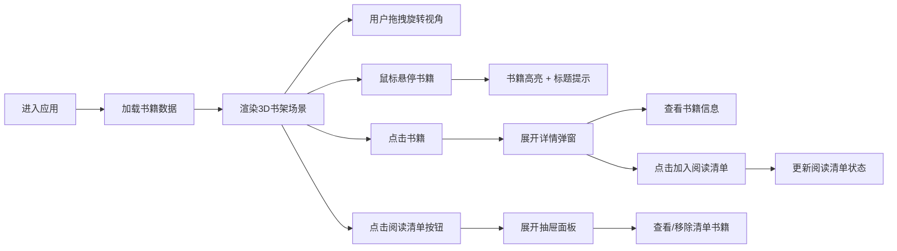

## 1. 产品概述

幻深图书馆是一个沉浸式3D馆藏探索应用，用户可以在虚构的三维图书馆环境中浏览书架、查看书籍详情并管理个人阅读清单。应用以深色典雅的视觉风格，结合Three.js实现真实感3D书架交互，为读者提供独特的虚拟图书馆体验。

### 产品目标
- 打造沉浸式3D图书馆浏览体验
- 提供直观的书籍发现和详情查看功能
- 支持个性化阅读清单管理与持久化
- 兼顾视觉表现力与性能流畅度

## 2. 核心功能

### 2.1 功能模块

| 模块名称 | 功能描述 |
|---------|---------|
| 3D书架场景 | 可旋转的三维书架，多层书籍展示，悬停高亮与脉动动画 |
| 书籍详情弹窗 | 点击书籍展开详情，展示封面、摘要、作者、评分和加入清单按钮 |
| 阅读清单抽屉 | 右侧滑入面板，展示已选书籍，支持移除操作，数据本地持久化 |
| 加载状态 | 数据加载时显示旋转加载指示器，过渡动画自然流畅 |

### 2.2 页面详情

| 页面名称 | 模块名称 | 功能描述 |
|---------|---------|----------|
| 主页 | 3D书架组件 | 渲染深色木质纹理书架，支持拖拽旋转视角，书籍悬停高亮与提示 |
| 主页 | 书籍详情弹窗 | 点击书籍后从中央展开，显示完整书籍信息与操作按钮 |
| 主页 | 阅读清单按钮 | 右上角圆形按钮，显示未读数量红点，点击展开抽屉 |
| 主页 | 阅读清单抽屉 | 左侧滑入面板，列表展示已收藏书籍，支持移除操作 |

## 3. 核心流程

## 4. 用户界面设计

### 4.1 设计风格

**整体风格**：深色典雅图书馆主题，神秘而富有沉浸感

**色彩体系**：
- 主色：`#1A1A2E`（深邃夜空蓝）
- 辅色：`#2A2A3A`（深灰紫）
- 强调色：`#7C5CFC`（蓝紫色渐变到 `#5B3CC4`）
- 文本主色：`#E0E0E0`（浅灰白）
- 文本次色：`#A0A0B0`（淡灰紫）
- 书籍暖色调：`#8B4513`、`#A0522D`、`#D2691E`、`#CD853F`、`#F5DEB3`
- 金色星级：`#FFD700`
- 危险/删除：`#E55B5B`

**按钮风格**：
- 主按钮：蓝紫色渐变背景，圆角8px，悬浮时上抬3px并提升亮度
- 圆形图标按钮：深灰紫背景，白色图标，带未读红点
- 移除按钮：圆形红色背景

**字体与字号**：
- 标题：24px 粗体
- 作者信息：16px
- 正文/摘要：14px
- 书脊文字：白色小字
- 清单项：14px

**布局风格**：
- 3D场景全屏居中
- 右上角固定阅读清单按钮
- 书籍详情弹窗居中展开
- 阅读清单抽屉从左侧滑入
- 卡片式设计，带细微阴影和深度

**动效风格**：
- 所有过渡动画使用缓动函数，持续300-400ms
- 书籍悬停：亮度提升 + 脉动呼吸（1.5秒周期）
- 弹窗：从中心缩放展开
- 抽屉：左侧滑入
- 按钮悬浮：微抬升 + 亮度变化

### 4.2 页面设计概述

| 页面名称 | 模块名称 | UI元素 |
|---------|---------|--------|
| 主页 | 3D书架场景 | 深色径向渐变背景、星光粒子、木质书架、彩色书脊、书脊文字、悬停高亮、工具提示 |
| 主页 | 书籍详情弹窗 | 半透明深色背景、方形封面图、书名、作者、五星评分、摘要、加入清单按钮 |
| 主页 | 阅读清单按钮 | 圆形按钮、书本图标、红色未读标记 |
| 主页 | 阅读清单抽屉 | 深色面板、书籍卡片、封面缩略图、书名、移除按钮、滑入动画 |

### 4.3 响应式设计

- **桌面端（>1200px）**：5层书架，完整交互
- **平板端（768px-1200px）**：3层书架，中等缩放
- **移动端（<768px）**：2层书架，下方增加横向滚动条，最小支持360px宽度
- 书架整体保持在视口中居中
- 触控设备支持手势旋转

### 4.4 3D场景指引

**环境与氛围**：
- 深色径向渐变背景（#0A0A1A 到 #1A1A2E）
- 细小星光粒子点缀，随机闪烁
- 整体神秘感与图书馆沉浸氛围

**光照设置**：
- 环境光提供基础照明
- 方向光模拟主光源，营造书架立体感
- 轻微漫反射和光泽材质

**相机设置**：
- 环绕式轨道相机
- 极角限制：-30° 至 60°
- 支持鼠标拖拽旋转

**交互与动画**：
- 书籍悬停高亮 + 脉动呼吸效果
- 平滑的视角旋转
- 点击书籍触发详情弹窗

**性能预算**：
- 帧率 > 30FPS
- 总多边形数 < 5000
- 书籍模型使用共享几何体和材质减少Draw Call
- 书籍总数不超过100本
