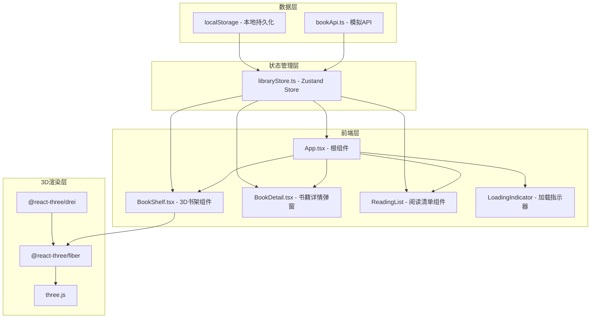

## 1. 架构设计



## 2. 技术选型

**前端框架**：React 18 + TypeScript
- 组件化开发，类型安全
- Hooks 管理组件状态

**构建工具**：Vite 5
- 极速热更新
- 原生ESM支持
- TypeScript 开箱即用

**3D渲染**：three.js + @react-three/fiber + @react-three/drei
- three.js 作为底层3D引擎
- @react-three/fiber 提供 React 声明式API
- @react-three/drei 提供常用辅助组件（OrbitControls等）

**状态管理**：Zustand
- 轻量级状态管理
- 简单的API设计
- 支持中间件（persist用于localStorage持久化）

**样式方案**：原生CSS + CSS Modules
- 避免引入额外CSS框架
- 使用CSS变量管理设计令牌
- CSS transitions/animations 实现动效

**数据模拟**：内置模拟API
- 异步函数模拟网络请求
- 200-400ms随机延迟
- 返回模拟书籍JSON数据

## 3. 文件结构

```
auto8/
├── package.json
├── index.html
├── vite.config.js
├── tsconfig.json
└── src/
    ├── App.tsx              # 根组件，整合3D场景与UI
    ├── main.tsx             # 应用入口
    ├── index.css            # 全局样式
    ├── store/
    │   └── libraryStore.ts  # Zustand状态管理
    ├── components/
    │   ├── BookShelf.tsx    # 3D书架组件
    │   ├── BookDetail.tsx   # 书籍详情弹窗
    │   └── ReadingList.tsx  # 阅读清单抽屉
    └── data/
        └── bookApi.ts       # 模拟API模块
```

## 4. 数据模型

### 4.1 Book 类型定义

```typescript
interface Book {
  id: string;
  title: string;
  author: string;
  summary: string;
  rating: number;      // 1-5
  color: string;       // 书脊颜色
  thickness: number;   // 书籍厚度
  shelfIndex: number;  // 所在书架层
  positionIndex: number; // 在层中的位置
}
```

### 4.2 Store 状态定义

```typescript
interface LibraryState {
  books: Book[];
  selectedBook: Book | null;
  readingList: Book[];
  isLoading: boolean;
  isDetailOpen: boolean;
  isListOpen: boolean;
  
  fetchBooks: () => Promise<void>;
  selectBook: (book: Book) => void;
  closeDetail: () => void;
  addToReadingList: (book: Book) => void;
  removeFromReadingList: (bookId: string) => void;
  toggleReadingList: () => void;
}
```

## 5. 核心模块说明

### 5.1 模拟API模块 (bookApi.ts)
- `fetchBooks()`: 异步获取书籍列表，返回Book数组
- `fetchBookDetail(id)`: 异步获取单本书籍详情
- 内置200-400ms随机延迟模拟网络请求
- 生成30-50本模拟书籍数据

### 5.2 状态管理 (libraryStore.ts)
- 使用zustand的`create`函数创建store
- 使用`persist`中间件实现阅读清单localStorage持久化
- 管理书架数据、选中书籍、阅读清单、加载状态、弹窗开关状态

### 5.3 3D书架组件 (BookShelf.tsx)
- 使用@react-three/fiber的Canvas组件
- 多层书架结构，每层放置8-10本书
- 书籍使用BoxGeometry，共享材质减少Draw Call
- 书脊文字使用Sprite + Canvas纹理
- OrbitControls控制视角，限制极角范围
- 悬停检测使用raycaster，高亮+脉动动画
- 响应式：根据屏幕宽度调整书架层数

### 5.4 书籍详情弹窗 (BookDetail.tsx)
- 半透明深色背景遮罩
- 从中心缩放展开动画（300ms ease-out）
- Canvas绘制几何风格封面
- 五星评分展示
- 加入阅读清单按钮

### 5.5 阅读清单组件 (ReadingList.tsx)
- 右上角圆形触发按钮
- 左侧滑入抽屉面板（350ms ease-in-out）
- 书籍卡片列表，支持左滑移除动画
- localStorage持久化存储
- 未读数量红点提示

## 6. 性能优化策略

### 6.1 3D渲染优化
- 书籍使用共享几何体和材质，减少Draw Call
- 使用InstancedMesh或复用Geometry/Material
- 控制总多边形数在5000以内
- 书脊文字使用Canvas纹理而非TextGeometry减少计算

### 6.2 动画优化
- 使用requestAnimationFrame驱动书架旋转
- CSS transitions 处理UI动画
- 避免频繁重排重绘

### 6.3 加载优化
- 显示加载指示器提升感知体验
- 数据预加载与缓存
- 懒加载非关键资源
