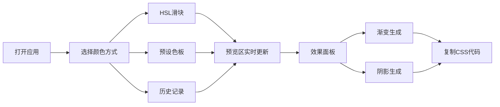

## 1. 产品概述

代码调色板是一款面向前端开发者和设计师的交互式CSS色彩探索工具，帮助用户快速创建、预览和组合色彩方案，生成可直接使用的渐变和阴影CSS代码。

- 核心用途：色彩方案探索、CSS代码生成、设计灵感获取
- 目标用户：前端开发者、UI/UX设计师、创意工作者
- 产品价值：降低色彩调试成本，提供一站式色彩方案生成能力

## 2. 核心功能

### 2.1 用户角色
本产品为单用户工具，无需登录，无角色区分。

### 2.2 功能模块
1. **色彩控制面板**：HSL滑块调节、预设色板、颜色历史记录
2. **颜色预览区**：主颜色实时预览、颜色值显示、悬停放大镜
3. **效果生成面板**：渐变生成器、阴影生成器、CSS代码输出与复制

### 2.3 页面详情
| 页面名称 | 模块名称 | 功能描述 |
|-----------|-------------|---------------------|
| 主页面 | HSL滑块 | 三个垂直/水平滑块控制色相、饱和度、亮度，实时更新颜色 |
| 主页面 | 预设色板 | 12种固定色块，点击快速应用，悬停显示颜色名称 |
| 主页面 | 颜色历史 | 最近使用的10个颜色，点击切换并置顶 |
| 主页面 | 颜色预览 | 主颜色大尺寸预览，显示十六进制和HSL值，悬停放大镜效果 |
| 主页面 | 渐变生成器 | 双色渐变、方向选择、实时预览、CSS代码输出复制 |
| 主页面 | 阴影生成器 | 偏移/模糊/透明度调节、实时预览、CSS代码输出复制 |

## 3. 核心流程

用户打开应用 → 通过滑块/色板/历史选择颜色 → 预览区实时更新 → 切换到渐变或阴影面板 → 调整参数 → 复制生成的CSS代码 → 应用到项目中

## 4. 用户界面设计

### 4.1 设计风格
- **主色调**：深空暗色主题，主背景#121220，面板背景#1E1E30
- **文字颜色**：#E0E0E0，输入框和滑块背景#2A2A44，边框#3A3A5C
- **按钮风格**：圆角12-16px，悬停变亮，点击缩放0.95，过渡0.2s ease
- **字体**：现代无衬线字体，等宽字体用于代码输出
- **布局风格**：Flex卡片式布局，桌面端左右两列，移动端纵向排列
- **图标风格**：简约线性图标

### 4.2 页面设计概述
| 页面名称 | 模块名称 | UI元素 |
|-----------|-------------|-------------|
| 主页面 | HSL滑块 | 垂直轨道8px高200px宽，滑块直径20px白色，色相渐变轨道 |
| 主页面 | 预设色板 | 40x40px色块，圆角8px，悬停放大1.1倍，两行6列 |
| 主页面 | 颜色预览 | 400x300px区域，圆角16px，1px边框，左下角显示颜色值 |
| 主页面 | 渐变预览条 | 100%宽40px高，圆角8px |
| 主页面 | 代码输出区 | #2A2A44背景，monospace字体，复制按钮 |

### 4.3 响应式
- 桌面端（≥768px）：左右两列布局，左列320px（控制区），右列480px（预览效果区）
- 移动端（<768px）：纵向单列布局，所有面板100%宽度，滑块改为水平方向

### 4.4 动画效果
- 颜色切换：0.2s ease过渡
- 滑块拖拽：60fps实时更新，无闪烁
- 按钮悬停：背景变亮，0.2s ease
- 按钮点击：缩放0.95，0.2s ease
- 色块悬停：放大1.1倍，0.2s ease
