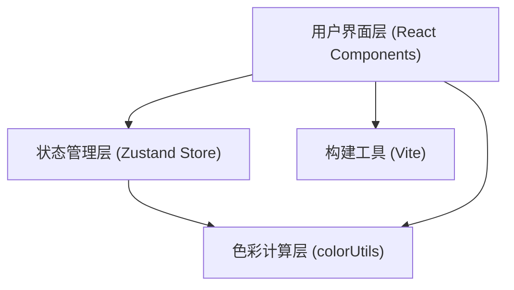

## 1. 架构设计



## 2. 技术说明
- **前端框架**：React 18 + TypeScript
- **构建工具**：Vite 5
- **状态管理**：Zustand 4
- **其他依赖**：uuid（唯一标识生成）
- **样式方案**：原生CSS + CSS变量，无需额外UI库

## 3. 项目结构
```
auto80/
├── package.json
├── index.html
├── tsconfig.json
├── vite.config.js
└── src/
    ├── App.tsx                    # 根组件，布局整合
    ├── store/
    │   └── useColorStore.ts       # Zustand状态管理
    ├── utils/
    │   └── colorUtils.ts          # 色彩计算工具函数
    └── components/
        ├── ColorSliders.tsx       # HSL滑块组件
        ├── ColorPreview.tsx       # 颜色预览组件
        ├── PalettePanel.tsx       # 色板与历史记录组件
        └── EffectsPanel.tsx       # 渐变与阴影效果组件
```

## 4. 核心数据模型

### 4.1 颜色状态
```typescript
interface HSL {
  h: number;  // 0-360
  s: number;  // 0-100
  l: number;  // 0-100
}

interface ColorState {
  hsl: HSL;
  hex: string;
  history: Array<{ id: string; hex: string; hsl: HSL }>;
  presets: Array<{ id: string; name: string; hex: string; hsl: HSL }>;
}
```

### 4.2 渐变参数
```typescript
interface GradientConfig {
  type: 'linear' | 'radial';
  direction: 'to right' | 'to bottom' | 'to bottom right' | 'radial';
  color1: string;  // hex
  color2: string;  // hex
}
```

### 4.3 阴影参数
```typescript
interface ShadowConfig {
  offsetX: number;     // -20 to 20
  offsetY: number;     // -20 to 20
  blurRadius: number;  // 0 to 40
  opacity: number;     // 0 to 1
}
```

## 5. 色彩计算模块（colorUtils.ts）核心函数
- `hslToHex(h, s, l)`: HSL转十六进制，性能优化，每帧<2ms
- `hexToHsl(hex)`: 十六进制转HSL
- `generateGradientColors(baseHex, count)`: 生成渐变色系
- `getContrastColor(hex)`: 计算对比色（用于文字显示）
- `generateShadowCSS(config)`: 生成阴影CSS代码
- `generateGradientCSS(config)`: 生成渐变CSS代码

## 6. 性能优化策略
- 使用`requestAnimationFrame`节流滑块更新，确保60fps
- 色彩计算函数纯函数化，无副作用，便于内联优化
- React组件使用memo优化，避免不必要的重渲染
- Zustand selector精确订阅，减少跨组件渲染
