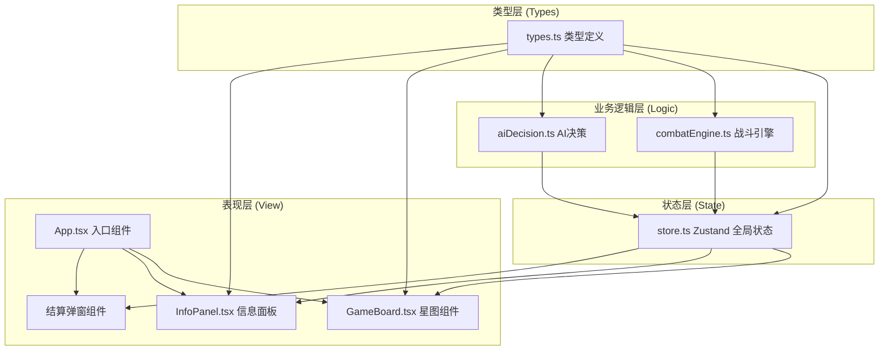

## 1. 架构设计



**数据流向**：
- 用户交互 → GameBoard/InfoPanel → store.dispatch → 状态更新 → 组件重渲染
- AI回合 → aiDecision → 决策结果 → store.dispatch → 状态更新
- 战斗触发 → combatEngine → 战斗结果 → store.dispatch → 战报日志

## 2. 技术栈描述

- **前端框架**：React@18 + TypeScript
- **构建工具**：Vite@5 + @vitejs/plugin-react
- **状态管理**：Zustand
- **唯一ID**：uuid
- **样式方案**：原生CSS + CSS Modules (或内联样式配合CSS变量)
- **动画方案**：CSS keyframes + requestAnimationFrame (粒子效果)

**初始化方式**：使用 Vite react-ts 模板创建项目，然后添加 zustand、uuid 等依赖。

## 3. 目录结构

```
src/
├── types.ts           # 全局类型定义（被所有模块引用）
├── store.ts           # Zustand 状态管理
├── combat/
│   └── combatEngine.ts # 战斗引擎模块
├── ai/
│   └── aiDecision.ts  # AI决策模块
├── components/
│   ├── GameBoard.tsx  # 星图组件
│   └── InfoPanel.tsx  # 信息面板组件
├── App.tsx            # 根组件
├── main.tsx           # 入口文件
└── index.css          # 全局样式
```

**模块调用关系**：
1. `types.ts` → 零依赖，定义所有核心类型
2. `combat/combatEngine.ts` → 依赖 types.ts
3. `ai/aiDecision.ts` → 依赖 types.ts
4. `store.ts` → 依赖 types.ts + combatEngine.ts + aiDecision.ts
5. `components/*` → 依赖 types.ts + store.ts
6. `App.tsx` → 依赖 components/* + store.ts

## 4. 核心数据模型

### 4.1 类型定义 (types.ts)

| 类型名称 | 字段 | 说明 |
|---------|------|------|
| `FleetType` | cruiser / frigate / mothership | 舰船类型枚举 |
| `Owner` | player / ai | 归属方 |
| `Ship` | id, type, hp, maxHp, attack, move, range | 单艘舰船数据 |
| `Fleet` | id, owner, ships, nodeId | 舰队数据 |
| `NodeType` | normal / resource / mothership_player / mothership_ai | 节点类型 |
| `StarNode` | id, x, y, type, fleetIds | 星图节点 |
| `CombatResult` | attackerDamage, defenderDamage, attackerRemaining, defenderRemaining, logs | 战斗结果 |
| `GameState` | nodes, fleets, turn, currentPhase, selectedNodeId, logs, winner | 游戏全局状态 |

### 4.2 Zustand Store (store.ts)

| State 字段 | 类型 | 说明 |
|-----------|------|------|
| nodes | StarNode[] | 星图节点列表 |
| fleets | Fleet[] | 所有舰队列表 |
| turn | number | 当前回合数 |
| currentPhase | 'player' \| 'ai' \| 'ended' | 当前阶段 |
| selectedNodeId | string \| null | 当前选中节点 |
| combatLogs | string[] | 战斗日志 |
| winner | Owner \| null | 胜者 |

| Action 方法 | 参数 | 说明 |
|------------|------|------|
| initGame | - | 初始化游戏，生成星图和舰队 |
| selectNode | nodeId | 选中/取消选中节点 |
| moveFleet | fleetId, targetNodeId | 移动舰队到目标节点 |
| endPlayerTurn | - | 结束玩家回合，触发AI行动 |
| aiTurn | - | 执行AI回合 |
| resolveCombat | attackerFleetId, defenderFleetId | 结算战斗 |

## 5. 战斗引擎设计

### 5.1 combatEngine.ts

**核心函数**：
- `calculateCombat(attackerFleet: Fleet, defenderFleet: Fleet, terrainBonus: number): CombatResult`

**战斗逻辑**：
1. 计算双方总攻击力和总血量
2. 应用地形修正（资源点+1攻击）
3. 按舰船类型分配伤害（优先攻击血量低的）
4. 生成详细战报日志
5. 返回战斗结果

**算法**：
- 每轮双方同时攻击
- 总伤害 = 总攻击力 + 地形修正
- 伤害优先分配给当前HP最低的舰船
- 战斗持续至一方全灭或设定最大回合数

## 6. AI决策设计

### 6.1 aiDecision.ts

**状态机**：

| 状态 | 触发条件 | 行为 |
|------|---------|------|
| ATTACK | 敌方舰队在射程内且战力占优 | 移动到敌方节点发起攻击 |
| CAPTURE | 资源点未被己方占领且可达 | 向资源点移动占领 |
| ADVANCE | 以上都不满足 | 向敌方母舰方向推进 |

**决策输出**：
```typescript
interface AIDecision {
  fleetId: string;
  targetNodeId: string;
  action: 'move' | 'attack';
}
```

## 7. 性能优化策略

1. **状态更新**：Zustand 轻量状态，避免不必要的重渲染
2. **动画性能**：
   - CSS transform/opacity 动画，触发GPU加速
   - 粒子效果使用 requestAnimationFrame 批量更新
   - 使用 will-change 提示浏览器优化
3. **渲染优化**：
   - 星图节点使用 memo 包裹
   - 避免在渲染中创建新对象/数组
4. **战斗计算**：纯函数同步计算，避免异步开销
