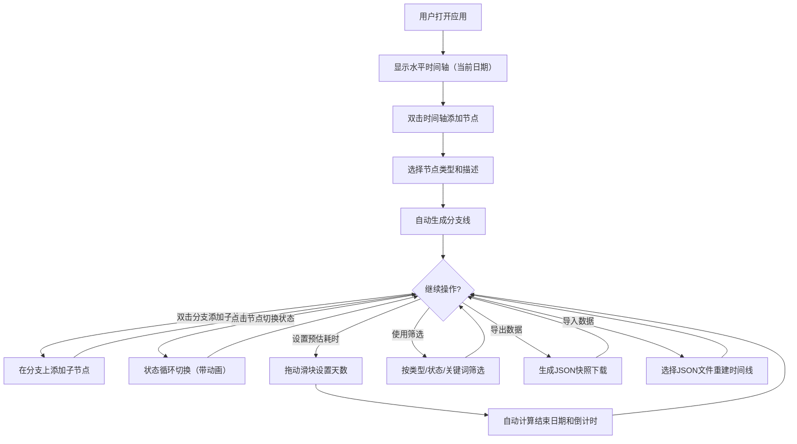

## 1. 产品概述

时序织图是一款可视化个人时间线规划与追踪应用，旨在解决传统甘特图和日历视图难以灵活拖拽调整、不支持分支与并行任务的问题。用户可以通过直观的交互方式在水平时间轴上添加节点、创建分支、追踪进度，以树状时间线的形式管理多个并行目标（如项目里程碑、阅读进度、技能学习路径）。

- 核心价值：让用户以直觉化、交互性强的方式规划和调整多目标并行计划
- 目标用户：需要同时管理多个长期目标并进行进度追踪的个人用户

## 2. 核心功能

### 2.1 功能模块

1. **主时间线页面**：水平时间轴、节点添加与管理、分支生成、进度追踪、缩放与拖拽
2. **筛选侧边栏**：按类型/状态/关键词筛选，高亮匹配节点

### 2.2 页面详情

| 页面名称 | 模块名称 | 功能描述 |
|----------|----------|----------|
| 主时间线页面 | 时间轴区域 | 中央水平时间轴（1200px），可左右拖拽平移，双击添加节点，支持鼠标滚轮缩放（0.5x-3x），Canvas渲染 |
| 主时间线页面 | 节点管理 | 双击轴上添加节点，弹出迷你菜单选择类型（目标#4ECDC4/子任务#FFE66D/里程碑#FF6B6B）和填写描述，点击节点切换状态（未开始→进行中→已完成→已延期），已完成节点显示勾选动画 |
| 主时间线页面 | 分支系统 | 添加节点后自动生成分支线（#6C63FF，2px宽，圆角转折），分支上可继续添加子节点形成树状时间线 |
| 主时间线页面 | 时间估算 | 每个节点可设置预估耗时（1-365天滑块），系统自动计算时间线结束日期并显示在右上角（带倒计时效果） |
| 主时间线页面 | 顶部工具栏 | 导出按钮（#6C63FF）生成JSON快照并下载，导入按钮（#FF6B6B）接受.json文件并重建时间线 |
| 主时间线页面 | 左侧筛选面板 | 按类型/状态/关键词搜索筛选，非匹配节点半透明0.2且不可交互，匹配节点高亮外发光（阴影扩散4px） |

### 2.3 交互细节

- **节点添加**：双击时间轴 → 弹出迷你菜单（200px宽，圆角6px，背景#2D2D44，白色文字） → 选择类型 + 填写描述 → 确认
- **状态切换**：点击节点 → 状态循环切换，节点颜色平滑过渡（0.3s），已完成显示勾选动画（0.4s）
- **时间估算**：滑块轨道200px，#4A4A6A，滑块按钮20px直径#6BCB77，拖动显示天数浮窗
- **筛选**：左侧面板240px，背景#2D2D44，圆角12px，1px #3A3A5C边框；搜索框圆角8px背景#1E1E2E白色文字
- **缩放**：鼠标滚轮缩放0.5x-3x，以鼠标位置为中心，过渡0.2s ease
- **响应式**：窗口<768px时侧边栏折叠为汉堡菜单（40px直径#4A4A6A圆形按钮），点击从左滑出（0.3s ease-out）

## 3. 核心流程

## 4. 用户界面设计

### 4.1 设计风格

- **主色调**：深色系暗色主题，主背景#1A1A2E，辅助背景#2D2D44
- **强调色**：目标#4ECDC4、子任务#FFE66D、里程碑#FF6B6B、分支线#6C63FF
- **字体**：Inter, sans-serif（无衬线体）
- **圆角**：统一8px或12px
- **交互反馈**：悬停0.2s ease阴影加深（0 2px 4px → 0 4px 12px），点击0.15s scale(0.97)
- **按钮风格**：导出按钮#6C63FF（悬停#7C73FF，点击缩放0.95），导入按钮#FF6B6B（悬停#FF7B7B）
- **布局风格**：顶部工具栏 + 左侧筛选面板 + 中央Canvas时间轴

### 4.2 页面设计概览

| 页面名称 | 模块名称 | UI元素 |
|----------|----------|--------|
| 主时间线页面 | 时间轴Canvas | 深色背景#1A1A2E，圆点标记日期，节点按类型着色，分支线#6C63FF圆角折线 |
| 主时间线页面 | 顶部工具栏 | 固定顶部，导出按钮#6C63FF圆角8px，导入按钮#FF6B6B圆角8px |
| 主时间线页面 | 左侧筛选面板 | 240px宽#2D2D44背景，圆角12px，1px #3A3A5C边框，三种筛选模式+搜索框 |
| 主时间线页面 | 节点迷你菜单 | 200px宽，圆角6px，背景#2D2D44，白色文字，类型选择+描述输入 |
| 主时间线页面 | 结束日期显示 | 右上角白色文字18px，倒计时效果 |
| 主时间线页面 | 时间滑块 | 200px轨道#4A4A6A，20px按钮#6BCB77，天数浮窗 |

### 4.3 响应式适配

- 桌面优先设计，窗口宽度≥768px时完整显示所有面板
- 窗口宽度<768px时：左侧筛选面板折叠为汉堡菜单（40px圆形按钮#4A4A6A，悬停#5A5A7A），点击从左侧滑出（0.3s ease-out动画）
- 时间轴Canvas自适应容器宽度

### 4.4 性能要求

- 节点数≤200时，拖拽和缩放帧率≥45fps
- 所有动画帧率≥30fps
- Canvas渲染分离布局计算与绘制
