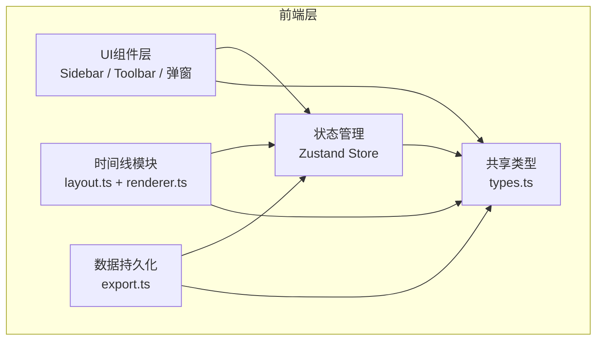
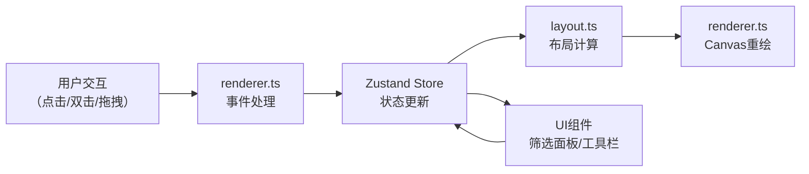
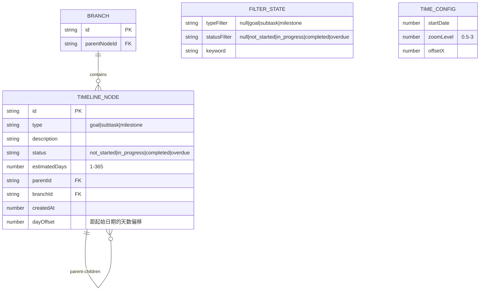

## 1. 架构设计



## 2. 技术描述

- **前端**：React 18 + TypeScript + Vite
- **状态管理**：Zustand
- **初始化工具**：vite-init（react-ts模板）
- **后端**：无（纯前端应用）
- **数据库**：无（JSON导入导出实现数据持久化）
- **唯一ID生成**：uuid

## 3. 路由定义

本应用为单页面应用，无路由切换。

| 路由 | 用途 |
|------|------|
| / | 主时间线页面，包含时间轴、工具栏、侧边栏 |

## 4. 模块架构

### 4.1 文件结构

```
src/
├── shared/
│   └── types.ts          # 共享类型定义：Node, Branch, FilterState, TimeConfig等
├── store.ts              # Zustand全局状态管理：nodes, filter, selectedNodeId等
├── timeline/
│   ├── layout.ts         # 布局计算：接收节点树，返回坐标和分支路径
│   └── renderer.ts       # Canvas渲染：绘制节点/分支线/交互反馈，处理鼠标事件
├── components/
│   ├── Sidebar.tsx       # 左侧筛选面板
│   └── Toolbar.tsx       # 顶部工具栏
├── storage/
│   └── export.ts         # JSON导出导入
├── App.tsx               # 应用入口组件
└── main.tsx              # 应用挂载入口
```

### 4.2 模块职责

| 模块 | 文件 | 职责 |
|------|------|------|
| 共享类型 | types.ts | 定义Node（id, type, description, status, estimatedDays, parentId, branchId, createdAt）、Branch（id, parentNodeId, nodes[]）、FilterState（typeFilter, statusFilter, keyword）、TimeConfig（startDate, zoomLevel, offsetX）等类型 |
| 状态管理 | store.ts | Zustand store管理nodes数组、filter状态、selectedNodeId、时间轴配置（offsetX, zoomLevel），提供addNode、updateNodeStatus、deleteNode、setFilter等action |
| 布局计算 | layout.ts | 接收store中的节点树，计算每个节点的Canvas坐标位置，计算分支线路径（贝塞尔曲线/圆角折线），输出LayoutResult供renderer使用 |
| 渲染引擎 | renderer.ts | Canvas绘制全部节点、分支线、时间轴、日期标记、交互反馈，处理鼠标点击/双击/滚轮/拖拽事件，调用layout.getLayout获取坐标，检测命中区域 |
| 侧边栏 | Sidebar.tsx | 三个筛选器（类型/状态/关键词），搜索框，通过store更新filter状态，响应式折叠 |
| 工具栏 | Toolbar.tsx | 导出和导入按钮，调用storage/export中的函数 |
| 数据持久化 | export.ts | exportToJSON序列化树形结构，importFromJSON反序列化并重建时间线 |

### 4.3 数据流



## 5. 核心数据模型

### 5.1 数据模型定义



### 5.2 类型定义

```typescript
type NodeType = 'goal' | 'subtask' | 'milestone';
type NodeStatus = 'not_started' | 'in_progress' | 'completed' | 'overdue';

interface TimelineNode {
  id: string;
  type: NodeType;
  description: string;
  status: NodeStatus;
  estimatedDays: number;
  parentId: string | null;
  branchId: string;
  createdAt: number;
  dayOffset: number;
}

interface Branch {
  id: string;
  parentNodeId: string;
}

interface FilterState {
  typeFilter: NodeType | null;
  statusFilter: NodeStatus | null;
  keyword: string;
}

interface TimeConfig {
  startDate: number;
  zoomLevel: number;
  offsetX: number;
}
```
