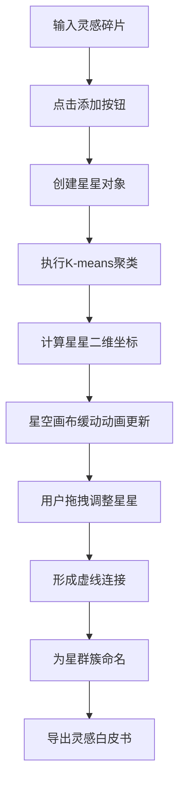

## 1. 产品概述
灵感星群是一款面向创意工作者的灵感碎片可视化管理工具，通过星空图形界面帮助用户将零散的灵感进行聚类整理，最终生成结构化的灵感白皮书。
- 核心目的：解决创意灵感碎片化、难以系统化整理的问题，通过可视化星群图直观展示灵感之间的关联
- 目标用户：设计师、作家、产品经理、创作者等需要频繁记录和整理创意的人群

## 2. 核心功能

### 2.1 功能模块
1. **星空画布**：可视化展示灵感碎片，按语义相似度聚类分布，支持拖拽交互
2. **灵感输入面板**：快速记录灵感碎片，实时添加到星群
3. **星群列表面板**：管理聚类簇，支持重命名和高亮
4. **底部工具栏**：导出白皮书、清空重置功能

### 2.2 页面详情
| 页面名称 | 模块名称 | 功能描述 |
|-----------|-------------|---------------------|
| 主页面 | 星空画布 | 深空蓝渐变背景，闪烁粒子，圆形星星图标，K-means聚类位置，拖拽发光轨迹，虚线连接线 |
| 主页面 | 灵感输入面板 | 输入框+添加按钮，左侧3px#4ECDC4边框，圆角16px，悬停动效 |
| 主页面 | 星群列表面板 | 按行展示聚类簇，点击高亮，双击重命名，本地存储 |
| 主页面 | 底部工具栏 | 导出白皮书(txt格式)、清空星群(带确认弹窗) |

## 3. 核心流程
用户在左侧输入面板输入灵感碎片→点击添加按钮→系统将灵感转换为星星→自动执行K-means聚类算法→星空画布以缓动动画更新星星位置→星星按主题聚类形成星群→用户可拖拽星星手动调整→用户在右侧面板为星群命名→点击导出按钮生成结构化白皮书

## 4. 用户界面设计

### 4.1 设计风格
- **主色调**：深空蓝径向渐变(#0A0A2E到#1A1A4E)，主题色#4ECDC4(青绿色)，辅助色#FFE66D(明黄)，#6BCB77(绿色)，#FF6B6B(红色)
- **按钮样式**：圆角8px，悬停放大1.05倍，过渡0.2s，带发光边缘
- **字体**：现代无衬线字体，深色背景白色文字
- **布局风格**：三栏式布局(768px以上)，响应式侧边栏(768px以下)
- **动画风格**：平滑缓动(cubic-bezier(0.25, 0.1, 0.25, 1))，持续0.8s，柔和发光效果

### 4.2 页面设计概述
| 页面名称 | 模块名称 | UI元素 |
|-----------|-------------|-------------|
| 主页面 | 星空画布 | 径向渐变背景、闪烁粒子、圆形星星、拖拽轨迹、虚线连接、发光光晕 |
| 主页面 | 灵感输入面板 | 深色背景#1A1A2E、圆角16px、#4ECDC4边框、输入框#2D2D44、绿色添加按钮 |
| 主页面 | 星群列表面板 | 深色背景#1A1A2E、圆角16px、#FFE66D边框、簇列表行高48px、颜色块+名称、内联重命名输入框 |
| 主页面 | 底部工具栏 | 背景#0D0D2B、1px顶部边框、导出按钮#FF6B6B、重置按钮#4A4A6A、确认弹窗 |

### 4.3 响应式
- **桌面端(≥768px)**：三栏布局，左侧输入面板300px，中间星空画布，右侧列表面板250px
- **移动端(<768px)**：星空画布全屏，输入和列表面板以可收起侧边栏呈现(收缩宽度48px仅显示图标)，展开动画0.3秒

### 4.4 性能要求
- 星星数量>50时启用增量聚类更新，计算时间≤200ms
- 30个簇以上时页面保持60fps流畅滚动
