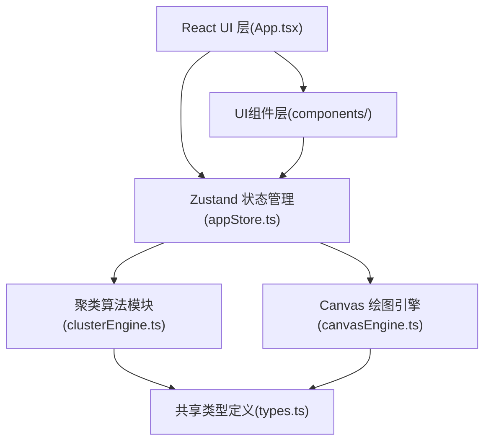
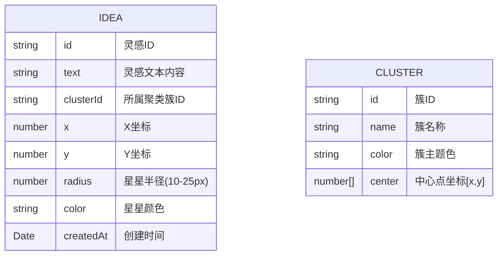

## 1. 架构设计



## 2. 技术描述
- **前端框架**：React@18 + TypeScript@5
- **构建工具**：Vite@5 + @vitejs/plugin-react
- **状态管理**：Zustand@4
- **其他依赖**：uuid(生成唯一ID)
- **后端**：无(纯前端应用，数据存储在localStorage)
- **数据库**：localStorage(浏览器本地存储)

## 3. 路由定义
| 路由 | 用途 |
|-------|---------|
| / | 主应用页面(单页应用，无多路由) |

## 4. 数据模型

### 4.1 数据模型定义



### 4.2 模块接口定义

**src/shared/types.ts** - 核心类型定义：
- `Idea`: 灵感碎片类型
- `Cluster`: 聚类簇类型
- `StarPosition`: 星星位置类型
- `ClusterResult`: 聚类结果接口
- `CanvasStar`: Canvas绘制用星星数据

## 5. 文件结构
```
├── package.json
├── index.html
├── tsconfig.json
├── vite.config.js
├── src/
│   ├── main.tsx          # React入口
│   ├── App.tsx           # 根组件，三栏布局
│   ├── shared/
│   │   └── types.ts      # 共享类型定义
│   ├── store/
│   │   └── appStore.ts   # Zustand全局状态
│   ├── cluster/
│   │   └── clusterEngine.ts  # K-means聚类引擎
│   ├── renderer/
│   │   └── canvasEngine.ts   # Canvas绘图引擎
│   └── components/
│       ├── InputPanel.tsx        # 左侧输入面板
│       ├── ClusterListPanel.tsx  # 右侧簇列表面板
│       ├── StarCanvas.tsx        # 星空画布组件
│       └── Toolbar.tsx           # 底部工具栏
```

## 6. 核心算法说明

### 6.1 K-means聚类算法
- 距离度量：欧几里得距离
- 初始聚类数：根据碎片数量动态设定(Math.ceil(Math.sqrt(n/2)))
- 终止条件：迭代100次或质心变化小于阈值
- 增量更新：星星数量>50时启用，仅对新添加的星星计算最近簇

### 6.2 Canvas渲染引擎
- 动画循环：requestAnimationFrame
- 缓动函数：cubic-bezier(0.25, 0.1, 0.25, 1)
- 粒子系统：背景闪烁星星，周期2秒随机
- 拖拽交互：鼠标事件+发光轨迹+虚线连接
