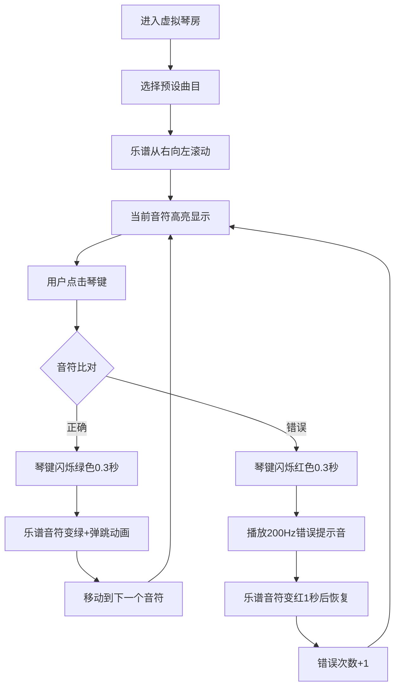

## 1. 产品概述

虚拟琴房是一个面向音乐学习者的交互式在线乐器教学平台，通过浏览器端的模拟钢琴键盘和实时音频反馈，帮助用户直观地学习和练习钢琴弹奏。平台提供练习模式，用户可根据滚动乐谱提示进行弹奏，并获得即时的正确性判定与视觉反馈。

- **核心价值**：降低乐器学习门槛，提供随时随地的练琴环境与实时纠错反馈
- **目标用户**：钢琴初学者、音乐爱好者、需要日常练琴的学生

## 2. 核心功能

### 2.1 用户角色
平台面向单用户角色，无需注册登录即可使用全部核心功能。

### 2.2 功能模块
1. **钢琴键盘模块**：88键标准钢琴键盘交互、视觉按压动画、音频发声
2. **乐谱视图模块**：垂直滚动乐谱显示、当前音符高亮、音高与时值标注
3. **练习模式模块**：预设曲目选择、音符实时比对、正确/错误反馈、进度统计
4. **音频引擎模块**：Tone.js合成器驱动、钢琴音色、错误提示音

### 2.3 页面详情
| 页面名称 | 模块名称 | 功能描述 |
|----------|----------|----------|
| 主界面 | 钢琴键盘区 | 88键可交互钢琴键盘，支持鼠标点击/触摸触发，按下时背景变深带过渡动画，悬停时发光增强 |
| 主界面 | 乐谱视图区 | 垂直滚动显示乐谱音符，圆形标记位置越高音越高，当前音符高亮发光，悬停显示音符详情 |
| 主界面 | 练习统计面板 | 显示正确率（颜色随数值变化）、总音符数、错误次数、重置按钮 |
| 主界面 | 曲目选择器 | 选择预设曲目（如《小星星》），加载对应乐谱 |

## 3. 核心流程

用户进入虚拟琴房 → 选择预设曲目 → 乐谱开始滚动显示 → 当前需要弹奏的音符高亮 → 用户点击对应琴键 → 系统实时比对：
- 弹奏正确：琴键闪烁绿色0.3秒，乐谱音符变绿并带弹跳动画，自动移动到下一个音符
- 弹奏错误：琴键闪烁红色0.3秒，播放200Hz三角波错误提示音，乐谱音符变红1秒后恢复，错误次数+1
→ 用户可随时查看正确率统计并重置练习

## 4. 用户界面设计

### 4.1 设计风格
- **深色霓虹风格**：主背景#1A1A2E，辅背景#16213E，键盘区背景#0F0F23，乐谱区背景#2D2D44
- **色彩系统**：
  - 白键#F5F5F5，按下#D3D3D3；黑键#333333，按下#555555
  - 音符标记#FFE66D，正确反馈#6BCB77，错误反馈#FF6B6B
  - 高亮发光#4ECDC4（霓虹青色）
  - 正确率颜色：<50%#FF6B6B，50-80%#FFE66D，>80%#4ECDC4
- **交互特效**：琴键带微弱发光边框（box-shadow 0 0 6px rgba(78,205,196,0.3)），悬停增强至10px 0.6透明度
- **动画**：按键0.1秒ease-out过渡，正确音符translateY(-2px) 0.15s ease弹跳

### 4.2 页面设计概览
| 页面名称 | 模块名称 | UI元素 |
|----------|----------|--------|
| 主界面 | 顶部标题 | 虚拟琴房品牌标识，霓虹青色发光文字 |
| 主界面 | 乐谱视图 | 垂直布局，圆形音符标记，当前音符外圈发光，悬停弹窗显示音高时值详情 |
| 主界面 | 统计面板 | 正确率数字+颜色标识，总音符数、错误次数，绿色重置按钮 |
| 主界面 | 钢琴键盘 | 横向滚动容器，88键标准布局，白键60×200px，黑键36×120px |

### 4.3 响应式设计
- 桌面端优先，乐谱视图与键盘上下布局
- 移动端：键盘区域支持水平滚动，乐谱视图宽度自适应屏幕
- 触摸设备支持琴键触摸触发

### 4.4 性能约束
- 点击到声音延迟 ≤ 30ms（Chrome 110桌面端）
- 乐谱滚动与按键动画帧率 ≥ 50fps
