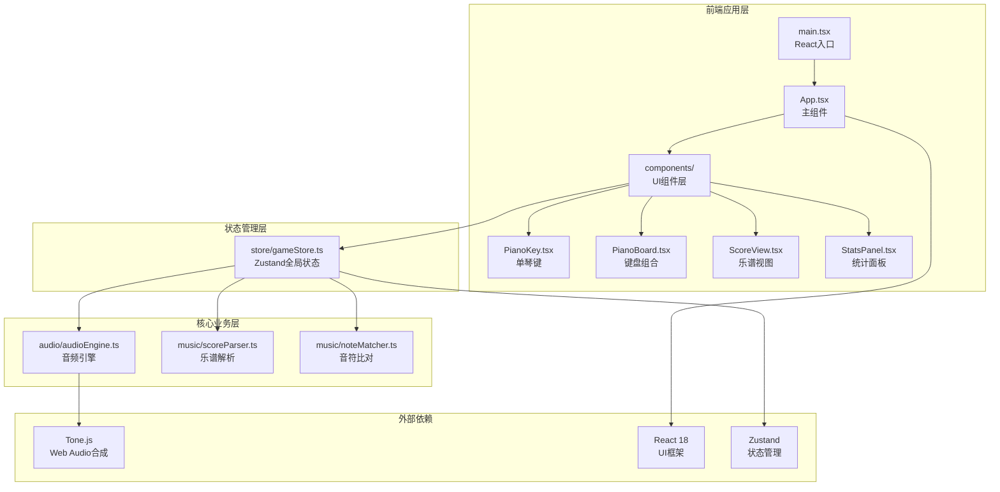

## 1. 架构设计



## 2. 技术选型说明

| 技术 | 版本 | 用途 |
|------|------|------|
| React | ^18 | UI组件框架 |
| React DOM | ^18 | DOM渲染 |
| TypeScript | ^5 | 类型安全 |
| Vite | ^5 | 构建工具与开发服务器 |
| @vitejs/plugin-react | ^4 | React JSX支持 |
| Zustand | ^4 | 轻量级全局状态管理 |
| Tone.js | ^14 | Web Audio API封装，音频合成 |

## 3. 目录结构与数据流

```
src/
├── main.tsx              # 入口：挂载App，初始化音频上下文，创建store
├── App.tsx               # 根组件：布局组装PianoBoard+ScoreView+StatsPanel
├── store/
│   └── gameStore.ts      # Zustand store：琴键状态、乐谱、弹奏记录、比对结果
├── audio/
│   └── audioEngine.ts    # 音频引擎：封装Tone.js Synth，playNote/playError方法
├── music/
│   ├── scoreParser.ts    # 乐谱解析：字符串→[{note, duration}]数组
│   └── noteMatcher.ts    # 音符比对：用户输入vs目标序列→匹配结果
└── components/
    ├── PianoKey.tsx      # 单琴键：视觉渲染+按下/高亮/闪烁状态
    ├── PianoBoard.tsx    # 88键键盘：布局+事件分发+响应式滚动
    ├── ScoreView.tsx     # 乐谱视图：滚动渲染+高亮+悬停提示
    └── StatsPanel.tsx    # 统计面板：正确率/总数/错误/重置
```

**数据流：**
1. `main.tsx` 创建 Zustand store 并初始化 `audioEngine`
2. 用户点击 `PianoKey` → 触发 `store.pressKey(note)` → `audioEngine.playNote()` 发声
3. 练习模式下：`store.currentScoreIndex` 指向目标音符 → `ScoreView` 渲染高亮
4. 用户弹奏 → `store.recordNote(note)` → `noteMatcher.compare()` 比对 → 更新 `store.matchResults`
5. 比对结果驱动 `PianoKey` 闪烁颜色（绿/红）和 `ScoreView` 音符状态变化

## 4. 数据模型

### 4.1 Store 状态定义

```typescript
interface Note {
  note: string;      // e.g. "C4", "F#5"
  duration: number;  // 四分音符=4, 八分=8, 二分=2, 全=1
}

interface MatchResult {
  index: number;
  correct: boolean;
  timestamp: number;
}

interface GameState {
  // 琴键状态
  pressedKeys: Set<string>;           // 当前按下的琴键
  flashKeys: Map<string, 'green'|'red'>; // 闪烁反馈

  // 乐谱数据
  currentScore: Note[];               // 当前曲目音符序列
  currentScoreIndex: number;          // 当前待弹奏索引
  scoreName: string;                  // 曲目名称

  // 弹奏记录
  playedNotes: string[];              // 用户弹奏序列
  matchResults: MatchResult[];        // 比对结果
  errorCount: number;                 // 错误次数

  // Actions
  pressKey: (note: string) => void;
  releaseKey: (note: string) => void;
  setScore: (name: string, notes: Note[]) => void;
  recordNote: (note: string) => void;
  resetPractice: () => void;
  getAccuracy: () => number;
}
```

### 4.2 预设乐谱格式

字符串格式：`"C4 4, G4 4, A4 4, G4 2, F4 4, E4 4, D4 4, C4 2"`
- 逗号分隔音符，空格分隔音高与时值
- 时值：1=全音符, 2=二分, 4=四分, 8=八分

## 5. 核心模块接口

### 5.1 audioEngine.ts
```typescript
interface IAudioEngine {
  init(): Promise<void>;              // 初始化Tone.js上下文
  playNote(note: string, duration?: string): void;  // 播放指定音高
  playError(): void;                  // 播放200Hz三角波错误音
}
```

### 5.2 scoreParser.ts
```typescript
function parseScore(scoreStr: string): Note[];
```

### 5.3 noteMatcher.ts
```typescript
function compareNote(played: string, target: Note): boolean;
function getAccuracy(results: MatchResult[]): number;
```
