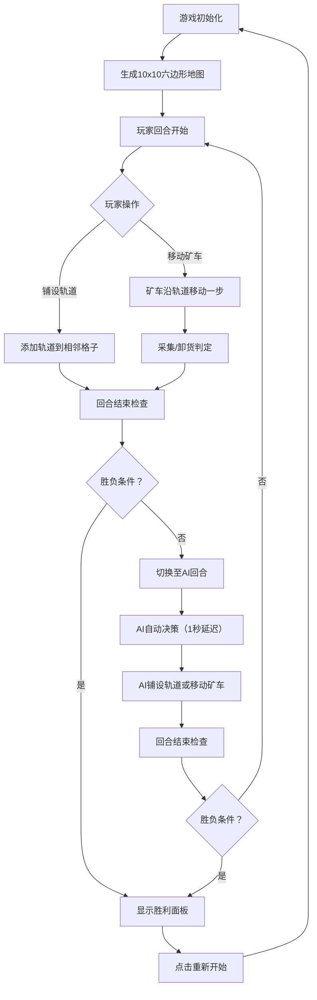

## 1. 产品概述

符文矿车是一款回合制策略游戏，玩家在六边形网格矿场中铺设轨道、派遣矿车采集符文石并运回基地换取积分，同时与AI对手竞争，避开地裂缝和熔岩陷阱。

- **核心玩法**：路径规划 + 资源采集 + 回合制策略
- **目标用户**：休闲策略游戏爱好者
- **产品价值**：提供简单易上手但富有策略深度的对抗体验

## 2. 核心功能

### 2.1 用户角色
| 角色 | 说明 |
|------|------|
| 玩家 | 手动操作，铺设轨道、移动矿车、采集符文 |
| AI对手 | 自动策略执行，优先向最近矿点铺路 |

### 2.2 功能模块
1. **地图系统**：六边形网格随机生成（10x10），四种地形
2. **轨道系统**：玩家与AI独立轨道网络，点击铺设
3. **矿车系统**：沿轨道移动、采集符文、返回基地卸货
4. **回合系统**：玩家回合→AI回合交替执行
5. **积分系统**：符文采集与基地卸货计分
6. **胜负判定**：先达50分或采集10块符文石获胜

### 2.3 页面详情
| 页面名称 | 模块名称 | 功能描述 |
|-----------|-------------|---------------------|
| 主游戏页 | 游戏地图面板 | 六边形网格渲染、矿车动画、轨道绘制、陷阱显示 |
| 主游戏页 | 左侧信息面板 | 回合数、玩家矿车状态、操作按钮 |
| 主游戏页 | 右侧信息面板 | AI矿车状态、游戏说明 |
| 主游戏页 | 顶部分数栏 | 双方积分实时显示 |
| 主游戏页 | 胜利弹窗 | 胜负结果展示、重新开始按钮 |

## 3. 核心流程

游戏开始→地图随机生成→玩家回合（点击铺设轨道或移动矿车）→采集判定→回合切换→AI回合自动执行→循环直至胜负条件达成→显示胜利面板→重新开始

## 4. 用户界面设计

### 4.1 设计风格
- **主色调**：暗色矿洞风格，背景 #1A1A2E
- **辅助色**：面板 #2D2D44、边框 #3A3A5C、网格线 #4A4A6A
- **强调色**：玩家蓝 #4ECDC4、AI红 #FF6B6B、成功绿 #6BCB77、符文多彩
- **按钮样式**：圆角矩形（圆角8px），悬停缩放1.05，点击缩放0.95，过渡0.2s
- **字体**：#E0E0E0 浅灰色文字，积分显示24px白色
- **布局**：三栏式，中央地图，左右各260px信息面板

### 4.2 页面设计概览
| 页面模块 | UI元素 |
|-----------|-------------|
| 六边形格子 | 外接圆半径32px，1px #4A4A6A边框 |
| 基地 | 绿色星形标记 |
| 符文矿点 | 闪烁彩色圆点（0.5秒周期，红/蓝/黄/绿随机） |
| 地裂缝 | 锯齿状裂纹线条 #FF4500，宽2px |
| 熔岩陷阱 | 橘红色动态流动填充（CSS动画） |
| 玩家轨道 | 棕色线段 #8B4513，宽3px |
| AI轨道 | 灰色线段 #AAAAAA，宽3px |
| 玩家矿车 | 蓝色圆点半径10px，白色光晕 |
| AI矿车 | 红色圆点半径10px，黑色光晕 |
| 胜利面板 | 半透明遮罩 #000000CC，中央面板宽400px圆角16px背景#2D2D44，按钮#4ECDC4 |

### 4.3 响应式
桌面端优先，固定布局，不做移动端适配

## 5. 性能要求
- 帧率稳定60FPS
- 地图渲染响应 < 200ms
- AI决策计算 < 200ms
- 矿车移动动画平滑过渡0.3秒
