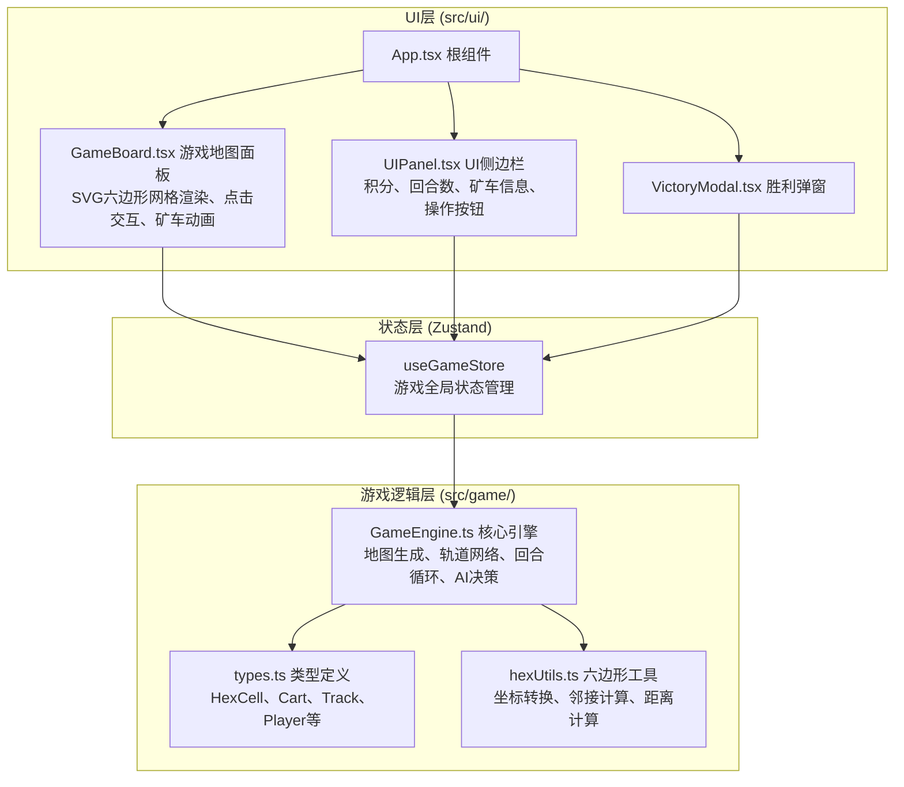

## 1. 架构设计



## 2. 技术选型说明

| 类别 | 技术 | 版本 | 说明 |
|------|------|------|------|
| 前端框架 | React | ^18 | 组件化UI构建 |
| 构建工具 | Vite | ^5 | 快速开发与构建 |
| 状态管理 | Zustand | ^4 | 轻量级游戏状态管理 |
| 语言 | TypeScript | ^5 | 严格类型安全 |
| 渲染方式 | SVG | - | 六边形网格与矢量图形绘制 |
| 动画 | CSS Transition + requestAnimationFrame | - | 矿车平滑移动与视觉效果 |

## 3. 项目目录结构

```
auto86/
├── index.html                    # 入口HTML
├── package.json                  # 依赖与脚本
├── tsconfig.json                 # TS配置（严格模式，ESNext）
├── vite.config.js                # Vite配置
└── src/
    ├── main.tsx                  # React入口
    ├── App.tsx                   # 根组件
    ├── App.css                   # 全局样式
    ├── index.css                 # 基础样式与CSS变量
    ├── game/                     # 游戏逻辑模块（纯TS，无UI依赖）
    │   ├── types.ts              # 所有类型定义
    │   ├── hexUtils.ts           # 六边形坐标与几何工具
    │   └── GameEngine.ts         # 核心游戏引擎类
    ├── ui/                       # UI渲染模块
    │   ├── GameBoard.tsx         # 地图面板组件
    │   ├── UIPanel.tsx           # 侧边信息面板
    │   └── VictoryModal.tsx      # 胜利弹窗组件
    └── store/
        └── useGameStore.ts       # Zustand状态管理
```

## 4. 核心数据模型

### 4.1 类型定义（types.ts）

```typescript
export type TerrainType = 'plain' | 'rune' | 'crack' | 'lava' | 'base';
export type RuneColor = 'red' | 'blue' | 'yellow' | 'green';
export type PlayerType = 'player' | 'ai';

export interface HexCoord {
  q: number;  // 轴坐标
  r: number;
}

export interface HexCell {
  coord: HexCoord;
  terrain: TerrainType;
  runeColor?: RuneColor;
  hasRune: boolean;
  isBase: boolean;
  baseOwner?: PlayerType;
}

export interface Cart {
  id: string;
  owner: PlayerType;
  position: HexCoord;
  carrying: RuneColor | null;
  targetPosition?: HexCoord;
}

export interface Track {
  from: HexCoord;
  to: HexCoord;
  owner: PlayerType;
}

export interface PlayerState {
  type: PlayerType;
  score: number;
  runesCollected: number;
  cart: Cart;
}

export interface GameState {
  grid: HexCell[][];
  hexSize: number;
  tracks: Track[];
  players: Record<PlayerType, PlayerState>;
  currentTurn: PlayerType;
  turnNumber: number;
  gameOver: boolean;
  winner: PlayerType | null;
  actionTaken: boolean;
  isAnimating: boolean;
}
```

### 4.2 六边形坐标系统

采用**轴坐标系（Axial Coordinates）**：
- `q`：列方向
- `r`：行方向
- 6个邻接方向：`(+1,0), (+1,-1), (0,-1), (-1,0), (-1,+1), (0,+1)`
- 像素坐标转换：平顶六边形布局

## 5. 核心模块设计

### 5.1 GameEngine 核心引擎

职责：
- `generateMap()`：随机生成10x10六边形地图，分配地形
- `refreshRunes()`：每回合随机刷新1-2个符文矿点
- `canBuildTrack(from, to, player)`：验证轨道铺设合法性
- `buildTrack(from, to, player)`：铺设轨道
- `canMoveCart(cart, target)`：验证矿车移动合法性
- `moveCart(cart, target)`：移动矿车，处理采集/卸货
- `isAdjacentTrack(cell, player)`：检查是否有相邻轨道
- `aiDecision()`：AI简单策略（寻最近符文矿点，BFS铺路/移动）
- `checkVictory()`：胜负条件判定
- `endTurn()`：结束当前回合，切换玩家

### 5.2 hexUtils 六边形工具

- `hexToPixel(coord, size)`：轴坐标→像素坐标
- `pixelToHex(x, y, size)`：像素坐标→轴坐标
- `getNeighbors(coord)`：获取6个相邻格子
- `hexDistance(a, b)`：六边形距离计算
- `hexKey(coord)`：坐标唯一标识（用于Map/Set）
- `findPathBFS(start, end, passable)`：BFS寻路

### 5.3 useGameStore Zustand Store

```typescript
interface GameStore {
  state: GameState;
  engine: GameEngine;
  initGame: () => void;
  handleCellClick: (coord: HexCoord) => void;
  endTurn: () => void;
  restartGame: () => void;
}
```

### 5.4 GameBoard 渲染组件

SVG渲染方案：
- `<svg>` 容器居中显示
- 每个六边形：`<polygon>` 元素
- 轨道：相邻格子中心之间的 `<line>`
- 矿车：`<circle>` + `<filter>` 光晕效果，CSS transition实现平滑移动
- 符文：`<circle>` + CSS @keyframes 闪烁动画
- 地裂缝：多个短线段组合成锯齿形 `<polyline>`
- 熔岩：`<path>` + CSS @keyframes 渐变流动动画

### 5.5 UIPanel 信息面板

左侧面板（玩家信息）：
- 回合数显示
- 当前回合提示
- 玩家积分与已采集符文数
- 矿车状态（位置/携带符文）
- 操作按钮：结束回合、重新开始

右侧面板（AI信息）：
- AI积分与符文数
- 游戏玩法说明

## 6. UI交互流程

1. 玩家点击六边形格子 → `handleCellClick(coord)`
2. Store判断：
   - 与矿车相邻且有轨道 → 移动矿车
   - 与已有轨道相邻且非障碍 → 铺设轨道
   - 其他 → 忽略
3. 操作后 `actionTaken = true`，玩家需点击"结束回合"
4. 回合切换 → AI执行 → 1秒延迟显示结果 → 回到玩家回合

## 7. 性能优化策略

- **SVG重用**：六边形路径定义为 `<defs>` 中的 `<path>`，使用 `<use>` 引用
- **状态订阅最小化**：Zustand使用selector精确订阅，避免全量重渲染
- **动画**：矿车移动使用CSS transform + transition，不触发重绘
- **AI计算**：简单BFS，10x10网格复杂度极低（<1ms）
- **避免重计算**：邻接列表、像素坐标缓存到引擎中
