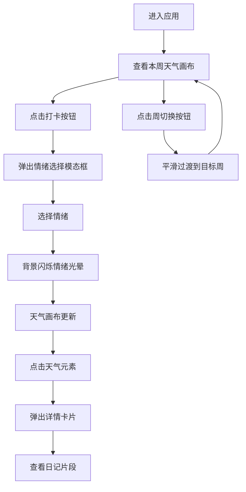

## 1. 产品概述

情绪气象站是一款将情绪记录与天气插画相结合的治愈系应用，用户通过每日打卡记录情绪状态，系统自动生成专属天气主题插画，让抽象的情绪变得可视化、可触摸。

- 核心价值：将情绪数据转化为生动的天气视觉，帮助用户感知和回顾自己的情绪变化
- 目标用户：关注心理健康、喜欢记录生活的年轻人
- 市场定位：轻量级情绪记录工具，以独特的天气视觉化为核心差异化

## 2. 核心功能

### 2.1 功能模块

1. **情绪打卡模块**：六种情绪选择（开心/平静/烦躁/悲伤/焦虑/疲惫），点击反馈动画
2. **天气画布模块**：渐变天空背景、动态云朵星星、天气元素（太阳/月亮/雨滴/雪花/雷电云）
3. **周切换模块**：周数导航、历史周查看、平滑过渡动画
4. **详情卡片模块**：天气元素点击交互、日记片段展示、情绪时间线

### 2.2 页面详情

| 页面名称 | 模块名称 | 功能描述 |
|----------|----------|----------|
| 主画布页 | 天空背景 | 渐变颜色随七天整体情绪变化，从深蓝#0B1026到暖橙#FF7E5F |
| 主画布页 | 装饰元素 | 随机散布大小40-80px的半透明云朵和星星，每3秒缓慢漂移 |
| 主画布页 | 天气元素 | 根据一周情绪数据生成太阳、月亮、雨滴、雪花、雷电云等元素 |
| 主画布页 | 悬浮工具栏 | 显示当前周数、左右切换周数按钮、平滑过渡动画 |
| 主画布页 | 打卡按钮 | 底部固定按钮，点击弹出情绪选择模态框 |
| 情绪选择模态框 | 情绪按钮 | 六种情绪微表情，圆形按钮，点击放大回弹效果 |
| 情绪选择模态框 | 情绪光晕 | 选择后背景闪烁对应情绪色的光晕，1秒淡出 |
| 情绪选择模态框 | 日期条 | 本周各日缩略天气图标，从左滑入 |
| 详情卡片 | 情绪指示条 | 顶部4px情绪颜色指示条 |
| 详情卡片 | 日记片段 | 最多5条日记片段，带时间戳和情绪小图标 |

## 3. 核心流程

用户进入应用 → 查看当前周的天气画布 → 点击打卡按钮 → 选择情绪 → 天气画布更新 → 点击天气元素 → 查看日记详情 → 切换周数 → 查看历史情绪

## 4. 用户界面设计

### 4.1 设计风格

- **整体风格**：治愈系、梦幻、沉浸式
- **主色调**：深蓝#0B1026（低落情绪）到暖橙#FF7E5F（高涨情绪）的渐变
- **情绪色板**：
  - 开心：暖黄#FFD700
  - 平静：浅蓝#87CEEB
  - 烦躁：橙红#FF6347
  - 悲伤：冷蓝#4A90D9
  - 焦虑：紫灰#9370DB
  - 疲惫：灰绿#708090
- **字体**：圆润现代无衬线字体，标题加粗，正文轻盈
- **按钮风格**：圆形按钮，柔和阴影，点击微缩下陷
- **卡片风格**：半透明毛玻璃效果，圆角12-16px，柔和阴影

### 4.2 页面设计概览

| 页面名称 | 模块名称 | UI元素 |
|----------|----------|--------|
| 主画布页 | 天空背景 | 线性渐变、动态色彩过渡、全屏覆盖 |
| 主画布页 | 装饰元素 | 半透明云朵、闪烁星星、缓慢漂移动画 |
| 主画布页 | 天气元素 | 太阳/月亮发光效果、雨滴下落、雪花飘落、雷电云闪烁 |
| 主画布页 | 悬浮工具栏 | 半透明深色背景、backdrop模糊、左右箭头按钮 |
| 主画布页 | 打卡按钮 | 底部居中、悬浮高度、脉冲呼吸效果 |
| 情绪选择模态框 | 半透明背景 | #FFFFFFCC、圆角16px、底部滑入动画 |
| 情绪选择模态框 | 情绪按钮网格 | 2行3列、等大圆形、间距均匀 |
| 详情卡片 | 卡片容器 | 深色背景#1A1A2E、圆角12px、底部展开动画 |
| 详情卡片 | 日记列表 | 时间轴布局、情绪色圆点、时间戳 |

### 4.3 交互动效

- **模态框滑入**：从底部向上滑入0.3s ease
- **按钮点击**：放大1.15倍并弹回，0.15s
- **光晕效果**：情绪色光晕扩散淡出，1s
- **周切换**：画布和元素渐变过渡0.6s ease
- **详情卡片**：从透明到不透明、从下向上展开0.4s ease
- **云朵漂移**：每3秒缓慢移动，循环动画
- **星星闪烁**：随机间隔的透明度变化

### 4.4 性能要求

- 切换周数响应时间 ≤ 200ms
- 点击天气元素响应时间 ≤ 200ms
- 画布动画帧率 ≥ 30fps
