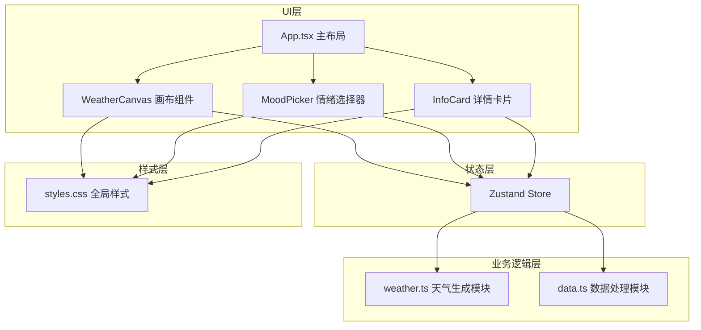

## 1. 架构设计

本项目为纯前端React应用，采用分层架构设计，将数据处理、状态管理、视觉渲染和UI交互分离，确保代码可维护性和可扩展性。



## 2. 技术描述

- **前端框架**：React 18 + TypeScript
- **构建工具**：Vite 5
- **状态管理**：Zustand
- **唯一ID生成**：uuid
- **样式方案**：纯CSS + CSS动画 + CSS变量
- **无后端**：纯前端应用，使用模拟数据

## 3. 项目文件结构

```
├── index.html                 # 入口HTML
├── package.json               # 项目依赖配置
├── tsconfig.json              # TypeScript配置
├── vite.config.ts             # Vite配置
└── src/
    ├── main.tsx               # React入口
    ├── App.tsx                # 主应用组件
    ├── store.ts               # Zustand状态管理
    ├── data.ts                # 模拟数据和数据处理
    ├── weather.ts             # 天气生成与渲染逻辑
    ├── styles.css             # 全局样式和动画
    └── components/
        ├── WeatherCanvas.tsx  # 天气画布组件
        ├── MoodPicker.tsx     # 情绪选择模态框
        └── InfoCard.tsx       # 详情卡片组件
```

## 4. 数据模型

### 4.1 情绪类型

```typescript
type MoodType = 'happy' | 'calm' | 'irritated' | 'sad' | 'anxious' | 'tired';
```

### 4.2 日记条目

```typescript
interface DiaryEntry {
  id: string;
  date: string;
  mood: MoodType;
  content: string;
  timestamp: string;
}
```

### 4.3 天气元素

```typescript
type WeatherElementType = 'sun' | 'moon' | 'rain' | 'snow' | 'thunder' | 'cloud';

interface WeatherElement {
  id: string;
  type: WeatherElementType;
  x: number;
  y: number;
  size: number;
  opacity: number;
  date: string;
  mood: MoodType;
}
```

### 4.4 周数据

```typescript
interface WeekData {
  weekNumber: number;
  startDate: string;
  endDate: string;
  entries: DiaryEntry[];
  avgMoodScore: number;
}
```

### 4.5 Store状态

```typescript
interface MoodStore {
  currentWeek: number;
  selectedElement: WeatherElement | null;
  isMoodPickerOpen: boolean;
  flashMood: MoodType | null;
  // actions
  setCurrentWeek: (week: number) => void;
  setSelectedElement: (el: WeatherElement | null) => void;
  setMoodPickerOpen: (open: boolean) => void;
  selectMood: (mood: MoodType) => void;
  clearFlash: () => void;
}
```

## 5. 模块职责

### 5.1 data.ts - 数据模块

- 生成模拟的多周情绪日记数据
- 提供按周查询日记的接口
- 计算一周情绪平均分
- 情绪类型与颜色、分值的映射

### 5.2 weather.ts - 天气生成模块

- 根据一周情绪数据计算天空渐变色
- 生成天气元素配置（太阳、云、雨、雪、雷电等）
- 生成装饰性云朵和星星配置
- 提供情绪到天气类型的映射规则

### 5.3 store.ts - 状态管理

- 管理当前周数
- 管理选中的天气元素
- 管理情绪选择器的显示状态
- 管理情绪闪烁效果
- 提供选择情绪的action

### 5.4 WeatherCanvas.tsx - 画布组件

- 渲染渐变天空背景
- 渲染装饰性云朵和星星动画
- 渲染天气元素
- 处理天气元素的点击事件
- 响应周切换的过渡动画

### 5.5 MoodPicker.tsx - 情绪选择器

- 六种情绪按钮网格布局
- 点击放大回弹动画
- 情绪光晕闪烁效果
- 本周日期缩略图展示

### 5.6 InfoCard.tsx - 详情卡片

- 显示选中天气元素的详情
- 展示相关日记片段列表
- 情绪颜色指示条
- 时间戳和情绪图标

## 6. 性能优化策略

1. **CSS动画优先**：使用transform和opacity属性实现动画，触发GPU加速
2. **will-change提示**：对频繁动画的元素添加will-change提示
3. **状态最小化**：Zustand store按需订阅，避免不必要的重渲染
4. **memo优化**：对纯展示组件使用React.memo
5. **requestAnimationFrame**：复杂动画使用RAF控制帧率
6. **节流防抖**：对窗口resize等事件做节流处理

## 7. 动画实现方案

| 动画效果 | 实现方式 | 时长 | 缓动函数 |
|----------|----------|------|----------|
| 模态框滑入 | CSS transform: translateY | 0.3s | ease |
| 按钮点击缩放 | CSS transform: scale | 0.15s | ease |
| 情绪光晕 | CSS box-shadow + opacity | 1s | ease-out |
| 周切换过渡 | CSS transition + opacity | 0.6s | ease |
| 详情卡片展开 | CSS transform + opacity | 0.4s | ease |
| 云朵漂移 | CSS animation + transform | 3s循环 | ease-in-out |
| 星星闪烁 | CSS animation + opacity | 随机间隔 | ease-in-out |
