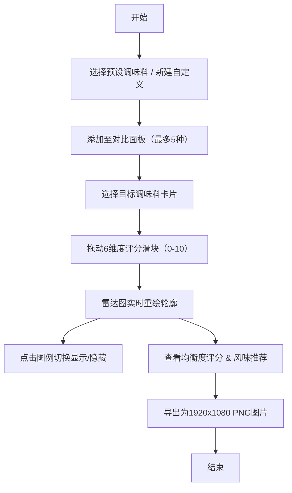

## 1. 产品概述

风味试纸是一款面向美食品鉴师的交互式调味料风味雷达对比应用，通过极坐标雷达图直观呈现多种调味料在盐、糖、酸度、鲜度、苦度、辛辣度六个维度的风味轮廓，辅助用户评估调味平衡性与组合效果。

- 核心问题：传统表格数据难以快速对比多款调味料的多维风味特征
- 目标用户：美食评测社区品鉴师、专业厨师、调味研发人员
- 产品价值：将抽象的风味数据转化为可视化雷达轮廓，支持多产品叠加对比与实时评分调整

## 2. 核心功能

### 2.1 用户角色

| 角色 | 注册方式 | 核心权限 |
|------|----------|----------|
| 品鉴师 | 无需注册，直接使用 | 全部功能：添加调味料、调整评分、对比、导出 |

### 2.2 功能模块

1. **主页面**：左侧控制面板 + 右侧雷达图区域
2. **调味料管理**：预设库选择、自定义添加、删除、选择切换
3. **风味评分调整**：6维度滑块评分（盐、糖、酸度、鲜度、苦度、辛辣度）
4. **雷达图渲染**：多调味料叠加显示、图例交互（隐藏/显示）
5. **风味推荐**：基于当前组合推荐最接近的预设调味料
6. **导出功能**：将当前雷达对比图保存为1920x1080透明PNG

### 2.3 页面详情

| 页面名称 | 模块名称 | 功能描述 |
|----------|----------|----------|
| 主页面 | 控制面板 | 调味料下拉选择、自定义新建、已添加列表（卡片形式）、6维度评分滑块、均衡度显示 |
| 主页面 | 雷达图区域 | 6维极坐标雷达图、最多5种调味料轮廓叠加、图例交互、风味推荐、导出按钮 |

## 3. 核心流程

用户从预设库或自定义创建中选择调味料添加至对比面板，通过滑块实时调整各维度评分，雷达图同步重绘呈现风味轮廓变化；用户可点击图例切换显示状态，查看均衡度评分，系统推荐相似风味预设，最终可将对比图导出为PNG图片。

## 4. 用户界面设计

### 4.1 设计风格

- **主色调**：深空灰蓝 #1A1A2E（控制面板背景）、#0F0F23（雷达区域渐变起点）
- **强调色**：#6C63FF（交互高亮）、#FF5252（删除按钮）、#8E8EB2（辅助文字）
- **字体**：现代无衬线字体，标题18px白色加粗，卡片名称16px浅紫色
- **布局风格**：左右两栏（桌面）/ 上下结构（移动端），卡片式调味料列表
- **动效**：所有交互0.2s ease-in-out平滑过渡，滑块悬停放大、删除按钮缩放

### 4.2 页面设计概览

| 页面名称 | 模块名称 | UI元素 |
|----------|----------|--------|
| 主页面 | 控制面板 | 宽320px，深灰蓝背景#1A1A2E，圆角16px，内边距24px，控件间距8px |
| 主页面 | 调味料卡片 | 宽100%，背景#2D2D44，圆角12px，边框1px #3D3D5C，悬停边框#6C63FF |
| 主页面 | 删除按钮 | 直径24px圆形，背景#FF5252，悬停#FF1744，点击缩放0.9 |
| 主页面 | 评分滑块 | 轨道高4px圆角2px背景#3D3D5C，填充对应调味料主色，按钮直径16px白色悬停20px |
| 主页面 | 雷达图区域 | 径向渐变#0F0F23至#1A1A2E，图表居中最大600x600px，网格线#2D2D44不透明度0.5 |

### 4.3 响应式

- 桌面端（≥1024px）：左右两栏布局，左侧控制面板320px固定宽度，右侧雷达图自适应
- 移动端（<768px）：上下结构，控制面板折叠至顶部，雷达图占满剩余视口
- 所有交互支持触摸操作，滑块触摸区域适当扩大

## 5. 性能约束

- 5种调味料同时显示且全部维度调整时，重绘帧率≥50fps
- 状态更新（评分拖动、添加/删除）到雷达图重绘响应时间≤50ms
