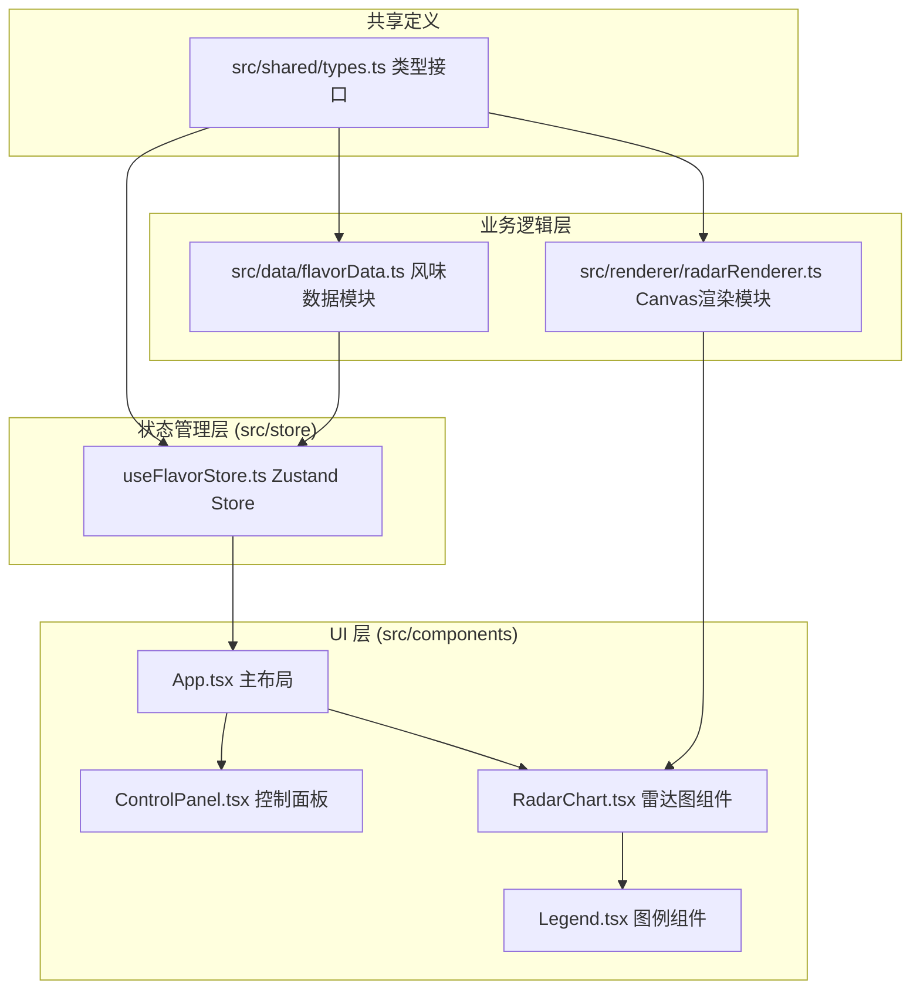

## 1. 架构设计



**数据流向说明：**
1. 用户在 ControlPanel 操作（添加/删除调味料、调整评分）
2. 触发 Zustand Store (useFlavorStore) 状态更新
3. Store 使用 flavorData.ts 处理数据逻辑
4. RadarChart 组件监听 Store 变化，调用 radarRenderer.ts 重绘 Canvas
5. 图例和均衡度计算从 Store 派生数据渲染

## 2. 技术说明

- **前端框架**：React 18 + TypeScript（严格模式）
- **构建工具**：Vite，配置 @vitejs/plugin-react 与路径别名 @
- **状态管理**：Zustand（轻量级，响应快，适合高频状态更新）
- **图形渲染**：原生 HTML5 Canvas 2D API（无 Three.js 依赖，雷达图为2D极坐标）
- **第三方库**：uuid（生成调味料唯一ID）

## 3. 目录结构

```
src/
├── shared/
│   └── types.ts              # 全局类型定义（FlavorProfile等）
├── data/
│   └── flavorData.ts         # 预设数据、推荐算法、均衡度计算
├── renderer/
│   └── radarRenderer.ts      # 纯函数Canvas渲染器
├── store/
│   └── useFlavorStore.ts     # Zustand状态管理
├── components/
│   ├── App.tsx               # 主布局
│   ├── ControlPanel.tsx      # 左侧控制面板
│   ├── RadarChart.tsx        # 雷达图组件
│   ├── Legend.tsx            # 图例组件
│   ├── FlavorCard.tsx        # 调味料卡片
│   ├── SliderGroup.tsx       # 6维度评分滑块组
│   └── RecommendPanel.tsx    # 风味推荐面板
├── App.css                   # 全局样式
├── index.css
└── main.tsx
```

## 4. 接口类型定义（src/shared/types.ts）

```typescript
export type FlavorDimension = 'salt' | 'sweet' | 'sour' | 'umami' | 'bitter' | 'spicy';

export interface FlavorScores {
  salt: number;    // 盐度 0-10
  sweet: number;   // 甜度 0-10
  sour: number;    // 酸度 0-10
  umami: number;   // 鲜度 0-10
  bitter: number;  // 苦度 0-10
  spicy: number;   // 辛辣度 0-10
}

export interface FlavorProfile {
  id: string;
  name: string;
  scores: FlavorScores;
  color: string;
  visible: boolean;
}

export interface ComparisonData {
  profiles: FlavorProfile[];
  averageScores: FlavorScores;
  recommendedPresetId: string | null;
}

export const DIMENSION_LABELS: Record<FlavorDimension, string> = {
  salt: '盐',
  sweet: '糖',
  sour: '酸度',
  umami: '鲜度',
  bitter: '苦度',
  spicy: '辛辣度',
};

export const DIMENSION_ORDER: FlavorDimension[] = ['salt', 'sweet', 'sour', 'umami', 'bitter', 'spicy'];
```

## 5. 核心模块说明

### 5.1 src/data/flavorData.ts
- **预设调味料库**：至少6种（酱油、醋、蜂蜜、辣椒油、柠檬汁、芥末），每种含默认6维评分
- **调色板**：12色循环取色
- **推荐算法**：计算当前组合平均轮廓与各预设的欧几里得距离，取最近者
- **均衡度计算**：6维度评分的方差（方差越小越均衡）

### 5.2 src/renderer/radarRenderer.ts
- 纯函数，接收 Canvas 元素 + FlavorProfile[] + 容器尺寸
- 绘制极坐标系（6轴、网格、标签）
- 叠加绘制每种调味料的多边形轮廓与填充（半透明）
- 返回交互坐标映射（用于点击检测）

### 5.3 src/store/useFlavorStore.ts
- profiles: FlavorProfile[]（最多5个）
- selectedId: string | null
- actions: addPreset, addCustom, removeProfile, updateScore, toggleVisible, selectProfile
- getters: averageScores, balanceScore, recommendedPreset

## 6. 性能优化策略

- Canvas 渲染使用 requestAnimationFrame 批量帧调度
- Zustand 选择器优化，避免不必要的重渲染
- 滑块使用节流（16ms）降低状态更新频率
- 雷达图尺寸最大600x600，控制像素填充率
