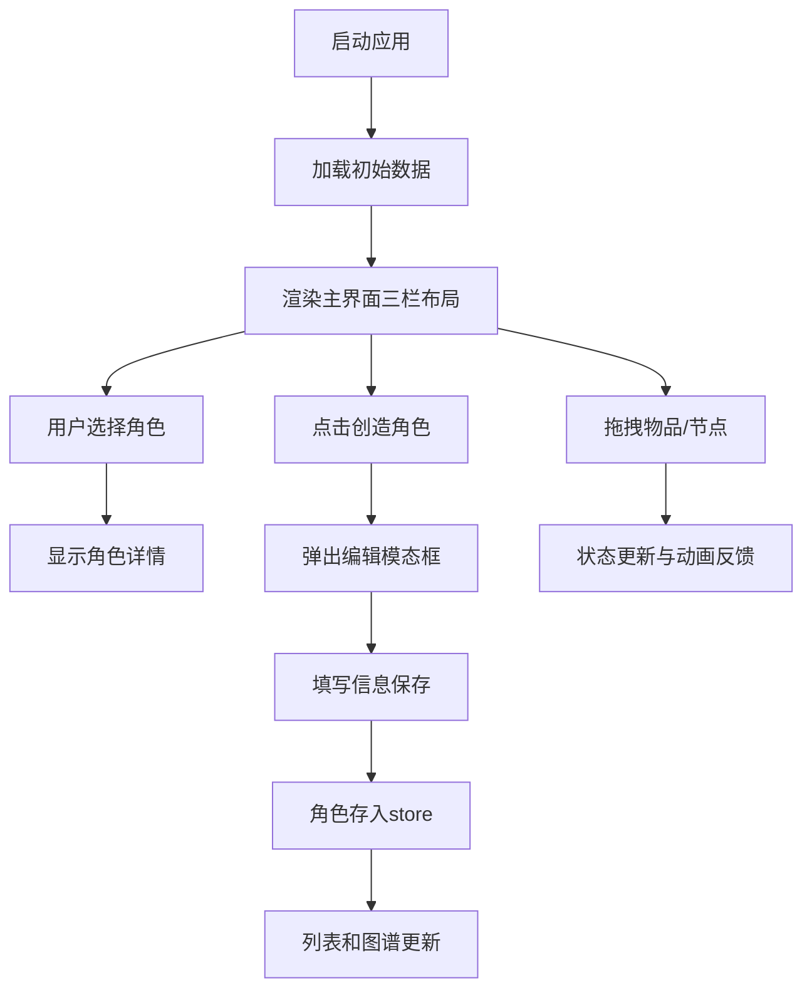

## 1. 产品概述

角色速写板是一款互动式角色设计辅助应用，帮助用户快速创建、编辑和组织虚构角色的视觉与文字档案。面向作家、游戏设计师、剧本创作者和角色扮演爱好者，提供头像生成、属性背包管理和关系图谱可视化功能，让角色创作过程更加直观高效。

产品价值：将分散的角色信息整合到一个可视化工具中，通过力导向关系图谱直观展示角色间关系，提升创作效率和角色设计的连贯性。

## 2. 核心特性

### 2.1 用户角色

| 角色 | 注册方式 | 核心权限 |
|------|----------|----------|
| 创作者 | 无需注册，本地使用 | 创建、编辑、删除角色，管理关系图谱，导出角色卡 |

### 2.2 功能模块

1. **角色列表模块**：左侧角色卡片列表，支持快速浏览和选择
2. **角色详情与编辑模块**：右侧详情面板，展示角色完整信息，支持属性背包管理
3. **关系图谱模块**：中央力导向图，可视化角色关系，支持节点拖拽和关系添加
4. **历史记录模块**：撤销/重做操作，最多50步操作历史
5. **导出模块**：导出角色卡为PNG，导出关系图谱为SVG

### 2.3 页面详情

| 页面名称 | 模块名称 | 功能描述 |
|---------|----------|----------|
| 主界面 | 角色列表 | 横向卡片布局，显示头像、姓名和标签，支持滚动 |
| 主界面 | 关系图谱 | d3-force力导向布局，节点可拖拽，双击聚焦，支持缩放平移 |
| 主界面 | 角色详情 | 展示角色完整信息，可折叠属性背包，支持物品拖拽转移 |
| 编辑模态框 | 角色创建/编辑 | 全屏模态框，填写姓名、年龄、外貌、性格、背景，上传头像 |
| 添加关系面板 | 关系管理 | 选择两个角色和关系类型，添加有向连线 |
| 导出菜单 | 导出功能 | 导出角色卡PNG和图谱SVG，成功提示动画 |

## 3. 核心流程

### 3.1 角色创建流程
用户点击"创造角色"按钮 → 弹出全屏编辑模态框 → 填写角色信息和上传头像 → 点击"保存并关闭" → 角色存入store → 闪光特效反馈 → 列表和图谱同步更新

### 3.2 关系添加流程
用户展开"添加关系"面板 → 选择源角色和目标角色 → 选择关系类型 → 点击确认 → 连线动画 → 图谱更新

### 3.3 物品转移流程
用户从属性背包拖拽物品 → 拖拽时显示半透明复制品 → 进入目标卡片区域高亮边框 → 释放完成转移 → 粒子爆炸效果

## 4. 用户界面设计

### 4.1 设计风格
- **主色调**：暗色太空主题，主背景 #0A0A2E，组件背景 #1A1A2E
- **强调色**：紫色 #6C5CE7（主按钮），绿色 #00B894（成功/保存）
- **辅助色**：黄色 #FDCB6E（标签/副角），红色 #FF6B6B（反派/警告），青色 #00CEC9（高亮）
- **文字颜色**：主文字 #DFE6E9，次要文字 #8B8B9E
- **按钮风格**：圆角8px，悬停缩放回弹动画0.15s
- **卡片风格**：1px #2A2A44边框，8px圆角，阴影 0 4px 12px rgba(0,0,0,0.2)
- **字体**：现代无衬线字体，清晰易读
- **图标风格**：线性简约图标，与文字搭配

### 4.2 页面设计概览

| 页面名称 | 模块名称 | UI元素 |
|---------|----------|--------|
| 主界面 | 顶部菜单栏 | 导出按钮（文字下划线悬停），标题 |
| 主界面 | 角色列表 | 左侧240px宽，横向卡片布局，自定义滚动条 |
| 主界面 | 关系图谱 | 中央自适应区域，d3力导向图，节点拖拽，缩放平移 |
| 主界面 | 角色详情 | 右侧320px宽，角色信息，可折叠属性背包 |
| 编辑模态框 | 角色编辑 | 全屏模态框，底部滑入动画，表单字段，保存按钮 |
| 历史记录 | 撤销重做 | 底部圆形按钮，旋转动画 |

### 4.3 响应式设计
- **桌面端**：三栏布局（列表240px + 图谱自适应 + 详情320px）
- **平板端（<768px）**：右侧详情面板变为底部抽屉，图谱区域扩大填充
- **触摸优化**：节点拖拽、物品拖拽支持触摸操作，增加可点击区域

### 4.4 动效设计
- 模态框入场：底部向上滑入 + 淡入，0.35s cubic-bezier
- 按钮点击：缩放回弹动画 0.15s
- 撤销/重做按钮：旋转动画 ±30度，0.2s
- 保存闪光特效：半透明闪光 0.3s
- 物品转移：粒子爆炸消失 0.3s
- 关系连线：绘制动画 0.5s
- 状态过渡：渐变色过渡 0.3s ease
- 导出成功：顶部消息条滑入，1.5s后消失
