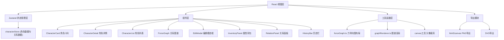

## 1. 架构设计



## 2. 技术说明

- **前端框架**：React 18 + TypeScript
- **构建工具**：Vite 5 + @vitejs/plugin-react
- **状态管理**：Zustand 4
- **力导向图**：d3-force 3
- **唯一ID生成**：uuid 9
- **图片导出**：html2canvas
- **样式方案**：原生CSS + CSS Modules

## 3. 目录结构

```
src/
├── App.tsx                      # 主应用组件
├── main.tsx                      # 入口文件
├── index.css                     # 全局样式
├── stores/
│   └── characterStore.ts        # Zustand store（角色、关系、历史记录）
├── components/
│   ├── CharacterCard.tsx         # 角色卡片组件
│   ├── CharacterList.tsx         # 角色列表组件
│   ├── CharacterDetail.tsx      # 角色详情面板
│   ├── EditModal.tsx            # 角色编辑模态框
│   ├── ForceGraph.tsx           # 力导向图组件
│   ├── InventoryPanel.tsx       # 属性背包面板
│   ├── RelationPanel.tsx        # 添加关系面板
│   └── HistoryBar.tsx           # 历史记录工具栏
├── utils/
│   ├── forceGraph.ts            # d3-force 布局计算
│   └── canvasUtils.ts             # Canvas工具函数
├── renderer/
│   └── graphRenderer.ts         # 图谱渲染模块
└── types/
    └── index.ts                 # TypeScript 类型定义
```

## 4. 数据模型

### 4.1 类型定义

```typescript
interface Character {
  id: string;
  name: string;
  age: number;
  avatar: string; // base64
  appearance: string;
  personality: string[]; // 性格标签
  background: string;
  faction: 'protagonist' | 'deuteragonist' | 'antagonist';
  attributes: { name: string; icon: string; }[]; // 属性背包物品
  stats: number; // 属性点总数，用于节点大小计算
}

interface Relation {
  id: string;
  sourceId: string;
  targetId: string;
  type: string; // 朋友、敌人、恋人、师徒、兄弟等
  style: 'solid' | 'dashed';
}

interface HistoryState {
  characters: Character[];
  relations: Relation[];
}

interface CharacterStore {
  characters: Character[];
  relations: Relation[];
  selectedCharacterId: string | null;
  history: HistoryState[];
  historyIndex: number;
  // actions
  addCharacter: (char: Omit<Character, 'id'>) => void;
  updateCharacter: (id: string, updates: Partial<Character>) => void;
  deleteCharacter: (id: string) => void;
  addRelation: (rel: Omit<Relation, 'id'>) => void;
  deleteRelation: (id: string) => void;
  selectCharacter: (id: string | null) => void;
  transferItem: (fromId: string, toId: string, itemIndex: number) => void;
  undo: () => void;
  redo: () => void;
  _pushHistory: () => void;
}
```

### 4.2 历史记录设计

- 使用历史栈存储最多50步操作
- 每次操作前保存当前状态快照
- undo/redo 通过索引移动实现
- 新操作会清除 redo 栈

## 5. 性能优化策略

1. **角色列表虚拟化**：超过50个角色时使用虚拟滚动
2. **力导向图性能**：
   - d3-force tick 节流渲染
   - 节点拖拽时临时提高 alphaTarget 优化
   - 30节点以内保证45fps以上
3. **状态更新优化**：
   - Zustand 选择器优化重渲染
   - 列表项 memo 包裹
4. **Canvas 头像处理**：使用 OffscreenCanvas 或 Worker 处理
