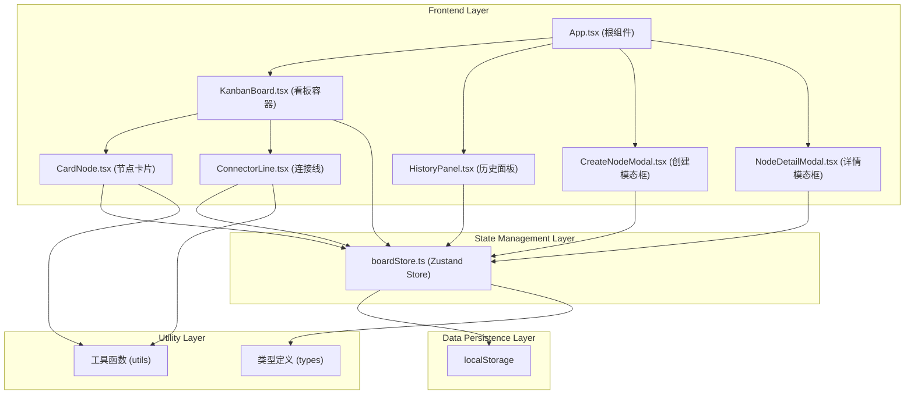
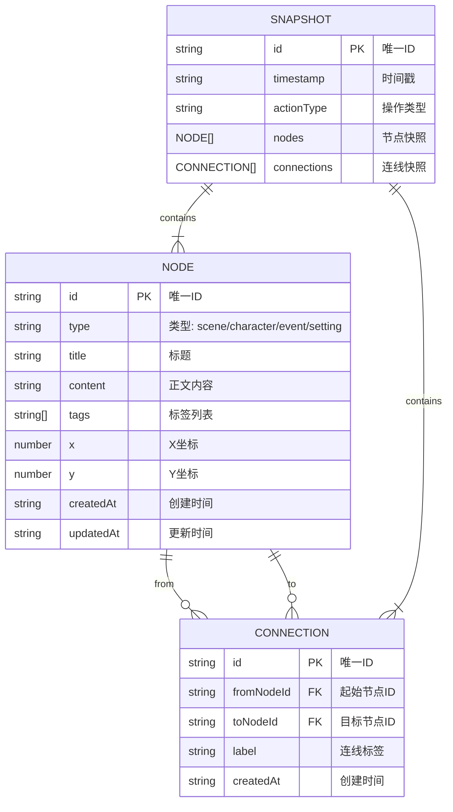

## 1. Architecture Design



## 2. Technology Description

- **前端框架**：React 18 + TypeScript
- **构建工具**：Vite 5
- **状态管理**：Zustand 4
- **唯一ID生成**：uuid 9
- **样式方案**：原生CSS + CSS变量，不使用Tailwind（用户明确指定了详细的样式参数）
- **图标库**：lucide-react
- **数据持久化**：localStorage
- **初始化工具**：vite-init

## 3. Project Structure

```
src/
├── components/
│   ├── KanbanBoard.tsx       # 主看板容器
│   ├── CardNode.tsx          # 节点卡片组件
│   ├── ConnectorLine.tsx     # 连接线组件
│   ├── HistoryPanel.tsx      # 历史面板组件
│   ├── CreateNodeModal.tsx   # 创建节点模态框
│   └── NodeDetailModal.tsx   # 节点详情模态框
├── stores/
│   └── boardStore.ts         # Zustand状态管理
├── types/
│   └── index.ts              # TypeScript类型定义
├── utils/
│   └── index.ts              # 工具函数
├── App.tsx                   # 根组件
├── main.tsx                  # 入口文件
└── index.css                 # 全局样式
```

## 4. Data Model

### 4.1 数据模型定义



### 4.2 TypeScript类型定义

```typescript
// 节点类型
export type NodeType = 'scene' | 'character' | 'event' | 'setting';

// 节点数据
export interface BoardNode {
  id: string;
  type: NodeType;
  title: string;
  content: string;
  tags: string[];
  x: number;
  y: number;
  createdAt: string;
  updatedAt: string;
}

// 连线数据
export interface Connection {
  id: string;
  fromNodeId: string;
  toNodeId: string;
  label: string;
  createdAt: string;
}

// 操作类型
export type ActionType = 'create_node' | 'delete_node' | 'update_node' | 
                         'create_connection' | 'delete_connection' | 'update_connection';

// 历史快照
export interface Snapshot {
  id: string;
  timestamp: string;
  actionType: ActionType;
  nodes: BoardNode[];
  connections: Connection[];
}

// Store状态
export interface BoardState {
  nodes: BoardNode[];
  connections: Connection[];
  snapshots: Snapshot[];
  selectedNodeId: string | null;
  selectedConnectionId: string | null;
}

// Store动作
export interface BoardActions {
  addNode: (node: Omit<BoardNode, 'id' | 'createdAt' | 'updatedAt'>) => void;
  deleteNode: (nodeId: string) => void;
  updateNode: (nodeId: string, updates: Partial<BoardNode>) => void;
  moveNode: (nodeId: string, x: number, y: number) => void;
  addConnection: (connection: Omit<Connection, 'id' | 'createdAt'>) => void;
  deleteConnection: (connectionId: string) => void;
  updateConnection: (connectionId: string, updates: Partial<Connection>) => void;
  revertToSnapshot: (snapshotId: string) => void;
  selectNode: (nodeId: string | null) => void;
  selectConnection: (connectionId: string | null) => void;
  takeSnapshot: (actionType: ActionType) => void;
}
```

## 5. State Management

### 5.1 Zustand Store设计

`boardStore.ts` 负责管理所有看板状态，包括：

- **状态**：节点列表、连线列表、快照列表、选中状态
- **动作**：增删改节点、增删改连线、移动节点、回退快照、记录快照
- **持久化**：通过 `persist` middleware 自动同步到 localStorage
- **快照机制**：每次状态变更后自动记录快照，快照上限30个

### 5.2 快照机制

- 触发时机：创建/删除节点、修改节点、创建/删除/修改连线
- 存储内容：完整的节点列表和连线列表
- 上限管理：超过30个时自动丢弃最早的快照
- 回退逻辑：恢复节点和连线到快照状态，并重新记录当前状态为最新快照

## 6. Component Responsibilities

| 组件 | 职责 | 关键交互 |
|------|------|----------|
| KanbanBoard | 看板容器，横向滚动，渲染卡片和连线 | 双击空白创建节点、监听画布滚动 |
| CardNode | 单个节点卡片渲染和交互 | 拖拽移动、双击编辑、右键删除、连接点拖拽 |
| ConnectorLine | SVG贝塞尔曲线渲染 | 虚线流动动画、点击选中、右键菜单 |
| HistoryPanel | 固定顶部的历史记录面板 | 渲染最近10个快照、点击回退 |
| CreateNodeModal | 创建节点的模态框 | 类型选择、标题输入、确认创建 |
| NodeDetailModal | 节点详情编辑模态框 | 标题、内容、标签、关联节点编辑 |

## 7. Performance Considerations

- **拖拽性能**：使用原生拖拽事件，节流位置更新，保证帧率≥55fps
- **渲染优化**：React.memo包装卡片和连线组件，避免不必要重渲染
- **SVG优化**：使用绝对定位的SVG层，避免重排
- **存储优化**：localStorage读写异步化，避免阻塞主线程
- **快照上限**：30个快照限制，避免内存溢出
