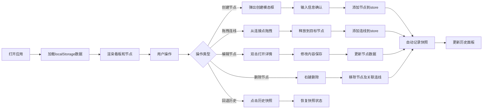

## 1. 产品概述

灵感分支看板是一款面向写作者、编剧和内容创作者的可视化叙事管理工具。它通过卡片化的看板界面，帮助用户以直观的方式管理写作灵感、角色设定和情节节点，解决传统文本大纲难以直观拖拽调整叙事分支、回溯修改记录的问题。

- 核心目标：提供可视化、可拖拽、可回溯的叙事结构管理体验
- 目标用户：小说作者、编剧、游戏策划、内容创作者
- 产品价值：将线性文本大纲转化为可视化的节点网络，支持叙事分支管理和历史版本回溯

## 2. 核心功能

### 2.1 Feature Module

1. **看板主界面**：横向滚动看板，卡片化节点展示，节点类型分类
2. **节点创建与编辑**：双击创建节点，类型可选（场景、角色、事件、设定），详情编辑面板
3. **节点连接与分支**：拖拽连线建立节点关系，贝塞尔曲线连接，分支管理
4. **历史快照系统**：自动记录操作快照，支持回退到任意历史状态
5. **数据持久化**：localStorage存储，Zustand状态管理

### 2.2 Page Details

| 页面名称 | 模块名称 | 功能描述 |
|-----------|-------------|---------------------|
| 看板主页面 | 看板容器 | 横向滚动背景渐变，渲染所有卡片和连线，监听双击创建事件 |
| 看板主页面 | 节点卡片 | 显示标题、类型标签、预览文字，支持拖拽移动、双击编辑、右键删除 |
| 看板主页面 | 连接线 | 贝塞尔曲线连接，虚线流动动画，支持点击选中、右键删除/编辑标签 |
| 看板主页面 | 历史面板 | 固定顶部，显示最近10次快照，点击回退到对应状态 |
| 模态框 | 创建节点 | 节点类型选择，标题输入，确认创建 |
| 模态框 | 节点详情 | 标题、正文、标签、关联节点编辑，保存更新 |

## 3. 核心流程

### 3.1 用户创建节点流程

用户双击看板空白处 → 弹出创建模态框 → 选择节点类型 → 输入标题 → 确认创建 → 卡片从中心弹出动画 → 自动记录快照 → 历史面板更新

### 3.2 用户连接节点流程

鼠标悬停卡片底部 → 显示连接点 → 拖拽连接点 → 贝塞尔曲线跟随鼠标 → 释放到目标卡片顶部 → 建立连接关系 → 虚线流动动画 → 自动记录快照

### 3.3 用户回退历史流程

用户点击历史面板快照项 → 确认回退 → 状态恢复到快照版本 → 画布重绘过渡动画 → 历史面板更新

### 3.4 流程图

## 4. 用户界面设计

### 4.1 设计风格

- **主题色调**：暗色主题，主背景#1E1E2E渐变到#2D2D44，卡片背景#2D2D44
- **类型色彩**：场景#4ECDC4、角色#FFE66D、事件#FF6B6B、设定#A29BFE
- **文字颜色**：主色#E0E0E0，辅助色#A0A0A0
- **卡片样式**：宽240px，圆角12px，阴影0 4px 12px rgba(0,0,0,0.25)
- **按钮交互**：悬停时颜色变化，过渡动画0.2s ease
- **字体选择**：使用JetBrains Mono作为等宽字体，搭配Inter作为UI字体

### 4.2 动效设计

- **节点创建**：从中心弹出并放大，0.3s ease-out
- **节点删除**：缩小并淡出，0.3s ease-in
- **节点选中**：缩放1.05，边框2px #FF6B6B，0.2s ease
- **模态框入场**：从下向上滑入，0.4s ease
- **状态回退**：画布重绘过渡，0.3s ease
- **连接线**：虚线滚动效果，速度1s线性
- **卡片保存**：闪烁一次，0.3s ease

### 4.3 页面设计概述

| 页面名称 | 模块名称 | UI Elements |
|-----------|-------------|-------------|
| 看板主页面 | 看板容器 | 横向滚动、渐变背景、双击监听、最小宽度1024px |
| 看板主页面 | 节点卡片 | 类型标签、标题、预览文字、拖拽手柄、连接点、右键菜单 |
| 看板主页面 | 连接线 | 贝塞尔曲线、虚线流动、选中高亮、右键菜单 |
| 看板主页面 | 历史面板 | 固定顶部、半透明背景、时间戳列表、类型图标、回退按钮 |
| 模态框 | 创建节点 | 类型选择器、标题输入、确认/取消按钮、滑入动画 |
| 模态框 | 节点详情 | 标题输入、正文文本区、标签添加器、关联节点列表、保存按钮 |

### 4.4 响应性

- **桌面优先**：最小宽度1024px，支持更大屏幕扩展
- **横向滚动**：看板内容超出视口时支持横向滚动
- **触控优化**：支持触控设备的拖拽和点击操作
