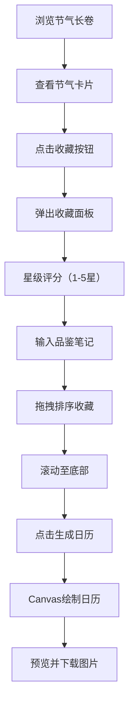

## 1. 产品概述

节气食单是一款以中国传统二十四节气为主题的时令菜谱应用，帮助用户根据节气探索和记录传统美食。用户可以浏览各节气的主打菜肴、收藏喜爱的菜谱、进行星级评分并写下品鉴笔记，最终生成专属的节气美食日历图片。

- **核心价值**：传承节气饮食文化，打造个性化的时令美食记录与分享体验
- **目标用户**：美食爱好者、传统文化追随者、注重养生的都市人群

## 2. 核心功能

### 2.1 功能模块

1. **节气长卷主页**：纵向滚动的二十四节气卡片列表，展示各节气主打菜品
2. **节气卡片**：展示菜名、食材列表、收藏按钮、评分交互区
3. **收藏面板**：迷你弹出面板，显示已收藏菜谱，支持拖拽排序
4. **品鉴笔记**：星级评分（1-5星）+ 文字笔记输入
5. **美食日历生成**：根据收藏菜谱生成可导出的节气美食日历图片

### 2.3 页面详情

| 页面名称 | 模块名称 | 功能描述 |
|---------|---------|---------|
| 主页 | 顶部导航栏 | 固定顶部，显示当前节气名称和手绘图标，毛玻璃效果 |
| 主页 | 节气长卷 | 纵向滚动的二十四节气卡片，滚动时淡入动画 |
| 主页 | 节气卡片 | 展示主打菜名、食材列表、收藏按钮、评分区 |
| 主页 | 收藏面板 | 点击收藏按钮弹出，显示已收藏列表，支持拖拽排序 |
| 主页 | 品鉴笔记 | 星级评分+textarea输入品鉴感受 |
| 主页 | 日历生成按钮 | 页面底部按钮，点击生成美食日历图片 |
| 弹窗 | 日历预览 | 展示生成的日历图片，提供下载按钮 |

## 3. 核心流程

用户浏览节气长卷 → 点击感兴趣的节气卡片 → 查看主打菜品详情 → 点击收藏按钮 → 弹出收藏面板 → 进行星级评分 → 输入品鉴笔记 → 拖拽调整收藏顺序 → 滚动到页面底部 → 点击生成美食日历 → 预览日历图片 → 下载保存

## 4. 用户界面设计

### 4.1 设计风格

- **主色调**：暖色调渐变背景（#F5EDE3 → #D4C9B8），卡片背景#FFFAF5
- **点缀色**：收藏红#E56B5D，星级橙#F39C12/#E67E22，按钮红#C0392B
- **中性色**：#CCBBA8、#D4C9B8、#B8A48C
- **字体**：标题使用手写风格字体（Windsong或类似），正文使用优雅衬线字体
- **卡片风格**：圆角24px，柔和阴影，顶部食材装饰插画区
- **按钮风格**：圆角32px胶囊按钮，悬停变色加深
- **图标风格**：手绘风格节气小图标（立春柳条、夏至荷叶等）

### 4.2 页面设计概述

| 页面名称 | 模块名称 | UI元素 |
|---------|---------|--------|
| 主页 | 顶部导航栏 | 半透明背景#FFF7EDCC，毛玻璃效果，高度64px，居中节气名称+手绘图标 |
| 主页 | 节气卡片 | 宽420px，圆角24px，背景#FFFAF5，阴影0 8px 24px rgba(80,60,40,0.12)，顶部装饰插画区 |
| 主页 | 收藏按钮 | 心形图标，默认#CCBBA8，收藏后#E56B5D，缩放动画0.2s |
| 主页 | 收藏面板 | 宽280px，从卡片下方弹出，动画0.3s ease-out，背景#FFF7ED，圆角16px |
| 主页 | 星级评分 | 五颗星，大小24px，悬停渐变#F39C12→#E67E22，点击锁定 |
| 主页 | 品鉴笔记 | textarea宽100%，高80px，边框1px #D4C9B8，焦点边框#B8A48C，圆角8px |
| 主页 | 日历生成按钮 | 背景#C0392B，白色文字，圆角32px，宽240px，高48px，悬停#A93226，阴影 |
| 弹窗 | 日历图片 | 1080x1920px，Canvas绘制，暖色水彩纹理背景，圆形徽章展示菜名和评分 |

### 4.3 动画与交互

- **滚动淡入**：opacity 0→1，transform translateY 20px→0，持续0.6s ease
- **收藏按钮**：缩放动画0.2s，颜色渐变
- **收藏面板**：从卡片下方弹出，动画0.3s ease-out
- **星级评分**：悬停高亮渐变，点击锁定颜色
- **拖拽排序**：延迟低于100ms，60FPS流畅动画

### 4.4 响应式

- 桌面端优先设计，卡片居中展示
- 移动端自适应卡片宽度
- 触摸优化交互体验
