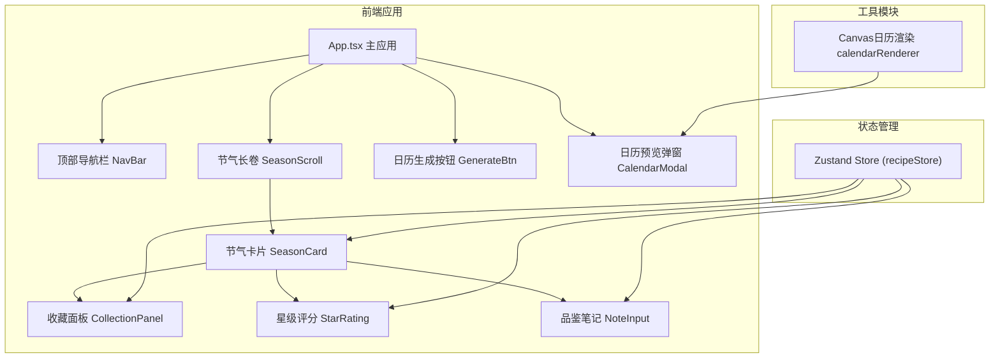

## 1. 架构设计



## 2. 技术描述

- **前端框架**：React@18 + TypeScript
- **构建工具**：Vite
- **状态管理**：Zustand
- **图标方案**：Lucide React + 手绘风格SVG装饰
- **Canvas渲染**：原生Canvas API绘制日历图片
- **文件下载**：file-saver
- **唯一标识**：uuid
- **动画方案**：CSS transitions + transforms，60FPS优化

## 3. 项目结构

```
src/
├── main.tsx              # React应用入口
├── App.tsx               # 主应用组件
├── stores/
│   └── recipeStore.ts    # Zustand状态管理
├── components/
│   ├── SeasonCard.tsx    # 节气卡片组件
│   ├── CollectionPanel.tsx # 收藏面板组件
│   ├── StarRating.tsx    # 星级评分组件
│   ├── NavBar.tsx        # 顶部导航栏
│   └── CalendarModal.tsx # 日历预览弹窗
└── utils/
    └── calendarRenderer.ts # Canvas日历渲染
```

## 4. 数据模型

### 4.1 节气菜谱数据

```typescript
interface Ingredient {
  name: string;
  icon: string;
}

interface SolarTermRecipe {
  id: string;
  solarTerm: string;       // 节气名称
  solarTermIcon: string;   // 节气图标标识
  dishName: string;        // 主打菜名
  description: string;     // 菜品描述
  ingredients: Ingredient[]; // 食材列表（3-5种）
  decoration: string;      // 顶部装饰插画标识
}
```

### 4.2 收藏记录

```typescript
interface FavoriteRecipe {
  id: string;
  recipeId: string;
  solarTerm: string;
  dishName: string;
  rating: number;          // 1-5星评分
  note: string;            // 品鉴笔记
  order: number;           // 排序顺序
  createdAt: number;
}
```

### 4.3 Store状态

```typescript
interface RecipeState {
  recipes: SolarTermRecipe[];      // 所有节气菜谱
  favorites: FavoriteRecipe[];     // 收藏列表
  currentSolarTerm: string;        // 当前节气
  
  // 操作方法
  toggleFavorite: (recipeId: string) => void;
  updateRating: (recipeId: string, rating: number) => void;
  updateNote: (recipeId: string, note: string) => void;
  reorderFavorites: (fromIndex: number, toIndex: number) => void;
  getFavoritesBySolarTerm: () => Record<string, FavoriteRecipe[]>;
}
```

## 5. 核心模块说明

### 5.1 recipeStore.ts
- 管理二十四节气菜谱数据
- 管理收藏列表、评分、笔记
- 提供拖拽排序方法
- 使用 immer 或直接操作数组确保不可变更新

### 5.2 SeasonCard.tsx
- 展示节气主打菜信息
- 集成收藏按钮、星级评分、品鉴笔记
- 触发收藏面板显示/隐藏
- 滚动进入视口时淡入动画

### 5.3 CollectionPanel.tsx
- 显示已收藏菜谱列表
- 支持HTML5 Drag and Drop拖拽排序
- 调用store的reorderFavorites方法
- 每项显示菜名、评分、删除按钮

### 5.4 calendarRenderer.ts
- 使用Canvas API绘制1080x1920px日历图片
- 暖色水彩纹理背景
- 按节气顺序排列圆形徽章
- 每个徽章显示菜名和星星评分
- 底部添加用户昵称和生成日期水印
- 返回dataURL供下载

## 6. 性能优化

- CSS transforms + opacity 动画确保60FPS
- 列表虚拟化/懒加载优化（24项可直接渲染）
- 拖拽排序使用requestAnimationFrame优化
- Canvas绘制离屏渲染
- Zustand 选择器优化重渲染
