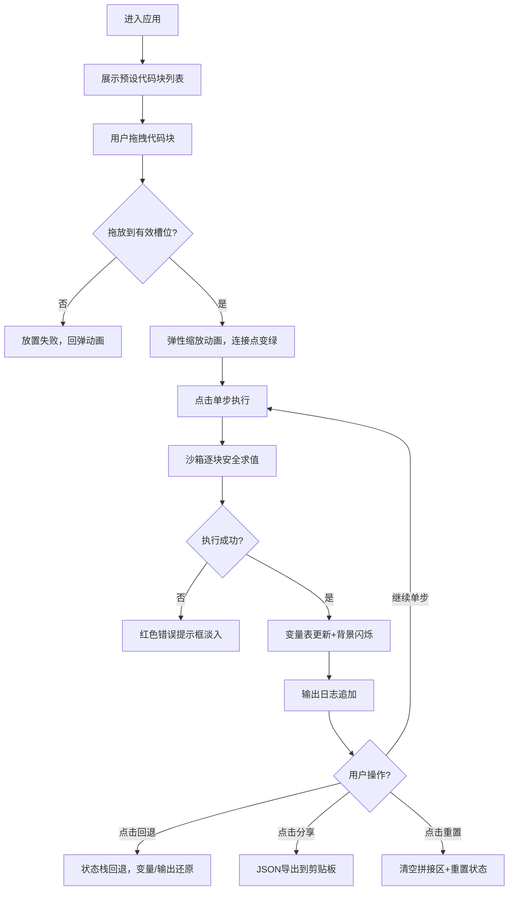

## 1. 产品概述

代码积木坊是一款面向编程初学者的交互式代码拼接学习平台，通过可视化拖拽代码块的方式帮助学员理解程序逻辑。用户将 JavaScript 语句像积木一样自由拼接组合，实时观察执行结果和变量变化，降低代码语法门槛，提升学习兴趣与效率。

## 2. 核心功能

### 2.1 用户角色

| 角色 | 注册方式 | 核心权限 |
|------|----------|----------|
| 学员用户 | 无需注册，直接使用 | 拖拽代码块、拼接执行、查看变量、分享导出、重置会话 |

### 2.2 功能模块

1. **代码块面板（左侧）**：展示 8+ 种预设代码块，支持拖拽操作
2. **拼接区域（中央）**：拖放放置、代码块排序、连接点高亮、单步执行、回退
3. **结果面板（右侧）**：执行输出、变量监视、错误提示、动画效果
4. **顶部导航**：应用名称、分享/导出、重置功能

### 2.3 页面详情

| 页面名称 | 模块名称 | 功能描述 |
|----------|----------|----------|
| 主工作区 | 代码块面板 | 圆角卡片展示代码块（宽180px高40px），拖拽半透明拖影，hover连接点高亮放大 |
| 主工作区 | 拼接区域 | 虚线槽位、圆形连接点（闲置/悬停/放置三态）、代码块间虚线连接、弹性放置动画 |
| 主工作区 | 变量监视窗口 | 实时变量名/值显示、新增渐入动画、值变化背景闪烁 |
| 主工作区 | 逐步执行控制 | 圆形单步按钮（紫色播放）、圆形回退按钮（橙色回退）、当前执行块高亮脉冲 |
| 主工作区 | 错误提示 | 异常捕获、红色提示框、淡入下降动画 |
| 主工作区 | 分享与重置 | 导出JSON到剪贴板、清空拼接区、按压反馈动画 |
| 主工作区 | 主题适配 | 深色/浅色主题自动切换（CSS媒体查询prefers-color-scheme） |

## 3. 核心流程

## 4. 用户界面设计

### 4.1 设计风格

- **主色调（深色）**：背景 #1A1A2E，导航栏 #0F0F23，卡片 #2D2D44，文字 #E0E0E0
- **主色调（浅色）**：背景 #F5F5F5，导航栏 #FFFFFF，卡片 #FFFFFF，文字 #333333
- **强调色**：执行高亮 #FFD166（金）、单步按钮 #6C5CE7（紫）、回退按钮 #E17055（橙）、分享 #2ECC71（绿）、重置 #E74C3C（红）、连接点 #4ECDC4（青）、错误 #FF6B6B（浅红）
- **按钮样式**：圆形控制按钮（直径40px），矩形功能按钮（圆角8px），按压 scale 0.95
- **字体**：等宽 Fira Code / monospace，14px 代码块，行高1.6，标题20px bold
- **布局**：三栏弹性布局（左280px / 中自适应 / 右320px），顶部导航56px高
- **连接视觉**：水平淡灰色虚线（stroke-dasharray 4 4），圆形连接点直径12px

### 4.2 页面设计概览

| 页面名称 | 模块名称 | UI元素与动效 |
|----------|----------|-------------|
| 主工作区 | 顶部导航栏 | 高度56px，居中"代码积木坊"20px bold，右上角分享/重置按钮 |
| 主工作区 | 代码块面板 | 宽度280px，垂直列表，圆角卡片，拖拽opacity 0.7 |
| 主工作区 | 拼接区域 | min-width 400px，虚线槽位，连接点hover放大1.2倍，放置scale 1.1→1，执行中脉冲 box-shadow 0 0 8px #FFD166 |
| 主工作区 | 结果面板 | 宽度320px，变量表行0.3s渐入，值变化白色闪烁0.5s，错误框0.4s顶部淡入下降 |

### 4.3 响应式

桌面优先设计，最小宽度 1000px 保证三栏布局完整展示。通过 CSS 媒体查询 `prefers-color-scheme` 自动适配深色/浅色主题。

### 4.4 性能要求

- 拖拽操作响应延迟 ≤ 16ms（60FPS）
- 单次代码块执行（≤100步）≤ 50ms
- iframe 沙箱隔离求值，不阻塞主线程
