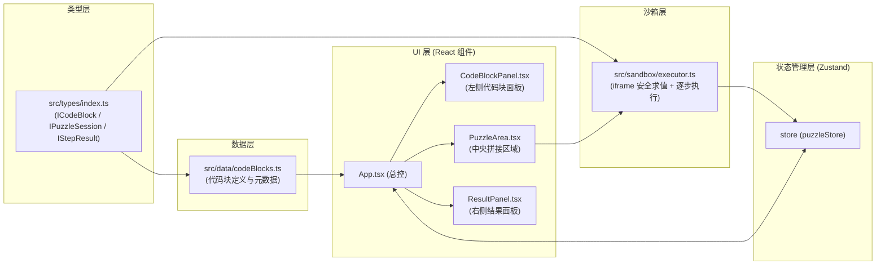

## 1. 架构设计



**数据流向说明：**
1. `src/data/codeBlocks.ts` → `App.tsx` → `CodeBlockPanel.tsx`：代码块元数据单向传递用于渲染
2. `PuzzleArea.tsx` → `executor.ts` → `puzzleStore` → `ResultPanel.tsx`：用户拖放后拼接序列传入沙箱，沙箱返回逐步执行结果，通过Zustand状态更新驱动右侧面板动画展示
3. 所有跨模块数据交换严格遵守 `src/types/index.ts` 中定义的接口契约

## 2. 技术描述

- **前端框架**：React@18 + TypeScript（strict模式，target ES2020，module ESNext）
- **构建工具**：Vite@5 + @vitejs/plugin-react
- **状态管理**：Zustand@4
- **唯一ID生成**：uuid + @types/uuid
- **初始化**：vite-init react-ts 模板
- **后端**：无（纯前端应用，沙箱用 iframe 隔离）
- **数据来源**：内置 mock 代码块元数据，无外部 API

## 3. 路由定义

| 路由 | 用途 |
|------|------|
| / | 主工作区（代码积木坊单页应用） |

## 4. 类型接口定义

```typescript
// src/types/index.ts
export interface ICodeBlock {
  id: string;           // 实例ID（拖入拼接区时生成）
  type: CodeBlockType;  // 代码块类型枚举
  label: string;        // 卡片显示标签
  template: string;     // 代码模板字符串（含占位符）
  placeholders?: Record<string, string>; // 占位符默认值
  category: 'basic' | 'control' | 'function' | 'io';
  color?: string;       // 可选强调色
}

export type CodeBlockType =
  | 'declare'       // 变量声明赋值
  | 'add'           // 加法运算
  | 'subtract'      // 减法运算
  | 'if'            // if-else 条件
  | 'for'           // for 循环
  | 'while'         // while 循环
  | 'function'      // 函数定义
  | 'call'          // 函数调用
  | 'print';        // 打印输出

export interface IPuzzleSession {
  blocks: ICodeBlock[];           // 拼接区代码块序列
  currentStepIndex: number;       // 当前执行指针
  executedResults: IStepResult[]; // 已执行步骤结果栈（用于回退）
  variables: Record<string, any>; // 当前变量快照
  output: string[];               // 累计输出日志
  error: string | null;           // 最近错误信息
}

export interface IStepResult {
  stepIndex: number;              // 对应代码块索引
  executedCode: string;           // 实际执行的代码
  variablesBefore: Record<string, any>;
  variablesAfter: Record<string, any>;
  changedVars: string[];          // 本步骤变化的变量名
  output: string[];               // 本步骤新增输出
  error: string | null;
  timestamp: number;
}
```

## 5. 文件结构与职责

```
src/
├── main.tsx                      # React入口，挂载 <App />
├── App.tsx                       # 根组件，整合三栏布局+状态连接
├── types/
│   └── index.ts                  # 接口定义（被 data 和 sandbox 共同引用）
├── data/
│   └── codeBlocks.ts             # 预设代码块列表与元数据
├── sandbox/
│   └── executor.ts               # iframe沙箱：安全求值+逐步执行+死循环检测
├── store/
│   └── puzzleStore.ts            # Zustand store，管理 IPuzzleSession
└── components/
    ├── CodeBlockPanel.tsx        # 左侧面板：代码块列表+拖拽开始
    ├── PuzzleArea.tsx            # 中央区：拖放放置+排序+连接点+单步/回退
    └── ResultPanel.tsx           # 右侧面板：变量监视+输出+错误提示
```

## 6. 沙箱安全策略

- 使用动态创建的隐藏 iframe + `srcdoc` + `sandbox="allow-scripts"` 实现隔离
- 通过 `postMessage` 与主线程异步通信，通信协议：
  - 请求：`{ type: 'EVAL_STEP', code: string, vars: Record<string,any> }`
  - 响应：`{ ok: boolean, vars: Record<string,any>, output: string[], error: string|null }`
- 死循环防护：`setTimeout` 50ms 超时，超时时终止 iframe 并返回错误
- 变量注入/提取：通过序列化 JSON 在父子窗口传递，杜绝引用泄漏
