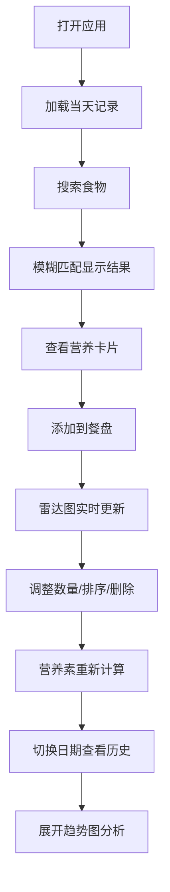

## 1. 产品概述

饮食营养规划应用是一款基于浏览器的日常膳食管理工具，旨在帮助用户直观地规划每日饮食营养摄入。解决传统饮食记录软件操作繁琐、数据分散、难以一目了然对比不同食物营养素均衡性的痛点。

- **主要目标用户**：关注健康饮食、需要控制营养摄入的普通用户、健身人群、慢性病患者
- **核心价值**：通过可视化雷达图和趋势图，让营养数据一目了然，帮助用户做出更科学的饮食决策

## 2. 核心功能

### 2.1 用户角色

| 角色 | 注册方式 | 核心权限 |
|------|----------|----------|
| 普通用户 | 无需注册（本地存储） | 使用全部功能，数据存储于浏览器localStorage |

### 2.2 功能模块

1. **主界面**：食物搜索栏、营养数据卡片展示、餐盘面板
2. **餐盘管理**：食物添加/删除/拖拽排序、数量修改、实时雷达图
3. **历史日志**：7天日期导航、每日记录切换、自动保存
4. **趋势分析**：7天热量趋势折线图、营养摄入对比

### 2.3 页面详情

| 页面名称 | 模块名称 | 功能描述 |
|----------|----------|----------|
| 主界面 | 搜索栏 | 圆角输入框，模糊匹配食材库，下拉展示最多10条结果 |
| 主界面 | 营养卡片 | 展示每100g六大营养素，横向柱状条可视化，颜色按类别区分 |
| 主界面 | 餐盘面板 | 右侧固定面板，可拖拽食物条目，双击修改数量，删除按钮动效 |
| 主界面 | 营养雷达图 | Canvas绘制六维雷达图，超100%顶点变红，填充半透明色 |
| 主界面 | 日期导航条 | 7天日期按钮切换，当天高亮，支持历史记录编辑 |
| 主界面 | 趋势扩展面板 | 点击展开动画，7天热量趋势折线图，数据点标注 |

## 3. 核心流程

### 主要用户流程：
1. 用户打开应用 → 自动加载当天餐盘记录（如有）
2. 在搜索栏输入食物名称 → 模糊匹配显示下拉结果
3. 点击搜索结果 → 展开营养数据卡片，查看营养素分布
4. 将食物添加到餐盘 → 雷达图实时更新营养总和
5. 双击数量字段修改摄入量 → 营养素重新计算
6. 拖拽调整食物顺序 / 点击删除按钮移除食物
7. 切换历史日期 → 查看或编辑对应日期记录
8. 点击趋势按钮 → 展开查看7天热量摄入趋势

## 4. 用户界面设计

### 4.1 设计风格
- **整体风格**：深色科幻风格（Dark Sci-Fi），神秘科技感
- **主背景色**：#0A0A1A（深空蓝黑）
- **辅助色**：#1E1E2E（卡片背景）、#2D2D44（面板背景）
- **强调色**：#4ECDC4（薄荷绿/主操作色）、#FF6B35（能量橙/热量）、#FFD166（金黄/脂肪）
- **营养素配色**：热量#FF6B35、蛋白质#4ECDC4、脂肪#FFD166、碳水#6C5CE7、膳食纤维#00CEC9、钠#E17055
- **圆角规范**：搜索栏20px、卡片16px、面板24px、按钮8px
- **阴影规范**：卡片0 4px 12px rgba(0,0,0,0.25)、通用0 2px 8px rgba(0,0,0,0.2)
- **字体**：使用现代无衬线字体，标题加粗，数字等宽对齐
- **交互反馈**：悬停缩放1.05（0.2s ease），点击缩放0.95恢复
- **毛玻璃效果**：卡片面板添加backdrop-filter增强层次感

### 4.2 页面设计概览

| 页面/模块 | 组件名称 | UI元素与交互 |
|-----------|----------|--------------|
| 主界面布局 | 搜索栏 | 顶部居中，圆角20px，背景#1E1E2E，占位符文字提示，下拉结果10项 |
| 主界面布局 | 营养卡片 | 宽280px，背景#2D2D44，圆角16px，六大营养素横向柱状条6px高 |
| 主界面布局 | 餐盘面板 | 右侧固定宽320px，背景#1A1A2E，边框1px #2D2D44，标题"今日餐盘"20px加粗 |
| 餐盘面板 | 食物条目 | 高48px，背景#2D2D44，圆角8px，可拖拽排序，双击编辑数量 |
| 餐盘面板 | 删除按钮 | 圆形20px，背景#FF6B6B，点击缩小淡出动画0.2s |
| 餐盘面板 | 雷达图 | Canvas直径200px，填充#4ECDC44D，边线2px #4ECDC4，超量顶点#FF4757 |
| 底部导航 | 日期栏 | 高48px背景#1E1E2E，日期按钮44px正方形，当天#4ECDC4白字加粗 |
| 底部导航 | 趋势面板 | 展开动画0→240px（0.4s ease），折线图网格线#2D2D44，折线2px #FF6B35 |

### 4.3 响应式设计
- **桌面端（1024px-1920px）**：搜索结果区 + 右侧固定餐盘面板的左右布局
- **移动端（<1024px）**：搜索栏与餐盘面板上下堆叠排布，餐盘移至下方
- **雷达图自适应**：餐盘面板内自动缩小至140px直径（移动端/窄容器）
- **断点处理**：1024px为临界响应式断点，CSS媒体查询实现

### 4.4 性能要求
- 搜索响应：≤100ms（内置食材库，前端模糊匹配）
- 渲染帧率：拖拽排序≥50fps（requestAnimationFrame优化）
- 存储效率：localStorage增量更新，避免频繁序列化大对象
