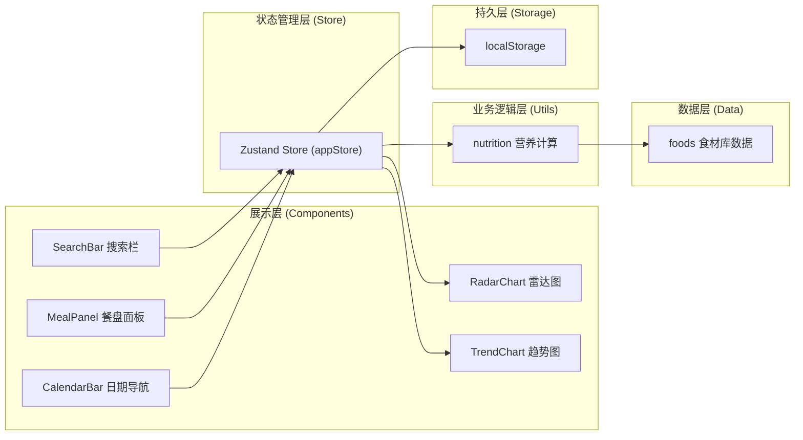
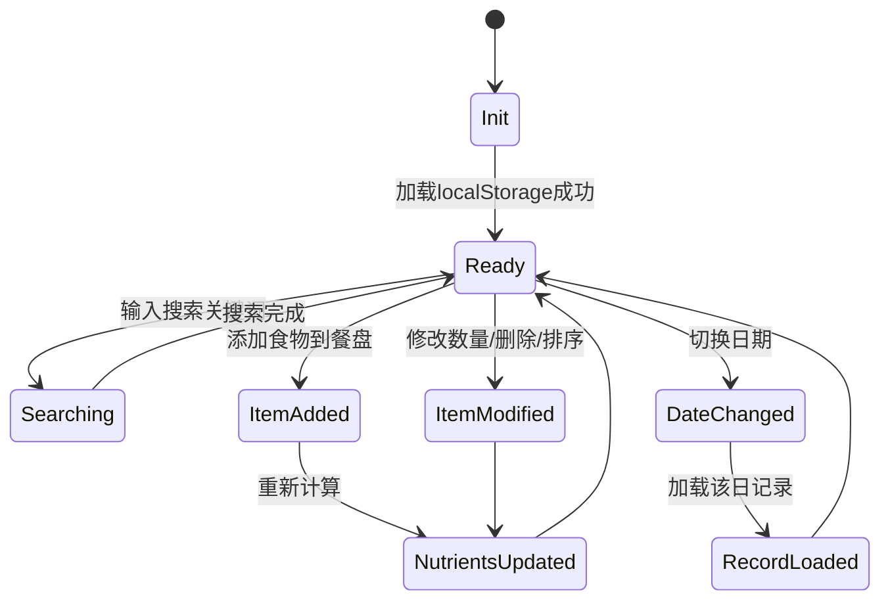

## 1. 架构设计



## 2. 技术说明

- **前端框架**：React 18 + TypeScript （严格模式）
- **构建工具**：Vite 5 + @vitejs/plugin-react
- **状态管理**：Zustand 4（轻量级，避免Redux繁琐）
- **UI渲染**：原生CSS + CSS变量（无UI库依赖，精确控制样式）
- **图表绘制**：Canvas 2D API（雷达图、折线图自研绘制）
- **拖拽实现**：HTML5 Drag and Drop API（原生高性能）
- **ID生成**：uuid
- **持久化**：浏览器localStorage（JSON序列化）

## 3. 目录结构定义

```
auto99/
├── package.json              # 依赖配置与启动脚本
├── index.html                # 入口HTML
├── tsconfig.json             # TypeScript严格模式配置
├── vite.config.js            # Vite + React插件配置
└── src/
    ├── main.tsx              # React入口渲染
    ├── index.css             # 全局样式与主题变量
    ├── data/
    │   └── foods.ts          # 内置食材库数据（30+常见食材）
    ├── utils/
    │   └── nutrition.ts      # 营养素聚合计算工具
    ├── stores/
    │   └── appStore.ts       # Zustand全局状态管理
    └── components/
        ├── SearchBar.tsx     # 搜索栏 + 下拉结果 + 营养卡片
        ├── MealPanel.tsx     # 餐盘面板 + 食物条目（拖拽/删除）
        ├── CalendarBar.tsx   # 7天日期导航条 + 趋势按钮
        ├── RadarChart.tsx    # 六维营养雷达图（Canvas）
        └── TrendChart.tsx    # 7天热量趋势折线图（Canvas）
```

## 4. 数据模型

### 4.1 核心类型定义

```typescript
// 营养素结构（每100g含量）
interface Nutrients {
  calories: number;      // 热量 kcal
  protein: number;       // 蛋白质 g
  fat: number;           // 脂肪 g
  carbs: number;         // 碳水化合物 g
  fiber: number;         // 膳食纤维 g
  sodium: number;        // 钠 mg
}

// 食物数据
interface Food {
  id: string;
  name: string;
  category: string;
  nutrients: Nutrients;
}

// 餐盘食物条目
interface MealItem {
  id: string;            // 条目唯一ID
  foodId: string;        // 关联食物ID
  foodName: string;
  amount: number;        // 摄入量（克）
  nutrients: Nutrients;  // 按摄入量计算后的营养素
}

// 每日记录
interface DailyRecord {
  date: string;          // YYYY-MM-DD
  items: MealItem[];
}

// 推荐摄入量（每日）
interface DRV {
  calories: number;      // 2000 kcal
  protein: number;       // 60 g
  fat: number;           // 65 g
  carbs: number;         // 300 g
  fiber: number;         // 25 g
  sodium: number;        // 2000 mg
}

// 应用状态
interface AppState {
  // 搜索
  searchQuery: string;
  searchResults: Food[];
  selectedFood: Food | null;
  
  // 餐盘
  currentMeal: MealItem[];
  
  // 历史
  selectedDate: string;
  records: Record<string, DailyRecord>;
  
  // UI
  showTrend: boolean;
}
```

### 4.2 状态转移



## 5. 关键实现方案

### 5.1 模糊搜索算法
- 基于食材名称+类别做字符串匹配
- 优先级：名称完全匹配 > 名称包含 > 类别匹配
- 使用Array.filter + String.includes，限制返回10条
- 通过useMemo缓存搜索结果，避免重复计算

### 5.2 营养素计算模块（nutrition.ts）
- `calculateTotalNutrients(items: MealItem[])`：数组营养素总和
- `calculatePercentage(nutrients: Nutrients, drv: DRV)`：与推荐值百分比
- `scaleNutrients(food: Food, amount: number)`：按摄入量缩放营养素

### 5.3 雷达图绘制（Canvas）
- 正六边形网格线（5层刻度：20%/40%/60%/80%/100%）
- 六条轴线带渐变（#4A4A6A → #2D2D44）
- 数据点连线 + 填充（#4ECDC44D半透明）
- 超100%数据点变色为#FF4757并加粗

### 5.4 趋势折线图（Canvas）
- 网格背景（垂直7列 + 水平5线，#2D2D44）
- Y轴自动缩放（根据最大热量值向上取整到100）
- 折线平滑连接（lineJoin: round）
- 数据点圆点（r=4，#FF6B35填充）
- X轴日期标签（MM/DD格式）

### 5.5 拖拽排序
- 使用原生HTML5 Drag & Drop API
- 拖拽时半透明样式 + 占位提示
- 状态更新后立即同步到localStorage

### 5.6 localStorage持久化
- 存储Key: `nutrition-app-records`
- Zustand middleware自动持久化records对象
- 初始化时从localStorage反序列化，异常则使用空默认值
