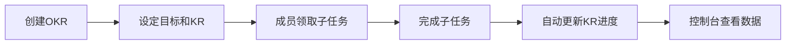

## 1. 产品概述

团队OKR目标对齐与追踪应用（Objective Tracker）是一款面向团队负责人和成员的目标管理工具，帮助团队清晰设定、分解和跟踪季度目标，通过可视化图表直观展示目标进度和偏差。

- 解决问题：团队目标不透明、进度追踪困难、成员任务对齐不清
- 目标用户：团队负责人（创建和管理OKR）、团队成员（领取和完成子任务）
- 产品价值：提升团队执行力，确保目标对齐，实时追踪进度

## 2. 核心功能

### 2.1 用户角色

| 角色 | 核心权限 |
|------|----------|
| 团队负责人 | 创建季度OKR、设定目标和关键结果、查看进度报表 |
| 团队成员 | 领取子任务、更新任务状态、查看目标进度 |

### 2.2 功能模块

1. **OKR列表页**：展示所有季度目标，支持点击展开详情
2. **OKR详情页**：两列布局，左侧KR面板，右侧子任务看板
3. **控制台页面**：雷达图展示OKR完成度分布（五维度）
4. **子任务看板**：支持拖拽排序、任务领取、状态更新

### 2.3 页面详情

| 页面名称 | 模块名称 | 功能描述 |
|-----------|-------------|---------------------|
| OKR列表页 | 目标卡片 | 显示标题、进度条、截止日期，点击展开详情 |
| OKR详情页 | KR面板 | 显示KR环形进度图、权重、支持编辑完成度 |
| OKR详情页 | 任务看板 | 子任务拖拽排序、任务卡片、完成按钮 |
| 控制台 | 雷达图 | SVG绘制、五维度数据、缩放和悬浮提示 |

## 3. 核心流程

负责人创建季度OKR → 设定目标和关键结果（带权重） → 成员领取子任务 → 完成子任务自动更新KR进度 → 控制台查看整体数据

## 4. 用户界面设计

### 4.1 设计风格

- 主色调：深色渐变主题（#1a1a2e 到 #16213e）
- 强调色：霓虹色（#00b4d8 青色、#e63946 红色）
- 文字色：白色
- 按钮风格：圆角按钮，点击0.15s缩放反馈（scale(0.95)）
- 字体：Google Fonts Inter
- 布局风格：卡片式布局 + 顶部固定半透明毛玻璃导航栏 + 可收缩侧边栏

### 4.2 页面设计概述

| 页面名称 | 模块名称 | UI元素 |
|-----------|-------------|----------|
| OKR列表页 | 目标卡片 | 深色卡片、进度条、截止日期、hover动效 |
| OKR详情页 | KR面板 | 环形进度图、权重标签、编辑按钮 |
| OKR详情页 | 任务看板 | 任务卡片拖拽排序、缩放动画、0.2s过渡 |
| 控制台 | 雷达图 | SVG绘制、五轴雷达、悬浮提示、缩放交互 |

### 4.3 响应式

- 桌面端优先，适配1280px到1920px屏幕宽度
- 两列布局在窄屏自动调整

### 4.4 动画与交互

- 按钮点击：0.15s缩放反馈 transform: scale(0.95)
- 任务拖拽：卡片缩放 + 0.2s过渡动画
- 空状态：带有回弹动画的SVG插画
- 所有动画帧率不低于45fps
