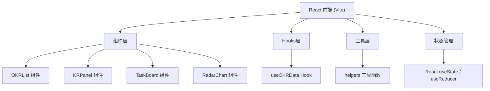

## 1. 架构设计



## 2. 技术描述

- 前端：React 18 + TypeScript + Vite
- 构建工具：Vite 5
- 图表库：d3 + recharts
- 样式方案：CSS Modules / 内联样式
- 字体：Google Fonts Inter

## 3. 路由定义

| 路由 | 页面 | 用途 |
|-------|------|-------|
| / | OKR列表页 | 展示所有季度目标 |
| /okr/:id | OKR详情页 | 目标详情、KR面板、任务看板 |
| /dashboard | 控制台 | 雷达图数据展示 |

## 4. 数据模型

### 4.1 类型定义

```typescript
interface KeyResult {
  id: string;
  title: string;
  weight: number; // 百分比权重
  progress: number; // 完成度 0-100
}

interface Task {
  id: string;
  krId: string;
  title: string;
  estimatedHours: number;
  deadline: string;
  completed: boolean;
  assignee?: string;
  order: number;
}

interface OKR {
  id: string;
  title: string;
  quarter: string;
  deadline: string;
  keyResults: KeyResult[];
  tasks: Task[];
}
```

### 4.2 数据结构说明

- OKR包含多个KeyResult（最多3个）
- 每个KeyResult有独立的权重（百分比）
- 任务关联到具体的KR
- 任务完成后按工时占比自动更新KR进度

## 5. 文件结构

```
src/
├── App.tsx              # 根组件，布局和路由
├── components/
│   ├── OKRList.tsx      # OKR列表组件
│   ├── KRPanel.tsx      # 关键结果面板
│   ├── TaskBoard.tsx    # 子任务看板
│   └── RadarChart.tsx   # SVG雷达图组件
├── hooks/
│   └── useOKRData.ts    # 自定义Hook
└── utils/
    └── helpers.ts       # 工具函数
```

## 6. 性能要求

- 所有动画帧率 ≥ 45fps
- API响应时间 ≤ 200ms（使用本地模拟数据）
- 组件按需渲染，避免不必要的重渲染
