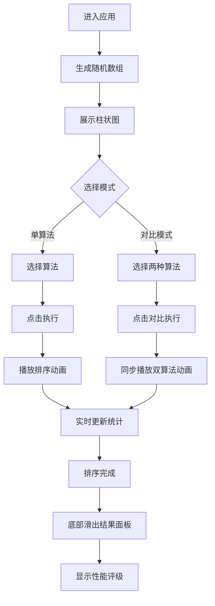

## 1. 产品概述

排序算法可视化对比工具是一款面向开发者的教育类Web应用，通过直观的动画演示帮助用户理解冒泡、选择、插入、快速、归并五种经典排序算法的执行过程与性能差异。用户可以随机生成或自定义数组数据，单算法模式下观看排序动画，对比模式下同步展示两种算法的执行效率。

- 核心价值：将抽象的算法逻辑转化为可视化动画，降低学习门槛
- 目标用户：计算机专业学生、初级开发者、算法爱好者
- 市场定位：轻量级、高性能、沉浸式的算法学习工具

## 2. 核心功能

### 2.1 用户角色
| 角色 | 注册方式 | 核心权限 |
|------|----------|----------|
| 访客用户 | 无需注册 | 使用全部可视化功能，调整参数设置 |

### 2.2 功能模块
1. **数据生成模块**：随机生成数组、手动输入数组、调整数组长度和数值范围
2. **算法选择模块**：下拉框选择5种排序算法，支持带图标展示
3. **单算法可视化**：柱状图动画展示排序全过程，实时统计信息
4. **双算法对比**：左右/上下分栏同步执行两种算法，拖拽调节分栏比例
5. **设置面板**：动画速度、数组长度、随机种子参数调节
6. **结果面板**：排序完成后弹出性能评级与统计数据

### 2.3 页面详情
| 页面名称 | 模块名称 | 功能描述 |
|---------|---------|----------|
| 主页面 | 顶部导航栏 | 应用标题、排序图标、设置按钮 |
| 主页面 | 控制面板 | 数组生成、算法选择、执行/对比按钮 |
| 主页面 | 可视化区域 | 单/双算法柱状图动画展示 |
| 主页面 | 统计信息区 | 比较次数、交换次数、步数、进度条 |
| 主页面 | 结果面板 | 性能评级、总耗时、统计摘要 |
| 主页面 | 设置面板 | 动画速度、数组长度、随机种子 |

## 3. 核心流程

用户进入应用后，默认展示随机生成的数组柱状图。用户可选择单算法模式点击"执行"观看排序动画，或选择两种算法点击"对比执行"进行同步比较。排序过程中实时更新统计数据，完成后底部滑出结果面板显示性能评级。设置面板可调节动画速度和数组参数。

## 4. 用户界面设计

### 4.1 设计风格
- 主色调：深色背景 #1E1E2E，卡片背景 #2A2A3E
- 强调色：蓝色 #3498DB（起始）、红色 #E74C3C（结束）组成渐变
- 状态色：橙色 #F39C12（比较中）、绿色 #2ECC71（交换）、灰色 #95A5A6（已排序）
- 文字色：浅灰 #E0E0E0
- 字体：现代无衬线字体，标题加粗，正文常规
- 布局：卡片式布局，圆角设计，微妙阴影
- 动效：framer-motion 弹簧动画（stiffness=120, damping=14）
- 图标风格：线性图标，与文字颜色一致

### 4.2 页面设计概述
| 页面名称 | 模块名称 | UI元素 |
|---------|---------|--------|
| 主页面 | 导航栏 | 深色背景、应用标题+排序图标、齿轮设置按钮 |
| 主页面 | 控制面板 | 输入框、下拉选择器（带图标）、主按钮、次按钮 |
| 主页面 | 可视化区 | 居中卡片、最大宽度1200px、高度500px、柱状图 |
| 主页面 | 统计区 | 数字翻滚动画、进度条（红到绿渐变） |
| 主页面 | 结果面板 | 底部滑入、弹性动画、性能评级图标 |
| 主页面 | 设置面板 | 滑入式侧边栏、滑块控件、数值输入 |

### 4.3 响应式
- 桌面端（≥768px）：对比模式左右分栏，可拖拽调节
- 移动端（<768px）：对比模式上下分栏，柱条高度按比例缩小
- 触控优化：按钮最小尺寸44px，点击区域充足

### 4.4 动画规范
- 柱条比较高亮：橙色、放大1.1倍、0.2秒过渡
- 柱条交换闪烁：绿色、0.3秒闪烁一次
- 已排序柱条：灰色、不可再高亮
- 数字翻滚：0.2秒过渡动画
- 结果面板：底部滑入、0.4秒弹性动画
- 进度条：宽度随步数变化、红到绿渐变
- 分栏拖拽：中间竖线、鼠标悬停双箭头光标
