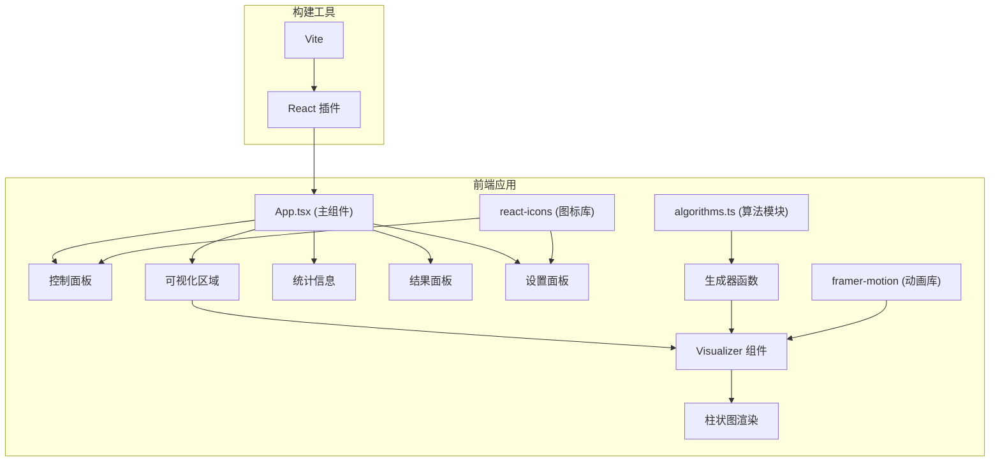

## 1. 架构设计



## 2. 技术描述

- 前端框架：React 18 + TypeScript（strict模式）
- 构建工具：Vite + @vitejs/plugin-react
- 动画库：framer-motion（弹簧动画）
- 图标库：react-icons
- 状态管理：React Hooks（useState、useEffect、useRef、useCallback）
- 样式方案：CSS Modules / 内联样式（配合 framer-motion）
- 性能优化：requestAnimationFrame 驱动动画、React.memo 避免重渲染

## 3. 文件结构

| 文件路径 | 用途说明 |
|---------|----------|
| `/package.json` | 项目依赖与脚本配置 |
| `/index.html` | 应用入口HTML |
| `/vite.config.ts` | Vite配置（React插件） |
| `/tsconfig.json` | TypeScript配置（strict模式） |
| `/src/App.tsx` | 主应用组件，协调数据生成、算法执行和可视化 |
| `/src/algorithms.ts` | 5种排序算法的生成器函数实现 |
| `/src/visualizer.tsx` | 可视化组件，渲染彩色柱状图动画 |
| `/src/types.ts` | TypeScript类型定义（可选，根据需要提取） |

## 4. 核心数据模型

### 4.1 算法步骤状态
```typescript
interface SortStep {
  array: number[];
  comparing: number[];  // 正在比较的索引
  swapping: number[];   // 正在交换的索引
  sorted: number[];     // 已排序的索引
  comparisons: number;  // 累计比较次数
  swaps: number;        // 累计交换次数
}
```

### 4.2 算法生成器类型
```typescript
type SortGenerator = Generator<SortStep, void, unknown>;
type SortFunction = (arr: number[]) => SortGenerator;
```

### 4.3 算法信息
```typescript
interface AlgorithmInfo {
  id: string;
  name: string;
  icon: string;  // react-icons 标识符
  fn: SortFunction;
}
```

## 5. 核心算法实现

### 5.1 冒泡排序
- 双重循环，相邻元素比较交换
- 每轮将最大值"冒泡"到末尾
- 优化：记录是否发生交换，提前终止

### 5.2 选择排序
- 每轮选择未排序部分的最小值
- 与未排序部分第一个元素交换
- 特点：交换次数少，比较次数多

### 5.3 插入排序
- 将未排序元素逐个插入已排序序列
- 从后往前扫描寻找插入位置
- 特点：对近乎有序数据效率高

### 5.4 快速排序
- 分治策略，选择基准元素
- 分区操作：小于基准放左，大于放右
- 递归排序左右子数组
- 基准选择：取首、中、尾的中位数

### 5.5 归并排序
- 分治策略，将数组一分为二
- 递归排序子数组
- 合并两个有序子数组
- 特点：稳定排序，空间换时间

## 6. 性能优化策略

1. **动画帧率控制**：使用 requestAnimationFrame 确保30fps以上
2. **步长间隔动态调整**：0.5x=400ms、1x=200ms、2x=100ms
3. **对比模式同步**：共享同一计时器，保证两面板同步性
4. **懒加载**：React.lazy 懒加载算法模块，首屏 < 2秒
5. **组件优化**：React.memo 包裹可视化组件，避免不必要重渲染
6. **内存优化**：生成器函数逐步yield，不预存全部状态

## 7. 动画实现方案

### 7.1 柱条动画
- framer-motion 的 motion.div 组件
- spring 动画：stiffness=120, damping=14
- 高度变化动画：随数值变化平滑过渡
- 颜色过渡：蓝到红渐变，根据数值计算

### 7.2 状态高亮
- 比较中：橙色 #F39C12 + scale(1.1)，0.2s 过渡
- 交换中：绿色 #2ECC71 闪烁，0.3s
- 已排序：灰色 #95A5A6，不可交互

### 7.3 数字翻滚
- 使用 framer-motion 的 AnimatePresence
- 数字变化时旧数字淡出、新数字淡入
- 0.2秒过渡时间

### 7.4 结果面板
- 从底部滑入：初始 y=100%，最终 y=0
- 弹性动画：type: "spring", stiffness: 120, damping: 14
- 0.4秒动画时长

## 8. 对比模式分栏实现

1. **容器**：flex 布局，两个可视化面板各占一定比例
2. **拖拽条**：中间 4px 宽的竖线，可拖拽
3. **拖拽逻辑**：记录起始位置，计算宽度比例
4. **响应式**：< 768px 自动切换为 flex-col 上下布局
5. **同步执行**：统一的 requestAnimationFrame 循环，同时推进两个算法的步数
