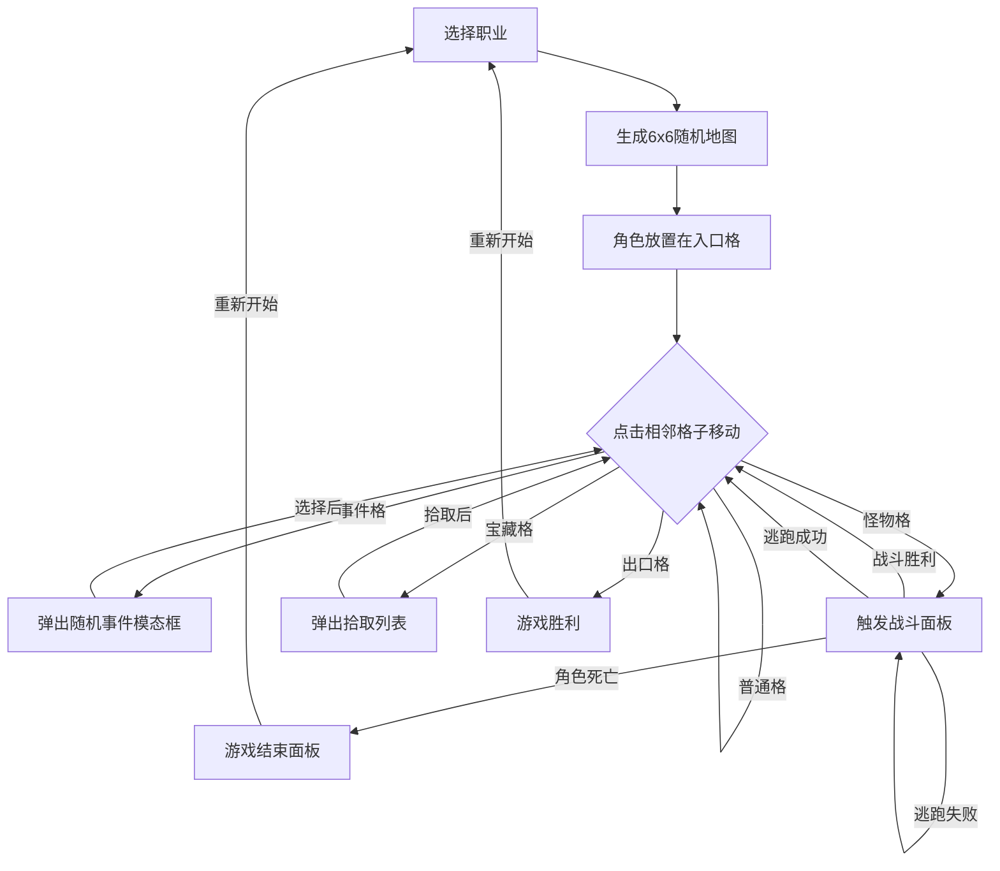

## 1. 产品概述
地下城探险事件与战斗模拟应用——一个2D网格地图驱动的桌游线上化项目，玩家在6x6随机地下城中选择职业、探索地图、遭遇随机事件、进行回合制战斗并查看动画模拟。
- 目标用户：桌游爱好者、地牢探险游戏玩家
- 核心价值：将线下桌游体验线上化，提供流畅的战斗动画和事件交互

## 2. 核心功能

### 2.1 用户角色
| 角色 | 选择方式 | 核心特征 |
|------|----------|----------|
| 战士 | 开始前选择 | 高生命值、高防御、中等攻击 |
| 法师 | 开始前选择 | 低生命值、高攻击、低防御 |
| 盗贼 | 开始前选择 | 中等生命值、高暴击、中等防御 |

### 2.2 功能模块
1. **地图探索页**：6x6网格地图、角色移动、格子交互、角色状态面板
2. **战斗模拟页**：回合制战斗面板、攻击动画、血条变化、逃跑机制
3. **事件交互页**：随机事件模态框、宝藏拾取列表、NPC对话

### 2.3 页面详情
| 页面名称 | 模块名称 | 功能描述 |
|----------|----------|----------|
| 地图探索页 | 地图网格 | 随机生成6x6网格，含入口、宝藏、怪物、事件、出口、普通格，点击相邻格子移动角色 |
| 地图探索页 | 角色状态面板 | 右侧显示角色头像、生命值进度条、攻防数值、装备图标，生命值<30%时血条变红晃动 |
| 地图探索页 | 操作指引栏 | 底部显示操作提示 |
| 战斗模拟页 | 战斗动画面板 | 从底部滑入，显示敌我头像、渐变血条、回合日志、攻击粒子特效 |
| 战斗模拟页 | 逃跑按钮 | 50%概率成功逃跑，失败则敌人继续攻击 |
| 事件交互页 | 事件模态框 | 透明度渐入+缩放动画，显示事件描述和选择按钮 |
| 事件交互页 | 宝藏拾取列表 | 显示可拾取装备和物品 |
| 游戏结束页 | 结束面板 | 暗色遮罩+墓碑动画，统计步数和击败怪物数，重新开始按钮 |

## 3. 核心流程

玩家选择职业 → 生成6x6随机地图 → 玩家从入口格开始 → 点击相邻格子移动 → 踩到事件格弹出随机事件 → 踩到怪物格触发战斗 → 回合制战斗（攻击动画+粒子特效+血条实时变化）→ 战斗胜利继续探索/战斗失败角色死亡 → 到达出口格获胜/生命值归零游戏结束

## 4. 用户界面设计

### 4.1 设计风格
- **主色调**：深褐#2C1810（背景）、深灰#3E2723（面板卡片）、米白#FFF3E0（文字）
- **强调色**：金色#FFD54F（高亮）、深红#8B0000（危险/按钮悬停）、亮绿#66BB6A（事件）、金色#FFD700（宝藏）
- **按钮样式**：圆角矩形8px，深灰默认背景，悬停渐变深红#8B0000并上移2px（0.2s过渡）
- **字体**：装饰性字体用于标题（MedievalSharp / Cinzel），正文用可读性高的衬线字体（Crimson Text）
- **布局**：地图居中占60%宽度，右侧角色状态面板，底部操作指引栏
- **动画**：弹窗0.4s弹性动画，角色移动0.3s EaseOut滑动，攻击粒子特效，血条渐变

### 4.2 页面设计概览
| 页面名称 | 模块名称 | UI元素 |
|----------|----------|--------|
| 地图探索页 | 地图网格 | 深褐#2C1810背景、浅灰#4E342E格子线、各格子类型闪烁/高亮、金色呼吸动画标记角色位置 |
| 地图探索页 | 角色状态面板 | 深灰#3E2723卡片+2px金色边框、头像、渐变血条（绿→红）、攻防数值、装备图标 |
| 战斗模拟页 | 战斗面板 | 从底部滑入0.4s弹性、敌我头像对峙、渐变血条、回合日志滚动列表、攻击粒子0.1s屏幕抖动 |
| 事件交互页 | 事件模态框 | 0.5s透明度渐入、缩放0.8→1、事件描述文字、选择按钮 |
| 游戏结束页 | 结束面板 | 暗色遮罩、墓碑图标从底部升起、统计步数和击败数、重新开始按钮 |

### 4.3 响应式适配
- 桌面端（≥768px）：地图居中60%宽度，右侧角色面板
- 移动端（<768px）：地图和面板上下排列，地图满宽，面板高度缩减200px，图标代替文字
