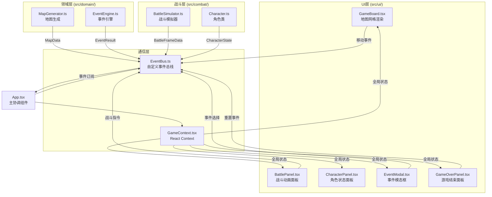

## 1. 架构设计



**数据流向**：
1. 玩家操作（UI层）→ 事件总线 → 领域层/战斗层处理
2. 领域层/战斗层产生结果 → 事件总线 → App.tsx更新Context → UI层重新渲染
3. MapGenerator生成地图 → 通过事件总线传递MapData → UI渲染地图 + 战斗模块读取怪物数据
4. EventEngine处理事件 → 返回EventResult → UI显示事件模态框
5. BattleSimulator每帧输出BattleFrameData → UI更新战斗动画

## 2. 技术说明
- **前端**：React@18 + TypeScript + Vite
- **初始化工具**：vite-init (react-ts模板)
- **状态管理**：React Context + 自定义EventBus（非zustand，按需求使用事件总线解耦）
- **动画库**：framer-motion（弹窗、滑动、粒子特效）
- **图标库**：react-icons（角色、怪物、装备等图标）
- **后端**：无
- **数据库**：无（纯前端状态管理）

## 3. 路由定义
| 路由 | 用途 |
|------|------|
| / | 单页应用，所有模块在同一页面通过状态切换显示 |

## 4. API定义
无后端API，所有数据在前端生成和管理。

## 5. 文件结构与调用关系

```
src/
├── App.tsx                    # 主应用组件，初始化Context，订阅事件总线，协调三个模块
├── eventBus.ts                # 自定义事件总线，TypeScript泛型实现发布/订阅模式
├── context/
│   └── GameContext.tsx         # React Context，管理全局游戏状态
├── domain/
│   ├── MapGenerator.ts        # 生成6x6网格地图 → 产出MapData → 通过事件总线传递
│   ├── EventEngine.ts         # 处理随机事件 → 产出EventResult → 传递给UI显示
│   └── types.ts               # 领域层类型定义（MapData, CellType, EventResult等）
├── combat/
│   ├── Character.ts           # 角色类（HP/ATK/DEF/装备）→ 接收怪物数据 → 计算伤害 → 更新状态
│   ├── BattleSimulator.ts     # 回合制战斗模拟 → setInterval驱动 → 输出BattleFrameData
│   └── types.ts               # 战斗层类型定义（BattleFrame, DamageResult等）
└── ui/
    ├── GameBoard.tsx           # 地图网格渲染 → 格子点击触发移动 → 角色位置动画
    ├── BattlePanel.tsx         # 战斗动画面板 → 血条渐变 → 攻击粒子 → 回合日志
    ├── CharacterPanel.tsx      # 角色状态面板 → 头像/血条/数值/装备
    ├── EventModal.tsx          # 事件模态框 → 事件描述 + 选择按钮
    ├── GameOverPanel.tsx       # 游戏结束面板 → 墓碑动画 + 统计 + 重置按钮
    └── ClassSelectScreen.tsx   # 职业选择界面 → 战士/法师/盗贼三选一
```

**调用关系**：
- App.tsx → GameContext.tsx（状态提供）
- App.tsx → EventBus.ts（事件订阅/分发）
- App.tsx → GameBoard.tsx, CharacterPanel.tsx, BattlePanel.tsx（UI组合）
- GameBoard.tsx → MapGenerator.ts（通过Context获取地图数据）
- BattlePanel.tsx → BattleSimulator.ts（通过Context获取战斗帧数据）
- CharacterPanel.tsx → Character.ts（通过Context获取角色状态）
- EventModal.tsx → EventEngine.ts（通过Context获取事件结果）
- GameOverPanel.tsx → App.tsx（通过事件总线触发重置）

## 6. 性能架构
- **Code Splitting**：React.lazy + Suspense实现按需加载战斗模块和事件模块
- **渲染优化**：React.memo包裹格子组件，useMemo缓存地图数据和战斗帧
- **动画帧率**：战斗动画使用requestAnimationFrame确保30FPS，setInterval备用
- **事件响应**：格子点击使用事件委托减少监听器数量，响应时间<50ms
