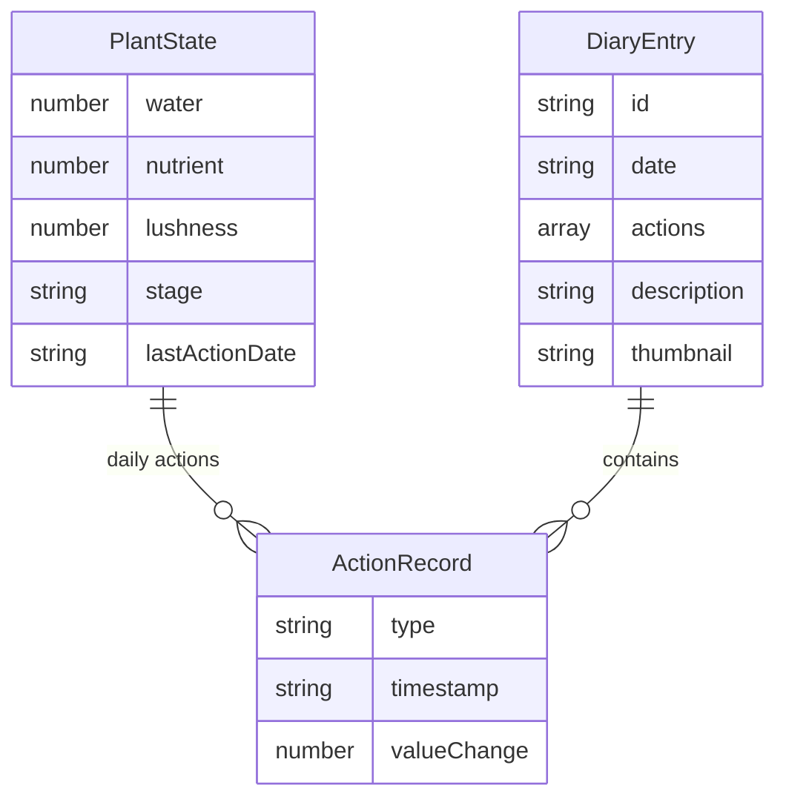

## 1. 架构设计

```mermaid
flowchart TB
    subgraph "前端"
        "App.tsx[主布局与状态管理]"
        "PlantCard.tsx[植物卡片组件]"
        "DiaryList.tsx[日记列表组件]"
        "utils.ts[工具函数]"
    end
    subgraph "数据持久化"
        "localStorage[本地存储]"
    end
    "App.tsx" --> "PlantCard.tsx"
    "App.tsx" --> "DiaryList.tsx"
    "App.tsx" --> "utils.ts"
    "PlantCard.tsx" --> "utils.ts"
    "DiaryList.tsx" --> "utils.ts"
    "utils.ts" --> "localStorage"
```

## 2. 技术说明
- 前端：React@18 + TypeScript + Vite
- 动画库：framer-motion
- 图标库：react-icons
- 状态管理：React useState + localStorage
- 初始化工具：vite-init
- 后端：无
- 数据库：无（localStorage持久化）

## 3. 路由定义
| 路由 | 用途 |
|------|------|
| / | 单页面应用，包含植物卡片和日记列表 |

## 4. API定义
- 不适用（纯前端应用）

## 5. 服务器架构图
- 不适用（无后端）

## 6. 数据模型

### 6.1 数据模型定义



### 6.2 数据定义语言

```typescript
interface PlantState {
  water: number;
  nutrient: number;
  lushness: number;
  beauty: number;
  stage: 'seed' | 'seedling' | 'mature';
  lastActionDate: string;
}

interface ActionRecord {
  type: 'water' | 'fertilize' | 'prune';
  timestamp: number;
  valueChange: number;
}

interface DiaryEntry {
  id: string;
  date: string;
  actions: ActionRecord[];
  description: string;
  thumbnail: string;
}

interface DailyActions {
  date: string;
  actions: ActionRecord[];
}
```
