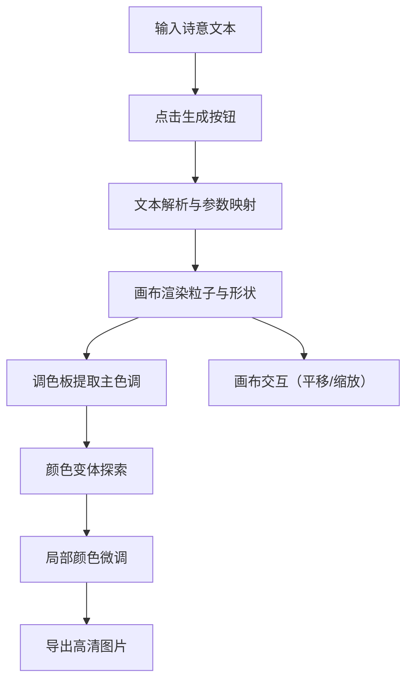

# 诗语微澜 - 产品需求文档

## 1. 产品概述

诗语微澜是一款诗意风格的交互式灵感画布应用，用户输入诗意文本即可动态生成抽象艺术画面，并可进行局部微调和颜色变体探索，最终导出为高清图片。

- 核心价值：将文字意境转化为可视化的抽象艺术，为创作者提供灵感探索工具
- 目标用户：设计师、艺术家、创意工作者、诗歌爱好者

## 2. 核心功能

### 2.1 功能模块

1. **文本输入与解析**：诗意文本输入，智能解析并生成抽象画
2. **画布渲染**：粒子系统、几何形状、渐变效果的动态渲染
3. **画布交互**：鼠标拖拽平移、滚轮缩放、悬停粒子效果
4. **调色板与变体**：颜色提取、HSV微调、随机变体生成
5. **导出与重置**：高清PNG导出、画布重置

### 2.3 页面详情

| 页面名称 | 模块名称 | 功能描述 |
|---------|---------|---------|
| 主画布页 | 控制面板 | 文本输入框、生成按钮、微调滑块、导出按钮、重置按钮 |
| 主画布页 | 画布区域 | 粒子系统渲染、几何形状绘制、平移缩放交互 |
| 主画布页 | 调色板面板 | 主色调展示、HSV颜色微调、随机变体缩略图 |

## 3. 核心流程

用户在左侧控制面板输入诗意文本 → 点击生成按钮 → 系统解析文本并映射为图形参数 → 画布渲染粒子系统与几何形状 → 用户通过调色板探索颜色变体 → 微调局部颜色 → 导出高清PNG图片

## 4. 用户界面设计

### 4.1 设计风格

- **主色调**：深紫蓝色系（#1A1A2E、#16213E、#0F3460）
- **点缀色**：亮红色（#E94560）
- **文字色**：浅灰色（#E0E0E0）
- **按钮样式**：圆角8px，细边框，hover时背景变亮
- **字体**：标题使用 Playfair Display（粗体），正文使用系统无衬线字体
- **布局风格**：左-中-右三栏结构，卡片式组件
- **动画风格**：平滑过渡（0.2s-0.3s ease-out），微交互反馈

### 4.2 页面设计概述

| 页面名称 | 模块名称 | UI元素 |
|---------|---------|--------|
| 主画布页 | 顶部标题 | Playfair Display 字体，#E94560 颜色，fade-in动画 |
| 主画布页 | 左侧控制面板 | 宽280px，#0F3460背景，圆角输入框，滑块，按钮 |
| 主画布页 | 中间画布区 | 2px虚线边框#E94560，hover变实线，占满剩余空间 |
| 主画布页 | 右侧调色板 | 宽280px，渐变背景，色卡卡片，HSV滑块，变体缩略图 |

### 4.3 响应式

- 桌面端（>960px）：左-中-右三栏布局
- 移动端（≤960px）：左右面板折叠为抽屉式，点击图标展开/收起
- 抽屉展开动画：0.3s从边缘滑入
- 触摸操作优化：支持双指缩放、单指拖拽

### 4.4 视觉细节

- 画布背景：深紫蓝色渐变（#1A1A2E 到 #16213E）
- 色卡：20x30px小矩形，圆角4px，hover缩放1.1倍（0.2s）
- 变体缩略图：120x90px，带阴影
- 导出加载：半透明遮罩 + 旋转加载图标
- Toast提示：图片导出成功后显示"图片已保存"
