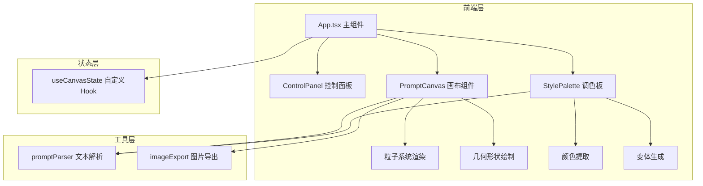

# 诗语微澜 - 技术架构文档

## 1. 架构设计



## 2. 技术描述

- **前端框架**：React 18 + TypeScript
- **构建工具**：Vite 5 + @vitejs/plugin-react
- **动画库**：framer-motion
- **图标库**：react-icons
- **图片导出**：html2canvas
- **状态管理**：自定义Hook（useCanvasState）
- **渲染方式**：Canvas 2D API
- **动画驱动**：requestAnimationFrame

## 3. 文件结构

```
d:\Pro\tasks\auto104\
├── package.json
├── index.html
├── vite.config.ts
├── tsconfig.json
└── src/
    ├── App.tsx
    ├── components/
    │   ├── PromptCanvas.tsx
    │   ├── StylePalette.tsx
    │   └── ControlPanel.tsx
    ├── utils/
    │   ├── promptParser.ts
    │   └── imageExport.ts
    └── hooks/
        └── useCanvasState.ts
```

## 4. 核心数据模型

### 4.1 画布状态

```typescript
interface CanvasState {
  particles: Particle[];
  shapes: Shape[];
  colors: string[];
  transform: { x: number; y: number; scale: number };
  prompt: string;
}
```

### 4.2 粒子数据

```typescript
interface Particle {
  x: number;
  y: number;
  size: number;
  color: string;
  opacity: number;
  velocity: { x: number; y: number };
  jitter: { amplitude: number; period: number };
}
```

### 4.3 形状数据

```typescript
interface Shape {
  type: 'circle' | 'wave' | 'rect';
  x: number;
  y: number;
  width: number;
  height: number;
  color: string;
  gradient?: { start: string; end: string };
}
```

### 4.4 颜色主题

```typescript
interface ColorTheme {
  id: string;
  name: string;
  colors: string[];
}
```

## 5. 核心模块说明

### 5.1 promptParser.ts
- 功能：解析诗意文本，提取关键词，映射到图形参数
- 输出：粒子参数、形状参数、颜色主题、运动强度

### 5.2 useCanvasState.ts
- 功能：管理画布全局状态，动画循环控制
- 方法：生成画面、更新颜色、重置画布、应用变体

### 5.3 PromptCanvas.tsx
- 功能：Canvas渲染，粒子动画，交互处理
- 交互：拖拽平移、滚轮缩放、悬停粒子效果

### 5.4 StylePalette.tsx
- 功能：展示主色调，HSV微调，随机变体生成
- 交互：色卡选择、颜色调整、变体应用

### 5.5 ControlPanel.tsx
- 功能：文本输入、参数微调、导出重置
- 交互：生成按钮、密度/速度滑块、导出按钮、重置按钮

### 5.6 imageExport.ts
- 功能：使用html2canvas导出高清PNG
- 参数：1920x1080分辨率，背景色#1A1A2E

## 6. 性能优化策略

- 粒子数量限制在300-500个
- 使用requestAnimationFrame驱动动画
- 离屏canvas预渲染静态元素
- 颜色提取使用量化算法，避免逐像素遍历
- 响应式重绘使用节流
