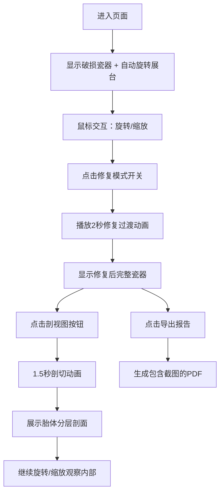

## 1. 产品概述

古董瓷器修复3D对比可视化工具，为文物修复师和博物馆策展人提供直观、可交互的瓷器修复效果展示方案。解决传统展示手段无法在单一视图中同步观察器物外部纹饰与内部胎体结构的问题，提升公众对文物修复工艺的理解与欣赏。

- **目标用户**：文物修复师、博物馆策展人、文博教育工作者
- **核心价值**：通过3D交互可视化技术，生动展示文物修复前后的对比效果，支持内部结构剖切观察
- **应用场景**：博物馆展厅互动展示、修复工作室成果展示、文博教育科普

## 2. 核心特性

### 2.1 用户角色

| 角色 | 使用场景 | 核心需求 |
|------|----------|----------|
| 文物修复师 | 修复成果展示、修复方案演示 | 精确的破损与修复对比、内部结构展示 |
| 博物馆策展人 | 展厅互动展项、公众教育 | 美观的展示效果、易用的交互方式 |
| 公众参观者 | 博物馆互动体验 | 直观的视觉效果、有趣的交互体验 |

### 2.2 功能模块

1. **3D瓷器展示**：破损与修复两种状态的康熙青花瓷碗3D模型
2. **交互控制**：鼠标旋转、缩放、剖切视图切换
3. **修复过渡动画**：破损到修复的平滑过渡动画效果
4. **属性信息面板**：文物基本信息、破损详情、修复材料说明
5. **剖切视图**：沿Y轴剖切展示胎体分层结构
6. **导出报告**：生成包含截图和修复参数的PDF报告

### 2.3 页面详情

| 页面名称 | 模块名称 | 功能描述 |
|----------|----------|----------|
| 主页面 | 3D场景画布 | 展示3D瓷器模型，支持旋转、缩放交互 |
| 主页面 | 属性面板 | 显示文物信息、破损类型、修复材料，提供剖切和导出按钮 |
| 主页面 | 展台底座 | 淡金色环形展台，缓慢自动旋转 |
| 主页面 | 修复模式开关 | 切换破损/修复状态，触发过渡动画 |

## 3. 核心流程

### 3.1 用户操作流程

用户进入页面后，看到破损状态的青花瓷碗在展台上缓慢旋转。用户可以通过鼠标拖拽旋转视角、滚轮缩放观察。点击"修复模式"开关，瓷器播放2秒修复过渡动画，显示修复后的完整外观。点击"剖视图"按钮，瓷器沿Y轴平滑切开，展示内部胎体分层结构，用户可继续旋转缩放观察内部。右上角属性面板实时显示当前状态的文物信息，点击"导出报告"可生成PDF。

## 4. 用户界面设计

### 4.1 设计风格

- **整体风格**：博物馆典雅风格，深灰色调衬托器物，庄重而精致
- **主色调**：深灰 #1A1A1A（背景）、暖黄 #FFF3E0（射灯中心）
- **点缀色**：青花蓝 #0A3A75 / #1A5BB5、淡金 #D4AF37
- **面板色**：半透明白色 rgba(255,255,255,0.85)
- **按钮样式**：圆角设计，悬停时透明度变化，点击涟漪效果
- **字体**：典雅的中文衬线字体配合现代无衬线字体
- **动效**：0.3秒ease-out缓动，平滑过渡

### 4.2 页面设计概览

| 模块名称 | UI元素 | 设计要点 |
|----------|--------|----------|
| 3D场景 | 瓷碗模型、环形展台、径向渐变背景 | 中心聚光效果，器物为视觉焦点 |
| 属性面板 | 标题区、信息区、开关按钮、功能按钮 | 右上角悬浮，半透明玻璃质感，圆角12px |
| 修复开关 | 滑动开关 + 文字标签 | 开关切换颜色变化，平滑过渡动画 |
| 剖切按钮 | 图标 + 文字 | 悬停效果，点击涟漪反馈 |
| 导出按钮 | 主按钮样式 | 底部突出显示，悬停高亮 |

### 4.3 响应式设计

- **桌面优先**：以1920x1080为基准设计，兼顾1366x768
- **窄屏适配**：面板在窄屏时自动折叠到边缘，变为可展开图标按钮
- **触控支持**：支持触摸旋转和缩放手势

### 4.4 3D场景指引

- **环境**：径向渐变背景，中心暖黄向边缘深灰过渡，模拟展厅射灯
- **光照**：主光源模拟射灯从上方照射，辅以环境光和补光，突出青花色泽
- **相机**：透视相机，默认距离约30cm，以碗心为中心点
- **材质**：瓷器使用物理材质，釉面有温润的反光效果，修复区域有微弱镜面反光
- **动画**：修复过渡2秒（颜色渐变 + 碎片聚拢），剖切动画1.5秒
- **性能**：60FPS，模型顶点数≤15000，纹理分辨率≤2048x2048
