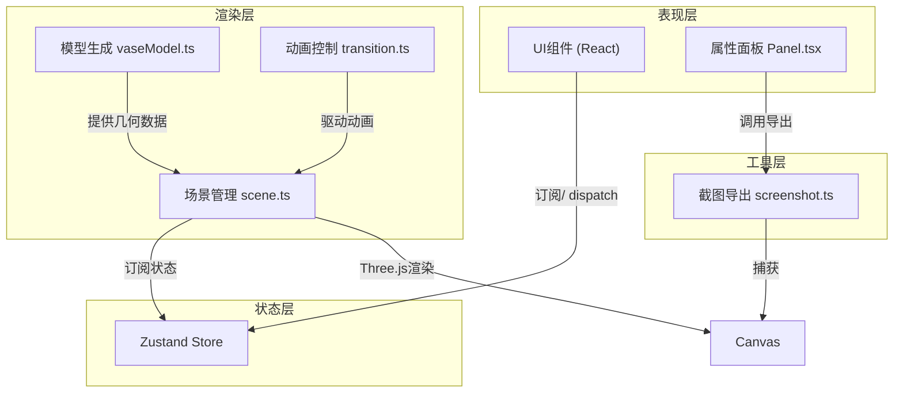

## 1. 架构设计

本项目为纯前端3D可视化应用，采用React + Three.js技术栈，通过zustand管理全局状态，模块化解耦3D渲染、动画控制和UI交互。



## 2. 技术选型

| 类别 | 技术 | 说明 |
|------|------|------|
| 框架 | React 18 + TypeScript | 组件化开发，类型安全 |
| 构建工具 | Vite | 快速开发构建 |
| 3D引擎 | Three.js | WebGL 3D渲染 |
| React绑定 | @react-three/fiber + @react-three/drei | Three.js的React声明式写法 |
| 状态管理 | zustand + immer | 轻量状态管理，支持不可变更新 |
| 截图导出 | html2canvas | Canvas内容捕获 |
| 样式 | 原生CSS + CSS变量 | 轻量灵活，支持主题定制 |

## 3. 目录结构

```
src/
├── scene/
│   └── scene.ts          # 场景初始化、相机控制、光照、展台
├── models/
│   └── vaseModel.ts      # 瓷碗3D模型生成、破损/修复几何、剖切片
├── animation/
│   └── transition.ts     # 修复过渡动画、剖切动画、视角切换
├── ui/
│   └── Panel.tsx         # 属性面板UI组件
├── screenshot/
│   └── screenshot.ts     # 截图和PDF导出功能
├── store/
│   └── useStore.ts       # 全局状态管理
├── App.tsx               # 应用入口组件
├── main.tsx              # React入口
└── index.css             # 全局样式
```

## 4. 状态管理设计

### 4.1 Store 状态定义

```typescript
interface AppState {
  // 视图模式
  mode: 'damaged' | 'repaired';
  repairProgress: number; // 0-1 修复动画进度
  
  // 剖切状态
  isCutaway: boolean;
  cutawayProgress: number; // 0-1 剖切动画进度
  
  // 相机视角
  cameraDistance: number;
  cameraRotationX: number;
  cameraRotationY: number;
  
  // 展台
  platformRotation: number;
  isUserInteracting: boolean;
  
  // 面板
  isPanelCollapsed: boolean;
  
  // Actions
  toggleRepairMode: () => void;
  toggleCutaway: () => void;
  setCameraDistance: (d: number) => void;
  setCameraRotation: (x: number, y: number) => void;
  setUserInteracting: (v: boolean) => void;
  togglePanel: () => void;
  exportReport: () => void;
}
```

## 5. 核心模块设计

### 5.1 模型生成 (vaseModel.ts)

- 使用 Three.js `LatheGeometry` 生成碗的基础旋转几何体
- 通过修改顶点位置实现：碗沿缺口、冲线裂纹、局部釉面剥落
- 生成两套UV：破损版和修复版，青花纹饰通过程序化纹理生成
- 剖切几何：沿Y轴切割，生成切面网格，展示三层胎体结构
- 顶点数控制在15000以内

### 5.2 动画系统 (transition.ts)

- 修复动画（2秒）：
  - 缺口碎片从散开位置聚拢归位
  - 冲线裂纹颜色渐隐
  - 补釉区域反光强度渐变
- 剖切动画（1.5秒）：
  - 碗的两半沿X轴反向平移展开
  - 切面渐显
  - 相机自动旋转使切面朝向用户
- 使用 requestAnimationFrame + 自定义缓动函数实现

### 5.3 场景管理 (scene.ts)

- 初始化：场景、相机、渲染器、光照系统
- 展台：环形几何体，自动旋转（0.02rad/s），用户交互时暂停
- 相机控制：OrbitControls自定义封装，支持阻尼旋转、滚轮缩放
- 背景：ShaderMaterial实现径向渐变
- 性能优化：几何体合并、纹理Atlas、LOD策略

### 5.4 属性面板 (Panel.tsx)

- 悬浮式面板，右上角定位
- 显示文物名称、年代、尺寸、破损/修复信息
- 修复模式开关（Toggle Switch）
- 剖视图按钮
- 导出报告按钮
- 窄屏时折叠为侧边图标

### 5.5 截图导出 (screenshot.ts)

- 使用 html2canvas 或直接读取WebGL画布像素
- 生成包含当前视角截图的报告
- 叠加文物信息和修复参数文本

## 6. 性能优化策略

- **几何体优化**：合理控制细分精度，使用IndexedGeometry
- **材质优化**：复用材质实例，使用InstancedMesh处理重复元素
- **纹理优化**：程序化生成纹理，分辨率≤2048，使用Mipmap
- **动画优化**：仅在动画期间更新矩阵，静态物体关闭矩阵自动更新
- **渲染优化**：启用抗锯齿，合理设置像素比，使用阴影贴图优化
