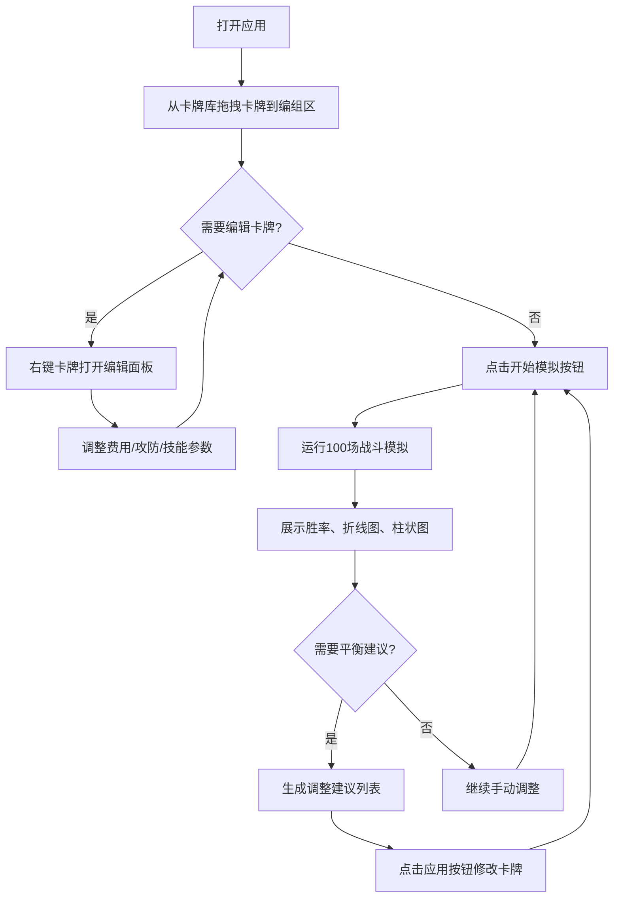

## 1. 产品概述
Roguelike卡牌游戏技能组合与数值平衡沙盒，帮助独立游戏团队快速验证不同技能组合与数值平衡的可行性，替代手动填表的低效工作流程。

- 核心目的：提供卡牌编辑、技能组合配置、自动战斗模拟、数值统计可视化与平衡建议的一站式工具
- 目标用户：独立游戏设计师、数值策划

## 2. 核心功能

### 2.1 功能模块

1. **卡牌编辑器模块**：卡牌库浏览、拖拽编组、右键编辑面板
2. **技能效果系统**：5种基础技能效果、数值参数调整、技能图标展示
3. **战斗模拟模块**：双卡组配置、100场自动战斗模拟、AI出牌策略
4. **数值统计可视化**：胜率累积折线图、卡组属性对比柱状图、关键指标展示
5. **平衡建议系统**：自动生成平衡调整建议、一键应用修改

### 2.2 页面详情

| 页面名称 | 模块名称 | 功能描述 |
|-----------|-------------|---------------------|
| 主界面 | 卡牌库区域 | 左侧30%宽度，展示所有可用卡牌，支持拖拽 |
| 主界面 | 卡组编组区域 | 右侧上半部分，展示两组卡组（每组最多10张），支持拖放删除和右键编辑 |
| 主界面 | 战斗结果区域 | 右侧下半部分，胜率大字显示、统计图表、平衡建议列表 |
| 主界面 | 编辑面板浮层 | 右键点击卡牌弹出，动画展开，可调整费用/攻防/技能 |

## 3. 核心流程

用户从卡牌库拖拽卡牌到两组卡组中 → 右键编辑卡牌数值和技能 → 点击开始模拟 → 系统运行100场战斗并统计 → 展示胜率、图表和平衡建议 → 用户可一键应用建议或手动继续调整

## 4. 用户界面设计

### 4.1 设计风格
- **主色调**：深色主题，背景#1E1E2E，卡片区域#282840，文字#E0E0E0
- **强调色**：蓝色#3498DB（左方卡组）、红色#E74C3C（右方卡组）、橙色#F39C12（平衡建议）、绿色#27AE60（应用按钮）
- **按钮风格**：圆角8px，0.2s ease-out过渡，悬停/点击状态颜色变化
- **字体**：现代无衬线字体，层次分明（标题18px加粗、正文14px、注释12px）
- **布局风格**：左右分栏（左侧卡牌库30%，右侧编组+结果70%），可拖拽分割线
- **图标风格**：react-icons，简洁线性风格

### 4.2 页面设计概述

| 页面名称 | 模块名称 | UI元素 |
|-----------|-------------|-------------|
| 主界面 | 卡牌库 | 滚动卡片网格，每张卡片120x170px，圆角12px，浅灰背景 |
| 主界面 | 编组区 | 两组卡组横向排列，每张卡牌可拖拽删除 |
| 主界面 | 编辑面板 | 从卡牌位置向上滑出动画0.3s ease-out，数值滑块+技能下拉 |
| 主界面 | 战斗结果 | 48px加粗渐变色胜率数字、recharts折线图/柱状图带0.5s渐入 |
| 主界面 | 加载状态 | 白色环形旋转指示器，周期1s |

### 4.3 响应式
- Desktop-first，左侧卡牌库30% / 右侧70%
- 移动端（<768px）自动切换为上下布局
- 移动端编组区变为横向滚动卡片列表
- 拖拽分割线仅在桌面端可用

### 4.4 动效设计
- 所有按钮和卡片交互：0.2s ease-out过渡
- 编辑面板展开：从卡牌位置向上展开，0.3s ease-out
- 图表数据更新：0.5s透明度渐入动画
- 模拟加载：白色环形旋转，1s周期
