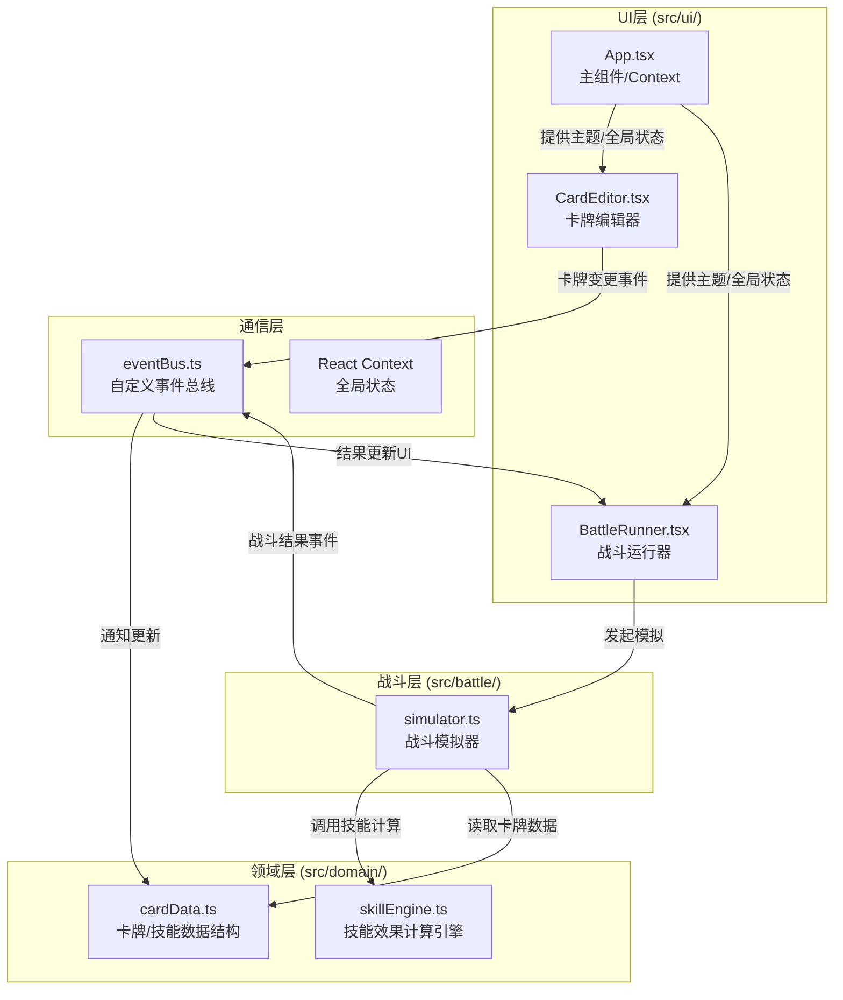
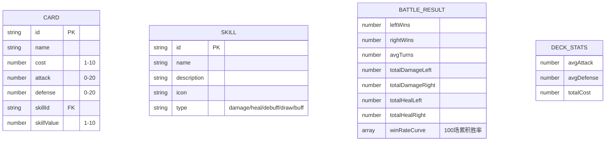

## 1. 架构设计



## 2. 技术描述

- **前端框架**：React@18 + TypeScript@5
- **构建工具**：Vite@5 + @vitejs/plugin-react
- **状态管理**：React Context + 自定义事件总线（EventBus）
- **图标库**：react-icons（Lucide风格）
- **动画库**：framer-motion
- **图表库**：recharts
- **性能优化**：setTimeout分片 + requestAnimationFrame（替代Web Worker简化实现，保证100场<1s）

## 3. 文件结构与调用关系

```
src/
├── domain/
│   ├── cardData.ts       # 定义Card/Skill类型、默认卡牌库数据
│   │                       # 被：skillEngine.ts、simulator.ts、CardEditor.tsx 读取
│   │                       # 流向：提供基础数据 → 编辑器/模拟器
│   └── skillEngine.ts    # 技能效果解析与计算
│                           # 接收：卡牌配置 + 战斗状态
│                           # 返回：效果计算结果
│                           # 被：simulator.ts 调用
├── battle/
│   └── simulator.ts      # 回合制战斗模拟器
│                           # 接收：两组卡组配置
│                           # 执行：100场模拟（分片异步）
│                           # 输出：胜率/回合数/伤害等统计
│                           # 调用：skillEngine.ts
│                           # 通知：通过eventBus发送结果
├── ui/
│   ├── CardEditor.tsx    # 卡牌编辑器（拖拽+编辑面板）
│   │                       # 订阅：eventBus的卡牌更新事件
│   │                       # 发布：卡牌修改事件
│   └── BattleRunner.tsx  # 战斗运行与可视化
│                           # 订阅：eventBus的战斗结果事件
│                           # 触发：simulator.start()
├── eventBus.ts           # 自定义事件总线
│                           # 事件类型：CARD_UPDATED / BATTLE_START / BATTLE_PROGRESS / BATTLE_COMPLETE
└── App.tsx               # 主组件，组合子组件，管理主题与全局Context
```

## 4. 数据模型

### 4.1 数据模型定义



### 4.2 核心类型定义（TypeScript）

```typescript
// 技能类型
type SkillType = 'extra_damage' | 'heal' | 'attack_halve' | 'draw' | 'double_attack';

interface Skill {
  id: string;
  name: string;
  description: string;
  icon: string;
  type: SkillType;
}

// 卡牌
interface Card {
  id: string;
  name: string;
  cost: number;     // 1-10
  attack: number;   // 0-20
  defense: number;  // 0-20
  skillId: string | null;
  skillValue: number; // 1-10
}

// 卡组
type Deck = Card[]; // 最多10张

// 战斗状态
interface BattleState {
  leftHp: number;
  rightHp: number;
  leftHand: Card[];
  rightHand: Card[];
  leftDeck: Card[];
  rightDeck: Card[];
  leftMana: number;
  rightMana: number;
  turn: 'left' | 'right';
  turnCount: number;
  rightAttackHalved: boolean;
  leftAttackHalved: boolean;
  leftDoubleAttack: boolean;
  rightDoubleAttack: boolean;
}

// 战斗结果
interface BattleResult {
  leftWins: number;
  rightWins: number;
  avgTurns: number;
  totalDamageLeft: number;
  totalDamageRight: number;
  totalHealLeft: number;
  totalHealRight: number;
  winRateCurve: number[]; // 长度100
  leftDeckStats: DeckStats;
  rightDeckStats: DeckStats;
}

interface DeckStats {
  avgAttack: number;
  avgDefense: number;
  totalCost: number;
}

// 平衡建议
interface BalanceSuggestion {
  cardId: string;
  deckSide: 'left' | 'right';
  field: 'cost' | 'attack' | 'defense' | 'skillValue';
  from: number;
  to: number;
  reason: string;
}
```

## 5. 事件总线定义

```typescript
// 事件类型枚举
enum EventType {
  CARD_UPDATED = 'card:updated',       // 卡牌数据变更
  BATTLE_START = 'battle:start',        // 开始模拟
  BATTLE_PROGRESS = 'battle:progress',  // 模拟进度
  BATTLE_COMPLETE = 'battle:complete',  // 模拟完成
  SUGGESTION_APPLY = 'suggestion:apply' // 应用平衡建议
}
```
