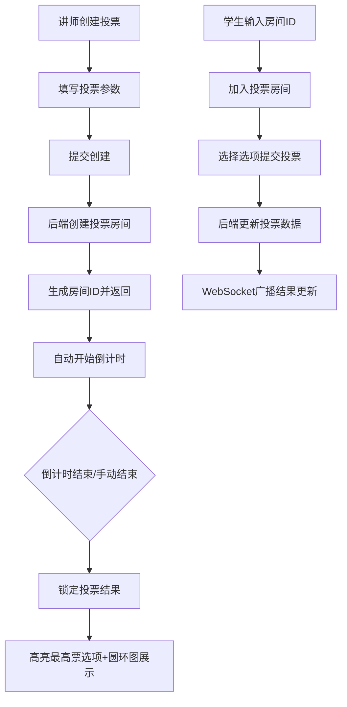

## 1. 产品概述

实时课堂投票系统是一款面向在线教育场景的互动工具，解决传统课堂中学生参与度低、教学反馈延迟的痛点问题。讲师可快速发起实时投票，学生即时参与，结果以可视化图表实时呈现，大幅提升课堂互动性和教学效果。

## 2. 核心功能

### 2.1 用户角色

| 角色 | 说明 | 核心权限 |
|------|------|----------|
| 讲师 | 发起投票、管理投票的用户 | 创建投票、设置投票参数、手动结束投票、查看实时结果 |
| 学生 | 参与投票的用户 | 通过房间ID加入投票、提交选项、查看实时结果 |

### 2.2 功能模块

1. **创建投票模块**：讲师填写投票标题、选项列表（2-6个）、投票时长（10-300秒）
2. **投票房间模块**：学生通过房间ID加入，显示投票题目、选项、实时结果、倒计时
3. **实时结果展示模块**：柱状图展示得票数和百分比，动画过渡更新
4. **投票结束模块**：结果锁定、高亮最高票选项、百分比圆环图展示
5. **投票列表模块**：多轮投票管理，按创建时间倒序，状态标签展示

### 2.3 页面详情

| 页面名称 | 模块名称 | 功能描述 |
|----------|----------|----------|
| 主页面 | 投票列表 | 网格布局展示所有投票，桌面4列、平板2列、手机1列 |
| 主页面 | 创建投票表单 | 讲师输入标题、选项、时长，校验后提交创建 |
| 投票详情页 | 投票信息展示 | 显示投票标题、选项列表、剩余倒计时、参与人数 |
| 投票详情页 | 实时结果图表 | 柱状图展示实时投票数据，0.5s平滑过渡动画 |
| 投票详情页 | 投票操作区 | 学生选择选项提交，提交后禁用并显示"已投票" |
| 投票详情页 | 结束结果展示 | 锁定结果，金色边框高亮最高票，圆环图展示占比 |

## 3. 核心流程

### 3.1 讲师创建投票流程
讲师打开主页面 → 点击"创建投票" → 填写标题、添加选项（2-6个）→ 设置投票时长（10-300秒）→ 提交表单 → 后端创建投票房间并返回房间ID → 自动开始倒计时 → 投票出现在列表中（绿色"进行中"标签）

### 3.2 学生参与投票流程
学生获取房间ID → 点击加入投票 → 输入房间ID进入投票房间 → 阅读投票题目 → 选择一个选项 → 点击提交投票 → 按钮变为不可用状态，显示"已投票" → 查看实时更新的投票结果

### 3.3 投票结束流程
倒计时归零或讲师手动点击结束 → 投票状态变为"已结束" → 结果页面锁定，不可再投票 → 高亮显示得票最高的选项（金色边框+缩放动画）→ 展示每项得票占比的圆环图

## 4. 用户界面设计

### 4.1 设计风格
- **主背景色**：#1a1a2e（深蓝紫深色背景）
- **卡片背景色**：#16213e（稍浅的深色卡片）
- **强调色**：#e94560（珊瑚红，品牌主色调）
- **渐变按钮**：#e94560 → #ff6b6b（线性渐变）
- **卡片样式**：圆角12px，阴影 box-shadow: 0 4px 20px rgba(0,0,0,0.3)
- **字体风格**：标题白色加粗，正文浅灰色，使用现代无衬线字体
- **按钮交互**：悬停放大 transform: scale(1.05)，过渡时间0.2s
- **状态标签**：进行中-绿色标签，已结束-灰色标签

### 4.2 页面设计概述

| 页面名称 | 模块名称 | UI元素 |
|----------|----------|--------|
| 主页面 | 顶部导航 | Logo、标题、创建投票按钮 |
| 主页面 | 投票列表网格 | 响应式网格：桌面4列/平板2列/手机1列 |
| 主页面 | 投票卡片 | 圆角卡片、状态标签、标题、房间ID、创建时间 |
| 创建投票弹窗 | 表单区域 | 标题输入框、选项列表（动态增减）、时长滑块/输入框 |
| 投票详情页 | 头部区域 | 投票标题、状态标签、房间ID、倒计时显示 |
| 投票详情页 | 选项列表 | 选项按钮卡片，选中/已投票状态区分 |
| 投票详情页 | 柱状图区域 | 渐变填充柱状图，得票数和百分比标签，0.5s过渡动画 |
| 投票详情页 | 统计信息 | 总参与人数、剩余倒计时、讲师操作按钮 |
| 投票结束页 | 结果展示 | 金色边框高亮最高票选项，缩放动画效果 |
| 投票结束页 | 圆环图 | SVG绘制的百分比圆环图，入场旋转动画1s |

### 4.3 响应式设计
- **设计策略**：桌面端优先，移动端适配
- **断点设置**：
  - 桌面端：≥1280px，投票列表4列网格
  - 平板端：768px - 1279px，投票列表2列网格
  - 手机端：<768px，投票列表1列网格，全屏展示
- **触摸优化**：按钮最小尺寸44×44px，增大触控区域，选项卡片间距适配手指点击

### 4.4 动画与交互细节
- **柱状图更新**：高度变化0.5s cubic-bezier(0.4, 0, 0.2, 1)平滑过渡
- **投票提交反馈**：按钮缩放动画 + Toast提示（2秒自动消失）
- **最高票高亮**：金色边框脉冲动画 + 1.02缩放效果
- **圆环图入场**：stroke-dasharray从0到目标值的旋转动画，持续1秒
- **页面切换**：淡入淡出过渡，300ms
- **卡片悬浮**：轻微上浮 + 阴影加深，过渡0.2s
