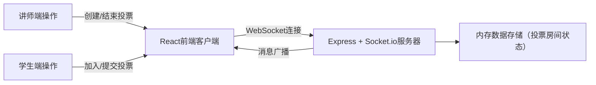
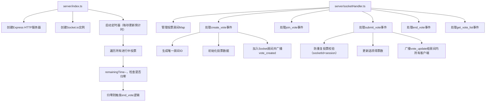

## 1. 架构设计



## 2. 技术选型说明

- **前端框架**：React 18 + TypeScript（严格模式）
- **构建工具**：Vite 5 + @vitejs/plugin-react
- **实时通信**：socket.io-client（前端WebSocket客户端）
- **状态管理**：React Hooks + 自定义useWebSocket Hook
- **UI样式**：原生CSS Modules（无额外UI框架，遵循用户指定的设计规范）
- **图表实现**：原生SVG + CSS动画（柱状图、圆环图，无第三方图表库）
- **后端框架**：Express 4 + Socket.io 4
- **后端运行**：ts-node（直接运行TypeScript代码）
- **数据存储**：内存存储（Map管理投票房间状态，单实例部署）
- **并发支持**：单Node.js实例支持最多50个并发投票房间

## 3. 路由定义（前端页面路由）

| 路由路径 | 页面组件 | 用途说明 |
|----------|----------|----------|
| `/` | HomePage | 主页面：投票列表 + 创建投票入口 |
| `/vote/:roomId` | VoteRoomPage | 投票房间详情页：展示投票、提交投票、查看结果 |

## 4. WebSocket事件定义（前后端通信协议）

### 4.1 客户端 → 服务端事件

| 事件名称 | 数据结构 | 功能描述 |
|----------|----------|----------|
| `create_vote` | `{ title: string; options: string[]; duration: number }` | 讲师创建新投票，duration单位：秒 |
| `join_vote` | `{ roomId: string }` | 学生通过房间ID加入投票 |
| `submit_vote` | `{ roomId: string; optionIndex: number }` | 学生提交投票选择 |
| `end_vote` | `{ roomId: string }` | 讲师手动结束投票 |
| `get_vote_list` | 无参数 | 获取所有投票列表（按创建时间倒序） |

### 4.2 服务端 → 客户端事件

| 事件名称 | 数据结构 | 功能描述 |
|----------|----------|----------|
| `vote_created` | `{ roomId: string; vote: VoteData }` | 投票创建成功，返回房间ID和投票数据 |
| `vote_joined` | `{ vote: VoteData; voted: boolean }` | 加入投票成功，返回投票数据和是否已投票标记 |
| `vote_update` | `{ vote: VoteData }` | 投票数据更新（有人提交后广播） |
| `vote_ended` | `{ vote: VoteData }` | 投票结束（倒计时归零或手动结束） |
| `vote_list` | `{ votes: VoteData[] }` | 返回投票列表数据 |
| `error` | `{ message: string }` | 操作错误提示 |
| `toast` | `{ message: string; type: 'success' \| 'error' \| 'info' }` | Toast提示消息 |

### 4.3 核心数据类型定义

```typescript
interface VoteOption {
  index: number;
  text: string;
  votes: number;
}

interface VoteData {
  roomId: string;
  title: string;
  options: VoteOption[];
  duration: number;
  remainingTime: number;
  totalVotes: number;
  status: 'active' | 'ended';
  createdAt: number;
  winnerIndex: number | null;
}

interface VoteRecord {
  roomId: string;
  socketId: string;
  optionIndex: number;
  timestamp: number;
}
```

## 5. 后端模块架构



### 5.1 后端模块职责

| 文件路径 | 职责说明 |
|----------|----------|
| `server/index.ts` | Express服务器入口：创建HTTP服务、挂载Socket.io、启动全局倒计时定时器（每秒执行一次）、监听端口 |
| `server/socketHandler.ts` | WebSocket事件处理器：定义所有socket事件监听、维护投票房间Map、实现防重复投票逻辑、执行投票状态更新、广播消息 |

## 6. 前端组件架构

### 6.1 目录结构

```
src/
├── main.tsx                 # 应用入口，渲染根组件
├── App.tsx                  # 根组件，路由配置
├── hooks/
│   └── useWebSocket.ts      # WebSocket连接封装Hook
├── components/
│   ├── CreateVote.tsx       # 创建投票表单组件
│   ├── VoteRoom.tsx         # 投票房间主组件
│   ├── VoteCard.tsx         # 投票列表卡片组件
│   ├── VoteList.tsx         # 投票列表容器组件
│   ├── BarChart.tsx         # 柱状图组件（SVG实现）
│   ├── DonutChart.tsx       # 圆环图组件（SVG实现）
│   ├── Toast.tsx            # Toast提示组件
│   └── CountdownTimer.tsx   # 倒计时显示组件
├── types/
│   └── index.ts             # 共享TypeScript类型定义
└── styles/
    └── global.css           # 全局样式
```

### 6.2 核心组件职责

| 组件名称 | 核心职责 |
|----------|----------|
| `useWebSocket.ts` | 封装Socket.io连接管理，提供连接状态、消息监听、发送消息方法，自动重连 |
| `CreateVote.tsx` | 表单验证（选项2-6个、时长10-300秒）、动态增减选项、提交创建投票 |
| `VoteRoom.tsx` | 投票房间主容器：管理投票状态、倒计时显示、选项交互、结果图表切换展示 |
| `BarChart.tsx` | 渲染渐变柱状图，展示得票数和百分比，高度变化带0.5s平滑过渡动画 |
| `DonutChart.tsx` | SVG绘制百分比圆环，stroke-dasharray实现入场旋转动画（1s从0到360度） |
| `VoteList.tsx` | 响应式CSS Grid布局，按创建时间倒序渲染投票卡片，状态标签展示 |

## 7. 性能优化与约束

### 7.1 WebSocket性能
- 消息延迟控制：后端处理逻辑<50ms，总端到端延迟<100ms
- 结果推送频率：投票提交后立即推送，保底每秒推送一次全量状态（用于倒计时同步）
- 房间隔离：使用Socket.io房间机制，消息仅广播给对应房间客户端

### 7.2 并发约束
- 最大并发房间数：50个（超出返回错误提示）
- 每房间最大连接数：200个（单教室规模）
- 投票记录校验：基于socketId + sessionStorage双重防重复

### 7.3 前端性能
- 图表更新：使用CSS transition而非JS动画，GPU加速渲染
- 状态更新：局部组件重渲染，避免全页面刷新
- 内存管理：投票列表虚拟滚动（如需），长时间运行页面无内存泄漏

### 7.4 启动方式

```bash
# 安装依赖
npm install

# 启动后端（在server目录执行）
cd server && npx ts-node index.ts

# 启动前端（项目根目录执行）
npm run dev

# 或使用npm run dev同时启动前后端（concurrently配置）
```
