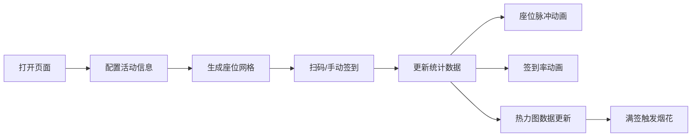

## 1. 产品概述

线下活动实时签到与热力分布可视化系统，帮助活动组织者在现场快速完成参与者签到，并实时展示座位区域的热力分布情况。
- 核心目标：简化签到流程，提供直观的座位热度可视化，辅助现场管理决策
- 目标用户：线下活动组织者、现场工作人员

## 2. 核心功能

### 2.1 功能模块

1. **活动配置模块**：配置活动名称、日期、座位区域网格
2. **座位签到模块**：Canvas绘制座位网格，支持扫码签到和手动点击签到
3. **实时统计面板**：展示签到人数、签到率、预估排队时长
4. **热力图可视化模块**：独立弹窗展示座位区域热力分布，支持自动刷新

### 2.2 页面详情

| 页面名称 | 模块名称 | 功能描述 |
|-----------|-------------|---------------------|
| 主页面 | 顶部导航栏 | 深蓝色渐变，展示活动名称、热力图入口按钮 |
| 主页面 | 活动配置区 | 输入活动名称、日期，设置座位行列数 |
| 主页面 | 座位区域图 | Canvas绘制座位网格，点击手动签到，脉冲动画、金色波纹特效 |
| 主页面 | 实时统计面板 | 已签到人数、总人数、签到率、预估排队时长，满签烟花特效 |
| 热力图弹窗 | 热力图展示 | Canvas 2D绘制座位热度渐变图，15秒自动刷新，手动刷新按钮 |

## 3. 核心流程

组织者打开页面 → 配置活动信息和座位网格 → 展示座位签到界面 → 扫码/手动签到 → 实时更新统计数据 → 查看热力图分布

## 4. 用户界面设计

### 4.1 设计风格

- **主色调**：浅色主题，主背景 #FAFAFA，卡片背景 #FFFFFF
- **导航栏**：深蓝色渐变 #1A237E → #283593
- **座位颜色**：未签到浅蓝 #E3F2FD，已签到翠绿渐变 #4CAF50 → #81C784
- **热力图颜色**：密集区域深红 #D32F2F 到橙黄 #FFC107，稀疏区域蓝色 #2196F3
- **按钮**：圆角 8px，按下缩放 0.95 倍 0.1s 动画
- **卡片**：圆角 12px，阴影 4px rgba(0,0,0,0.06)

### 4.2 动画效果

- 签到脉冲：座位从 1.0 → 1.1 → 1.0，0.3 秒
- 手动签到波纹：金色 #F4D03F 环形扩散，半径 30px，0.8 秒消失
- 统计面板边框：签到率 80% 时金色渐变从左到右循环动画
- 满签烟花：最多 80 个随机粒子，12 色预设，持续 3 秒
- 热力图刷新：半透明遮罩 #00000010 淡入 0.2s 再淡出
- 热力图图标：签到率 > 30% 从灰色 #9E9E9E 变为暖橙色 #FF9800

### 4.3 响应式设计

- 桌面端：左侧座位图 + 右侧统计面板双列布局
- 移动端（<768px）：纵向单列布局，热力图弹窗全屏显示

### 4.4 性能要求

- 实时签到数据更新频率 ≥ 1 次/秒
- 热力图渲染时间 ≤ 30 毫秒
