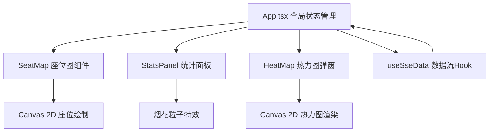

## 1. 架构设计



## 2. 技术描述

- **前端框架**：React 18 + TypeScript 5
- **构建工具**：Vite 5
- **动画库**：framer-motion
- **图标库**：react-icons
- **状态管理**：React useState/useReducer（组件内部状态）
- **数据流**：自定义 useSseData Hook 模拟 SSE 实时推送

## 3. 文件结构

```
src/
├── App.tsx                 # 主组件，全局状态管理
├── components/
│   ├── SeatMap.tsx         # 座位区域图（Canvas绘制、签到交互、动画）
│   ├── StatsPanel.tsx      # 统计面板（数据展示、烟花特效）
│   └── HeatMap.tsx         # 热力图弹窗（Canvas渲染、刷新逻辑）
├── hooks/
│   └── useSseData.ts       # 模拟实时签到数据流
└── styles/
    └── global.css          # 全局样式、主题变量、响应式
```

## 4. 数据模型

### 4.1 座位数据类型

```typescript
interface Seat {
  id: string;
  row: number;
  col: number;
  checkedIn: boolean;
  checkInTime?: number;
}
```

### 4.2 活动配置类型

```typescript
interface ActivityConfig {
  name: string;
  date: string;
  rows: number;
  cols: number;
}
```

### 4.3 统计数据类型

```typescript
interface StatsData {
  totalSeats: number;
  checkedInCount: number;
  checkInRate: number;
  recentSpeed: number; // 人/分钟
  estimatedWaitTime: number; // 分钟
}
```

## 5. 性能优化策略

- Canvas 批量绘制座位，避免频繁 DOM 操作
- 热力图使用离屏 Canvas 预渲染
- requestAnimationFrame 优化动画帧率
- useSseData 使用节流控制数据推送频率
- 组件 memo 化避免不必要的重渲染
