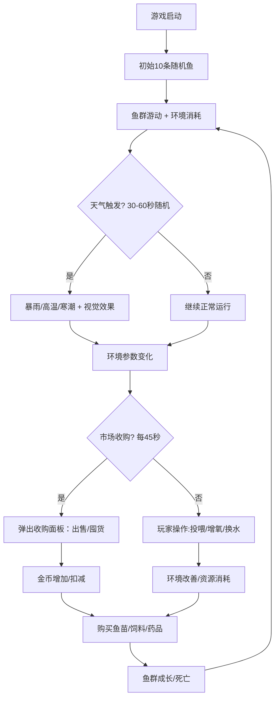

## 1. 产品概述
微型像素风渔场经营与海洋生态模拟游戏，玩家管理2D像素渔场，饲养多种鱼种，应对随机天气事件，通过市场交易获得收益。
- 主要目的：提供休闲经营+生态模拟的双重玩法，让玩家体验渔场管理的乐趣
- 目标用户：休闲游戏爱好者、像素风格玩家、模拟经营类用户

## 2. 核心功能

### 2.1 功能模块

1. **渔场主界面**：像素风鱼塘视图、鱼群动态游动、环境参数实时显示
2. **操作系统**：投喂、增氧、换水三种核心操作，带CD动画冷却
3. **鱼种养殖系统**：4种鱼种（草鱼、鲤鱼、鲈鱼、小龙虾），3阶段生长（小→中→大），死亡机制
4. **天气事件系统**：4种天气（晴天、暴雨、高温、寒潮），影响鱼塘环境参数，带视觉效果
5. **市场交易系统**：周期性收购、鱼苗购买、饲料/药品购买、历史价格趋势
6. **经济系统**：金币+水晶双货币，出售鱼获收益，购买资源消耗

### 2.2 页面详情

| 页面名称 | 模块名称 | 功能描述 |
|---------|---------|---------|
| 渔场主界面 | 鱼塘画布 | 640x480像素鱼塘，16x16网格线，渐变蓝水面，鱼群动态游动带尾迹 |
| 渔场主界面 | 鱼群交互 | 悬停显示鱼种名称大小标签，点击弹出详情面板（毛玻璃效果） |
| 渔场主界面 | 天气效果层 | 晴天太阳旋转/暴雨雨滴下落/高温红色热浪/寒潮冰晶飘落 |
| 控制面板 | 操作按钮 | 投喂、增氧、换水按钮，2秒圆形进度条CD动画（灰→绿） |
| 控制面板 | 资源显示 | 右上角显示当前金币+水晶数量，像素风字体 |
| 控制面板 | 鱼苗商店 | 花费水晶购买4种鱼苗（草鱼5、鲤鱼8、鲈鱼12、小龙虾6），鱼群上限60条 |
| 市场面板 | 收购历史 | 近5次收购记录展示：鱼种、单价、时间 |
| 市场面板 | 价格走势 | Recharts折线图展示4种鱼价格走势（不同颜色对应鱼种） |
| 市场面板 | 交易操作 | 一键出售按钮（大号黄色），金币跳跃动画，购买饲料/药品 |
| 鱼详情面板 | 鱼信息卡片 | 鱼种、大小、健康度渐变条、可出售状态，从右侧滑入280px宽 |

## 3. 核心流程
玩家启动游戏 → 初始10条随机鱼在鱼塘游动 → 周期性触发天气事件影响环境 → 玩家操作（投喂/增氧/换水）维持环境 → 鱼成长或死亡 → 每45秒触发市场收购 → 玩家选择出售/囤货 → 获得金币购买水晶/饲料/药品 → 购买鱼苗扩大养殖 → 循环经营

## 4. 用户界面设计

### 4.1 设计风格
- **主色调**：深蓝灰背景#1A252C，水面渐变蓝#4FC3F7→#2980B9
- **点缀色**：操作绿#27AE60、危险红#E74C3C、金币黄#F39C12、水晶青#3498DB
- **按钮风格**：圆角4px，点击0.1s缩放入反馈，2秒CD圆形进度条
- **字体**：像素风字体，基础16px，标签12px
- **布局**：左侧主画布640x480 + 右侧控制面板/市场面板滑入式
- **视觉效果**：鱼群3px宽淡蓝尾迹、毛玻璃详情面板、天气叠层高z-index

### 4.2 页面设计概要

| 页面模块 | UI元素 | 细节描述 |
|---------|--------|---------|
| 鱼塘画布 | 渐变水面 | 线性渐变#4FC3F7到#2980B9，16x16网格线#FFFFFF15透明度 |
| 鱼塘画布 | 鱼群像素块 | 草鱼#4A7C59/鲤鱼#E67E22/鲈鱼#BDC3C7/小龙虾#C0392B，死亡变灰#7F8C8D |
| 鱼塘画布 | 鱼游动动画 | 速度15-25px/s，每2-3秒随机折线转向，左右摆动+偶尔转头 |
| 天气层 | 晴天 | 黄色#F1C40F太阳图标旋转动画 |
| 天气层 | 暴雨 | 乌云+白色雨滴竖线顶部下落，鱼游动加速 |
| 天气层 | 高温 | 半透红波纹上涌+画面变暗红滤镜，鱼游动缓慢 |
| 天气层 | 寒潮 | 淡蓝小方块冰晶旋转飘落+淡蓝滤镜，鱼聚集底部 |
| 控制面板 | 操作按钮 | 3个操作按钮横向排列，圆形进度条#95A5A6→#27AE60 |
| 控制面板 | 资源栏 | 右上角金币💰+水晶💎，像素字体大数字 |
| 控制面板 | 鱼苗商店 | 4种鱼苗卡片，显示名称+价格+购买按钮 |
| 鱼详情面板 | 信息卡片 | 毛玻璃模糊10px，浅蓝#E3F2FD半透，健康度条绿→红渐变 |
| 市场面板 | 趋势图 | Recharts折线图，4色对应4鱼种，5个历史数据点 |
| 市场面板 | 一键出售 | 大号黄色按钮#F39C12，点击触发0.5s金币缓动动画 |

### 4.3 响应式
- 桌面优先设计，主画布固定640x480居中显示
- 侧边面板使用fixed定位，支持小屏幕堆叠布局
- 触摸优化：按钮最小40x40可点击区域

## 5. 性能要求
- 游戏循环帧率稳定≥30fps，使用requestAnimationFrame
- 鱼数量上限60条，超过限制无法购买新鱼苗
- 鱼游动轨迹0.5s渐隐尾迹，优化DOM节点复用
- 事件总线解耦模块，避免不必要的重渲染
