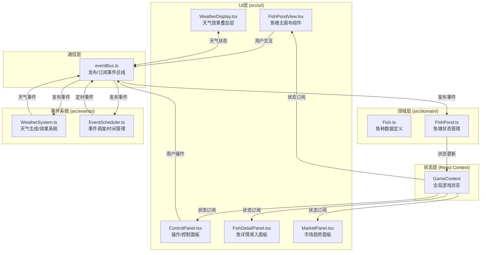

## 1. 架构设计



## 2. 技术描述

- **前端框架**: React@18 + TypeScript@5（strict模式）
- **构建工具**: Vite@5 + @vitejs/plugin-react@4
- **UI动画**: Framer Motion@11（滑入面板、金币跳跃、CD进度等动画）
- **图标库**: React Icons@5（天气、操作、货币图标）
- **图表库**: Recharts@2（市场价格走势折线图）
- **渲染方式**: 混合渲染（Canvas 2D绘制鱼群+DOM/SVG绘制UI层）
- **状态管理**: React Context + useReducer（全局状态），内部类封装领域逻辑
- **通信方式**: 自定义EventBus（发布/订阅模式解耦三大模块）
- **游戏循环**: requestAnimationFrame驱动，30fps目标帧率，deltaTime计算

## 3. 模块与文件结构

| 文件路径 | 职责说明 |
|---------|---------|
| `package.json` | 依赖配置，dev启动脚本 |
| `index.html` | 入口页面，16px基础字体，挂载点#root |
| `vite.config.ts` | Vite配置，启用React插件 |
| `tsconfig.json` | TypeScript strict模式配置 |
| `src/main.tsx` | React应用入口，挂载App + Context Provider |
| `src/App.tsx` | 顶层组件，组合三大UI模块 |
| `src/styles/global.css` | 全局样式（像素风、主题色变量、字体） |
| `src/eventBus.ts` | EventBus类：on/off/emit/once，实现模块解耦 |
| `src/context/GameContext.tsx` | React Context：游戏全局状态、reducer、actions |
| `src/domain/Fish.ts` | FishType枚举、Fish接口、鱼种配置表、生长逻辑 |
| `src/domain/FishPond.ts` | FishPond类：鱼塘环境、鱼群CRUD、操作方法（投喂/增氧/换水） |
| `src/events/WeatherSystem.ts` | WeatherType枚举、天气事件生成、环境影响计算、持续时间管理 |
| `src/events/EventScheduler.ts` | 游戏内时间、事件调度器（天气/市场）、暂停/加速控制 |
| `src/ui/FishPondView.tsx` | Canvas绘制鱼塘、鱼群游动算法、网格线、尾迹效果、交互处理 |
| `src/ui/ControlPanel.tsx` | 操作按钮（带CD进度条）、资源显示、鱼苗商店、市场入口 |
| `src/ui/WeatherDisplay.tsx` | 四种天气视觉效果（太阳/雨滴/热浪/冰晶），CSS动画实现 |
| `src/ui/FishDetailPanel.tsx` | 鱼详情面板（毛玻璃、滑入动画、健康度条） |
| `src/ui/MarketPanel.tsx` | 收购历史列表、Recharts价格折线图、一键出售、资源购买 |

## 4. 核心数据模型

### 4.1 数据模型关系

```mermaid
erDiagram
    GAME_STATE ||--o{ FISH : contains
    GAME_STATE ||--|| POND_ENV : has
    GAME_STATE ||--o{ WEATHER_EVENT : triggers
    GAME_STATE ||--o{ MARKET_RECORD : logs
    GAME_STATE ||--|| CURRENCY : has

    FISH {
        string id PK
        enum species "草鱼/鲤鱼/鲈鱼/小龙虾"
        enum size "小/中/大"
        number health 0-100
        number growthProgress 0-100
        number x "位置X"
        number y "位置Y"
        number vx "速度X"
        number vy "速度Y"
        boolean isDead
        number directionChangeTimer
    }

    POND_ENV {
        number oxygen 0-100
        number temperature ℃
        number waterQuality 0-100
        number feedAmount
    }

    WEATHER_EVENT {
        enum type "晴/暴雨/高温/寒潮"
        number durationSec
        number startTime
        object effects "水温/氧气/水质变更"
    }

    MARKET_RECORD {
        string id PK
        enum species
        number unitPrice
        number totalAmount
        timestamp time
    }

    CURRENCY {
        number coins
        number crystals
    }
```

### 4.2 鱼种配置表（Fish.ts）

| 鱼种 | 生长速度 | 售价范围(小/中/大) | 所需氧气 | 水温耐受范围 | 鱼苗价格 | 像素颜色 |
|------|---------|------------------|---------|------------|---------|---------|
| 草鱼 | 1.2x | 1-3/4-7/8-12 | 中 | 18-30℃ | 5水晶 | #4A7C59深绿 |
| 鲤鱼 | 1.0x | 1-3/4-7/8-12 | 中高 | 15-32℃ | 8水晶 | #E67E22橙黄 |
| 鲈鱼 | 0.8x | 1-3/4-7/8-12 | 高 | 20-28℃ | 12水晶 | #BDC3C7银灰 |
| 小龙虾 | 1.5x | 1-3/4-7/8-12 | 低 | 16-30℃ | 6水晶 | #C0392B红棕 |

## 5. EventBus事件定义

| 事件名 | 触发时机 | 携带数据 | 订阅者 |
|--------|---------|---------|--------|
| `pond:feed` | 点击投喂按钮 | {amount} | FishPond → 增加饲料 |
| `pond:aerate` | 点击增氧按钮 | {} | FishPond → 氧气+20 |
| `pond:waterChange` | 点击换水按钮 | {} | FishPond → 水质+30,水温微调 |
| `pond:fishClicked` | 点击鱼 | {fishId} | UI → 打开详情面板 |
| `pond:fishDied` | 鱼死亡 | {fishId,species} | UI + EventBus |
| `weather:changed` | 天气切换 | {WeatherType,duration} | WeatherDisplay + FishPond |
| `weather:ended` | 天气结束 | {WeatherType} | FishPond → 环境缓慢恢复 |
| `market:acquisitionStart` | 收购周期到达 | {species,priceRange} | UI → 弹出收购面板 |
| `market:sellFish` | 玩家出售鱼 | {fishIds[],species} | GameContext → 金币增加 |
| `market:hoardFish` | 玩家囤货 | {species} | FishPond → 随机生病标记 |
| `shop:buyFry` | 购买鱼苗 | {species,cost} | FishPond + GameContext → 扣水晶加鱼 |
| `shop:buyFeed` | 购买饲料 | {amount,cost} | GameContext → 扣水晶加饲料 |
| `shop:buyMedicine` | 购买药品 | {amount,cost} | GameContext → 扣水晶加药品 |
| `game:togglePause` | 暂停/继续 | {isPaused} | EventScheduler |
| `game:setSpeed` | 调整速度 | {speed 1x/2x/3x} | EventScheduler |
| `ui:openMarket` | 打开市场 | {} | UI → MarketPanel滑入 |
| `ui:closePanel` | 关闭面板 | {panelType} | UI → 关闭对应面板 |

## 6. 关键算法

### 6.1 鱼游动算法 (FishPondView.tsx)
- 位置更新：`x += vx * deltaTime; y += vy * deltaTime`
- 边界处理：碰到640x480边界反向，速度微调±20%
- 方向改变：每2-3秒随机生成新角度，v = speed * (cos/sin)angle
- 摆动效果：sin(time*freq)实现左右微摆，偶尔翻转direction
- 速度系数：根据天气动态调整（暴雨×1.5，高温×0.5）

### 6.2 天气影响系统 (WeatherSystem.ts)
- 触发时机：当前天气结束后，30-60秒随机间隔触发下一次
- 环境影响：应用瞬时delta值，天气持续期间每秒施加小量持续影响
- 恢复机制：天气结束后，每秒向基线(氧气85/水温24/水质90)线性回归1%

### 6.3 帧率控制
- `requestAnimationFrame`循环，记录lastTime，deltaTime = (now-lastTime)/1000
- 上限deltaTime = 0.05s（防止切后台后跳变）
- 实际帧率：DOM更新节流~15fps，Canvas绘制全速60fps（鱼游动流畅）

## 7. 性能优化策略
1. **Canvas分层渲染**：背景网格（静态，离屏缓存）+ 鱼群（动态每帧重绘）+ 尾迹（透明叠加）
2. **对象池**：鱼死后的Canvas/SVG节点复用给新生鱼苗，避免频繁GC
3. **事件防抖节流**：鼠标悬停鱼→标签显示节流100ms，resize事件防抖300ms
4. **React.memo**：ControlPanel/WeatherDisplay/MarketPanel等包装memo，减少无意义重渲染
5. **useMemo/useCallback**：价格走势数据、事件处理器缓存
6. **requestAnimationFrame调度**：鱼游动逻辑用rAF，UI更新批量放入rAF回调末尾
