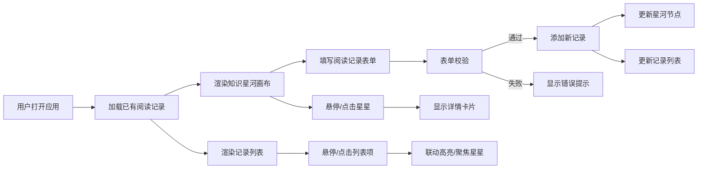

## 1. 产品概述

线上读书会社区的沉浸式阅读记录平台，让成员标记阅读进度、记录心情思绪，并以"知识星河"的可视化形式汇聚全体成员的阅读动态。

- **核心价值**：将阅读这一个人行为，通过可视化技术转化为社区共同的知识景观，增强归属感与阅读动力
- **目标用户**：线上读书会社区的全体成员
- **解决的问题**：传统读书笔记缺乏情感维度和社区共鸣感

## 2. 核心功能

### 2.1 功能模块

1. **阅读记录表单**：心情表情选择、书籍名、页码、感想文字的录入与校验
2. **知识星河画布**：基于D3力导向图的星星节点可视化
3. **记录列表联动**：右侧时间倒序的记录列表，与星河双向联动交互

### 2.2 页面详情

| 页面名称 | 模块名称 | 功能描述 |
|-----------|-------------|---------------------|
| 主页面 | 阅读记录表单 | 心情表情选择（5种）、书籍名输入、页码输入（1-9999）、感想文字（10-200字）、表单校验与提交动画 |
| 主页面 | 知识星河画布 | D3力导向图布局、星星节点渲染（颜色/大小动态）、共鸣连线、拖拽交互、悬停详情卡片 |
| 主页面 | 记录列表 | 时间倒序显示、色块标识、悬停脉冲、点击聚焦联动、展开完整感想 |

## 3. 核心流程

### 3.1 主用户流程

用户打开应用 → 看到已有的知识星河 → 在左上角表单填写阅读记录 → 提交后新星星出现在画布 → 可悬停/点击星星查看详情 → 可在右侧列表浏览所有记录 → 悬停/点击列表项联动星河

## 4. 用户界面设计

### 4.1 设计风格

- **主色调**：深色星空主题，径向渐变从#0D0D1A到#1A1A2E
- **点缀色**：#6C63FF（交互高亮色）、#FFD700（开心金色）、#9B59B6（沉思紫色）、#E91E63（感动粉色）、#FF7043（震撼橙色）、#42A5F5（平静天蓝）
- **文字色**：#E0E0E0（主文字）、#888（辅助文字）
- **按钮风格**：圆角过渡，悬停0.2秒亮色变化
- **字体**：现代无衬线字体，清晰可读
- **布局风格**：左右两栏（70%星河 + 30%列表），中间发光分隔线

### 4.2 页面设计概览

| 模块名称 | UI元素 | 样式描述 |
|-----------|-------------|-------------|
| 阅读记录表单 | 毛玻璃卡片 | backdrop-filter: blur(10px)，背景rgba(255,255,255,0.05)，圆角16px |
| 阅读记录表单 | 表情选择 | 圆形按钮40px，选中放大至48px加#6C63FF光晕 |
| 阅读记录表单 | 输入框 | 深色边框#2A2A4A，焦点变色#6C63FF，浅色文字#E0E0E0 |
| 知识星河画布 | 星星节点 | SVG圆形，颜色映射心情，大小映射累计页数（8-28px） |
| 知识星河画布 | 共鸣连线 | 半透明白线（#FFFFFF 0.1），粗细1-3px |
| 知识星河画布 | 详情卡片 | 半透明深色#1A1A2E 0.95，圆角12px |
| 记录列表 | 列表项 | 左侧色块（匹配星星颜色），悬停联动星星脉冲 |
| 全局 | 分隔线 | 发光竖线#FFFFFF 0.05，宽度1px |

### 4.3 响应式设计

- **桌面端（>768px）**：左右两栏布局，左侧70%星河，右侧30%列表
- **移动端（≤768px）**：单栏上下布局，星河在上，列表在下
- **触控优化**：增大交互热区，支持触控拖拽星星

### 4.4 动效与微交互

- 表单提交成功：绿色对勾0.3秒缩放+旋转动画
- 星星悬停：1.5倍放大，其他星星降低透明度至0.15
- 列表悬停：对应星星1秒周期脉冲闪烁（1.0↔1.2缩放）
- 点击列表项：0.6秒平滑平移+缩放聚焦到星星
- 力导向布局：节点缓慢运动自动收敛
