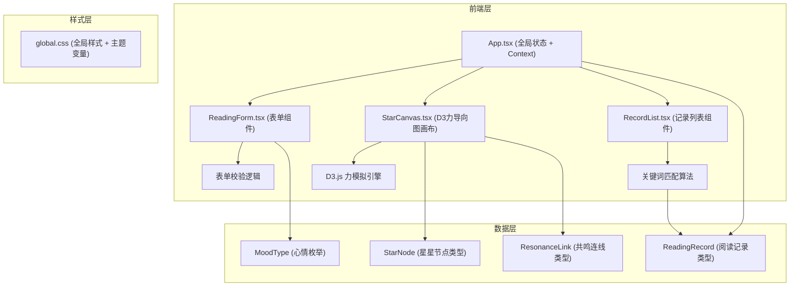

## 1. 架构设计



## 2. 技术栈说明

| 类别 | 技术选型 | 版本 | 用途 |
|------|----------|------|------|
| 框架 | React | ^18.x | UI组件框架 |
| 语言 | TypeScript | ^5.x | 类型安全开发 |
| 构建工具 | Vite | ^5.x | 开发构建与HMR |
| Vite插件 | @vitejs/plugin-react | ^4.x | React JSX支持 |
| 可视化 | D3 | ^7.x | 力导向图布局与SVG操作 |
| 动画 | framer-motion | ^11.x | 组件级动画与微交互 |
| 图标 | react-icons | ^5.x | 图标资源（表单、UI元素） |
| 类型定义 | @types/react | ^18.x | React类型声明 |
| 类型定义 | @types/react-dom | ^18.x | React DOM类型声明 |

## 3. 项目文件结构与调用关系

```
auto112/
├── package.json               # 项目依赖与脚本 (npm run dev)
├── index.html                 # 单页应用入口HTML
├── vite.config.ts             # Vite配置，启用React插件
├── tsconfig.json              # TS配置，strict模式 + ES2020
└── src/
    ├── App.tsx                # 主入口组件，管理全局状态
    │   ├── 创建ReadingContext（提供records/starData/addRecord）
    │   ├── 调用ReadingForm（传入onAddRecord回调）
    │   ├── 调用StarCanvas（传入records、onHighlightId）
    │   └── 调用RecordList（传入records、highlightId、onSelectId）
    ├── components/
    │   ├── ReadingForm.tsx    # 阅读记录表单组件
    │   │   ├── 使用useState管理表单状态
    │   │   ├── 校验：书籍名非空、页码1-9999、感想10-200字
    │   │   ├── 提交成功触发framer-motion对勾动画
    │   │   └── 通过回调调用App.addRecord()
    │   ├── StarCanvas.tsx     # 星河画布（D3力导向图）
    │   │   ├── useEffect初始化D3 forceSimulation
    │   │   ├── forceManyBody: -300（排斥力）
    │   │   ├── forceLink: 0.1（连线拉力）
    │   │   ├── tick间隔: ~30ms
    │   │   ├── 星星大小: 基于同书累计页数映射8-28px
    │   │   ├── 星星颜色: 心情映射5色
    │   │   ├── 连线粗细: 关键词匹配数映射1-3px
    │   │   ├── 拖拽: d3.drag()绑定
    │   │   ├── 悬停: 详情卡片 + 其他星透明度0.15
    │   │   └── 接收RecordList选中事件: 平移+缩放聚焦
    │   └── RecordList.tsx     # 记录列表组件
    │       ├── 时间倒序排序records
    │       ├── 提取感想摘要（前30字）
    │       ├── 悬停: 触发StarCanvas脉冲动画
    │       ├── 点击: 展开完整感想 + 通知StarCanvas聚焦
    │       └── 通过回调调用App.onSelectId()
    ├── types/
    │   └── index.ts           # 类型定义（新增目录）
    │       ├── MoodType = 'happy' | 'thinking' | 'moved' | 'shocked' | 'calm'
    │       ├── ReadingRecord { id, bookName, page, mood, thought, timestamp, keywords[] }
    │       ├── StarNode extends ReadingRecord { x, y, fx?, fy?, size, color }
    │       └── ResonanceLink { source, target, keywordCount, width }
    └── styles/
        └── global.css         # 全局样式
            ├── CSS变量: 主题色、心情色映射
            ├── 径向渐变星空背景
            ├── 毛玻璃卡片样式
            ├── @keyframes pulse, checkmark 等动画
            ├── 响应式媒体查询 <768px
            └── 表单/输入框/按钮基础样式
```

## 4. 数据流定义

### 4.1 核心类型定义

```typescript
// 心情类型枚举
type MoodType = 'happy' | 'thinking' | 'moved' | 'shocked' | 'calm';

// 阅读记录
interface ReadingRecord {
  id: string;           // UUID
  bookName: string;     // 书籍名称
  page: number;         // 当前页码 (1-9999)
  mood: MoodType;       // 心情类型
  thought: string;      // 感想文字 (10-200字)
  timestamp: number;    // 创建时间戳
  keywords: string[];   // 提取的关键词（用于共鸣连线）
}

// 星星节点（D3力导向图使用）
interface StarNode extends ReadingRecord {
  x: number;            // 当前X坐标
  y: number;            // 当前Y坐标
  fx?: number | null;   // 固定X（拖拽时）
  fy?: number | null;   // 固定Y（拖拽时）
  size: number;         // 星星半径 (8-28px)
  color: string;        // 星星颜色（心情映射）
}

// 共鸣连线
interface ResonanceLink {
  source: string;       // 源记录ID
  target: string;       // 目标记录ID
  keywordCount: number; // 匹配关键词数量
  width: number;        // 连线粗细 (1-3px)
}

// Context值类型
interface ReadingContextValue {
  records: ReadingRecord[];
  addRecord: (record: Omit<ReadingRecord, 'id' | 'timestamp' | 'keywords'>) => void;
  highlightId: string | null;
  setHighlightId: (id: string | null) => void;
  selectedId: string | null;
  setSelectedId: (id: string | null) => void;
}
```

### 4.2 心情-颜色映射表

| MoodType | 表情 | 颜色HEX | 语义 |
|----------|------|---------|------|
| happy | 😊 | #FFD700 | 开心（金色） |
| thinking | 🤔 | #9B59B6 | 沉思（紫色） |
| moved | 😢 | #E91E63 | 感动（粉色） |
| shocked | 😲 | #FF7043 | 震撼（橙色） |
| calm | 😌 | #42A5F5 | 平静（天蓝） |

### 4.3 关键词提取与共鸣算法

```
算法流程：
1. 感想文字 → 分词（中文按常见停顿词切分，或按2-4字滑动窗口提取高频词）
2. 过滤停用词（的、了、是、在...）
3. 每条记录保留 top 5 关键词
4. 两两记录比较，计算交集关键词数量 N
5. N >= 1 时生成共鸣连线，线宽 = clamp(N, 1, 3)
```

## 5. 状态管理

使用 React Context + useState（而非zustand，用户明确要求Context模式）：

- **App.tsx** 作为唯一数据源
- `records`: ReadingRecord[] 所有阅读记录
- `highlightId`: string | null 当前悬停高亮的记录ID（用于脉冲）
- `selectedId`: string | null 当前点击选中的记录ID（用于聚焦）
- 子组件通过回调函数向上传递事件，不直接修改状态

## 6. 性能约束实现方案

| 约束 | 实现方案 |
|------|----------|
| 节点数 ≤ 200 | App层截断逻辑：`records.slice(-200)` 传递给StarCanvas |
| tick间隔 ≈ 30ms | `simulation.alphaDecay(0.02)` 调整收敛速度，避免高频计算 |
| 60fps目标 | D3 tick事件中仅更新DOM属性，不触发React重渲染；使用requestAnimationFrame节流 |
| 悬停性能 | CSS transform: scale() 实现放大，走GPU合成层 |
| 聚焦动画 | CSS transition: transform 0.6s ease 实现平滑平移缩放 |

## 7. 启动方式

```bash
npm install   # 安装依赖
npm run dev   # 启动Vite开发服务器
```
