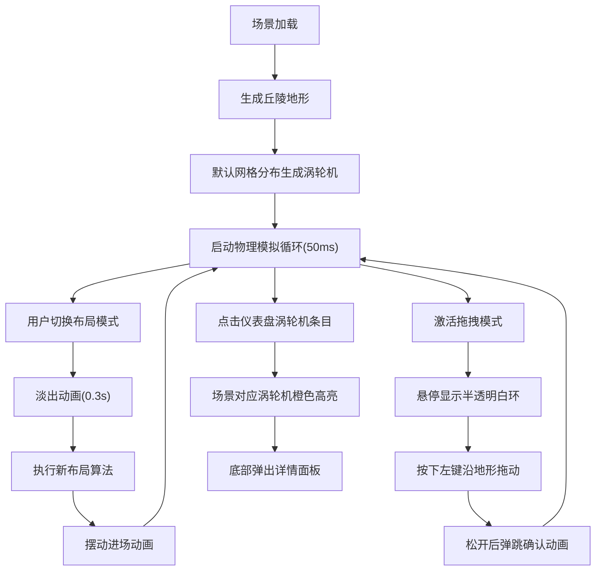

## 1. 产品概述

微型风力发电场布局优化与效能对比3D可视化工具，旨在帮助用户通过交互式3D场景直观地设计和评估风力涡轮机的布局方案。用户可拖拽调整涡轮机位置，实时对比网格分布、随机分布、沿等高线分布三种方案的发电效率与尾流干扰影响。

- 目标用户：能源规划师、风电场设计师、环境工程学生、清洁能源研究人员
- 核心价值：将抽象的流体力学计算转化为直观可视化的交互体验，帮助快速找到最优布局方案

## 2. 核心功能

### 2.1 功能模块

1. **3D地形场景**：10km x 10km随机丘陵地形，柏林噪声生成，渐变色彩渲染
2. **涡轮机管理**：生成、移动、拖拽、移除涡轮机，支持三种布局算法
3. **物理模拟引擎**：计算地形遮挡、尾流效应、各涡轮机发电量
4. **交互控制面板**：布局模式切换、数量调整、拖拽开关
5. **效能仪表盘**：总发电量、条形图对比、风速趋势图
6. **涡轮机详情面板**：单个涡轮机高亮与详细数据展示

### 2.2 页面详情

| 页面名称 | 模块名称 | 功能描述 |
|---------|---------|---------|
| 主场景页 | 3D场景 | 渲染地形、涡轮机、风向箭头、阴影投射 |
| 主场景页 | 控制面板(左) | 布局模式下拉、涡轮机数量滑块、拖拽激活开关 |
| 主场景页 | 效能仪表盘(右) | 总发电量大字显示、涡轮机条形图、风速折线图 |
| 主场景页 | 详情面板(底) | 单涡轮机风速、发电量、坐标、尾流影响百分比 |

## 3. 核心流程

## 4. 用户界面设计

### 4.1 设计风格

- **主色调**：天空蓝#87CEEB、草地绿#4CAF50、山地棕#795548
- **强调色**：橙#FF9800（高亮）、蓝#2196F3（风向/链接）、红#F44336（低效）
- **中性色**：浅灰#F5F5F5、灰#9E9E9E、深灰#2C2C2C、白#FFFFFF
- **材质风格**：毛玻璃半透明面板（backdrop-filter: blur）
- **按钮风格**：圆角8px，悬停背景#E0E0E0，点击下沉2px效果
- **字体**：系统无衬线字体，标题20px/600，正文14px/400，小字12px/400

### 4.2 页面设计概述

| 模块 | UI元素 | 设计规范 |
|------|--------|---------|
| 主场景3D | 渐变天空背景 | #87CEEB → #F5F5F5 垂直渐变 |
| 主场景3D | 地形表面 | 顶点色从绿#4CAF50过渡到棕#795548 |
| 主场景3D | 涡轮机 | 塔身灰圆柱，白色三叶片旋转 |
| 主场景3D | 风向箭头 | 半透明蓝色#2196F3，场景上方悬浮 |
| 控制面板 | 左侧悬浮面板 | #2C2C2C半透明，毛玻璃，padding:16px，width:260px |
| 控制面板 | 布局下拉 | 深色背景，白色文字，圆角8px |
| 控制面板 | 数量滑块 | 自定义滑块轨道与拇指，范围5-30 |
| 控制面板 | 拖拽开关 | iOS风格开关，激活时绿色 |
| 效能仪表盘 | 右侧悬浮面板 | #2C2C2C半透明，毛玻璃，padding:16px，width:320px |
| 效能仪表盘 | 总发电量 | 40px/700白色大字，带kW单位 |
| 效能仪表盘 | 条形图 | 渐变色条，红→黄→绿，hover显示tooltip |
| 效能仪表盘 | 折线图 | 绿线，带填充面积，200ms采样 |
| 详情面板 | 底部悬浮条 | #2C2C2C半透明，滑入动画 |

### 4.3 响应式设计

- **桌面端（≥768px）**：左侧控制面板 + 中间3D场景 + 右侧仪表盘，三栏并排
- **移动端（<768px）**：控制面板（上）+ 3D场景（中）+ 仪表盘（下），垂直堆叠
- **自适应缩放**：窗口大小变化时3D画布自动调整，涡轮机尺寸按视口比例缩放

### 4.4 3D场景指引

- **环境**：渐变天空雾效（FogExp2，密度0.0005），柔和环境光+方向光
- **光照**：AmbientLight(0xffffff, 0.6) + DirectionalLight(0xffffff, 0.8)，方向光开启阴影
- **相机**：PerspectiveCamera，起始俯视45°，支持OrbitControls旋转缩放
- **阴影**：PCFSoftShadowMap，涡轮机投射阴影，地形接收阴影，模糊半径3
- **交互**：Raycaster拾取涡轮机，拖拽时投影到地形高度，动画使用Tween逻辑
- **后处理**：FXAA抗锯齿，轻微色调映射提升观感
