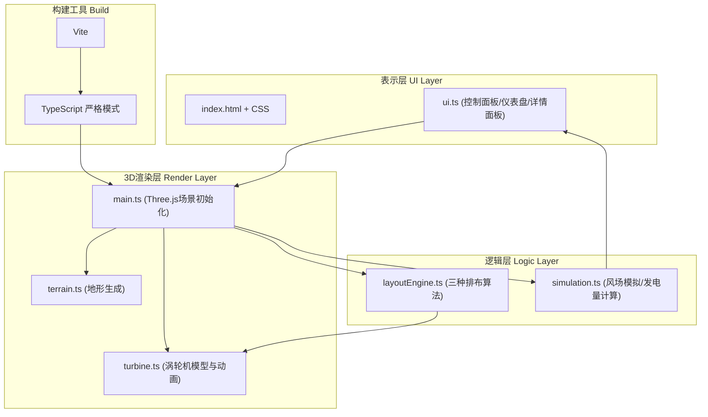
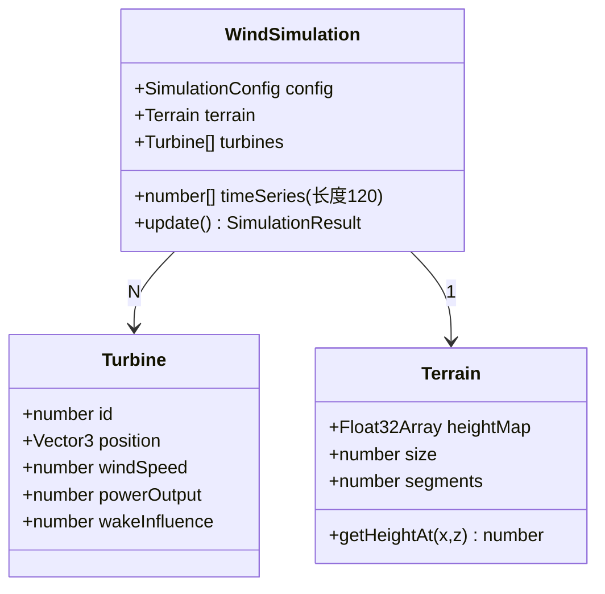

## 1. 架构设计



## 2. 技术描述

- **前端框架**：无框架，原生HTML/CSS + TypeScript
- **3D引擎**：Three.js @0.160+，附带@types/three类型定义
- **构建工具**：Vite @5.x，热模块替换（HMR）
- **语言**：TypeScript @5.x，strict:true严格模式
- **节点类型**：@types/node用于路径与环境变量
- **运行脚本**：
  - `npm run dev`：启动Vite开发服务器
  - `npm run build`：生产构建
  - `npm run preview`：预览构建产物

## 3. 目录结构

```
auto114/
├── package.json
├── index.html
├── vite.config.js
├── tsconfig.json
└── src/
    ├── main.ts          (入口：场景、相机、渲染器、控件、循环)
    ├── terrain.ts       (柏林噪声地形、顶点色渐变、碰撞查询)
    ├── turbine.ts       (涡轮机类：塔身/叶片/旋转/动画状态)
    ├── layoutEngine.ts  (网格/随机/等高线 三种分布算法)
    ├── simulation.ts    (50ms更新循环：风速、尾流、发电计算)
    └── ui.ts            (DOM控件：面板、滑块、按钮、图表)
```

## 4. 模块接口定义

### 4.1 terrain.ts 对外接口

```typescript
export interface TerrainOptions {
  size: number;        // 地形边长（世界单位，10000 = 10km）
  segments: number;    // 网格分段数，推荐128
  heightScale: number; // 最大高度（200米）
  noiseScale: number;  // 柏林噪声缩放
}

export class Terrain {
  public mesh: THREE.Mesh;
  constructor(options: TerrainOptions);
  getHeightAt(x: number, z: number): number;   // 查询任意(x,z)的高度
  getContourHeights(count: number): number[];  // 返回N条等高线海拔
  getNormalAt(x: number, z: number): THREE.Vector3;
}
```

### 4.2 turbine.ts 对外接口

```typescript
export interface TurbineState {
  id: number;
  position: THREE.Vector3;
  windSpeed: number;     // 当前实际风速
  powerOutput: number;   // 当前发电量(kW)
  wakeInfluence: number; // 受尾流影响百分比(0-100)
}

export class Turbine {
  public group: THREE.Group;
  public state: TurbineState;
  constructor(id: number, position: THREE.Vector3);
  setPosition(pos: THREE.Vector3): void;
  updateRotation(windSpeed: number, dt: number): void; // 叶片旋转
  playFadeIn(duration?: number): Promise<void>;
  playFadeOut(duration?: number): Promise<void>;
  playSwingEntrance(durationPer?: number): Promise<void>;
  playBounceConfirm(): Promise<void>;
  setHoverRing(visible: boolean): void;
  setHighlight(enabled: boolean): void;
  dispose(): void;
}
```

### 4.3 layoutEngine.ts 对外接口

```typescript
export type LayoutMode = 'grid' | 'random' | 'contour';

export interface LayoutParams {
  count: number;
  terrain: Terrain;
  minSpacing?: number;   // 最小间距(避免重叠)
}

export function generateGridLayout(params: LayoutParams): THREE.Vector3[];
export function generateRandomLayout(params: LayoutParams): THREE.Vector3[];
export function generateContourLayout(params: LayoutParams): THREE.Vector3[];
```

### 4.4 simulation.ts 对外接口

```typescript
export interface SimulationConfig {
  baseWindSpeed: number;      // 基准风速 8m/s
  windDirection: number;      // 风向(弧度)，默认沿+X轴
  terrainInfluence: number;   // 地形遮挡系数
  wakeDecay: number;          // 尾流衰减系数
  powerCoefficient: number;   // 风能利用系数Cp
  airDensity: number;         // 空气密度 1.225 kg/m³
  rotorArea: number;          // 叶片扫风面积
}

export interface SimulationResult {
  totalPower: number;             // 总发电量 kW
  efficiency: number;             // 综合效率(0-1)
  averageWindSpeed: number;       // 平均风速
  perTurbine: TurbineState[];     // 各涡轮机状态
  timeSeriesWindSpeed: number;    // 当前平均风速采样点
}

export class WindSimulation {
  constructor(config: Partial<SimulationConfig>, terrain: Terrain);
  update(turbines: Turbine[]): SimulationResult;
  subscribe(callback: (result: SimulationResult) => void): () => void;
  start(intervalMs?: number): void;  // 默认50ms
  stop(): void;
}
```

### 4.5 ui.ts 对外接口

```typescript
export interface UIControls {
  onLayoutChange: (mode: LayoutMode) => void;
  onCountChange: (count: number) => void;
  onDragToggle: (enabled: boolean) => void;
  onTurbineSelect: (id: number | null) => void;
}

export class Dashboard {
  constructor(controls: UIControls);
  updateSimulation(result: SimulationResult): void;
  setTurbineList(list: TurbineState[]): void;
  showTurbineDetail(state: TurbineState): void;
  hideTurbineDetail(): void;
  showDragHint(visible: boolean): void;
  handleResize(isMobile: boolean): void;
}
```

## 5. 核心算法说明

### 5.1 地形高度查询（双线性插值）

terrain.ts 使用128×128顶点网格，对任意(x,z)映射到(u,v)∈[0,1]后取周围4顶点高度，双线性插值得到平滑高度值，供涡轮机吸附定位。

### 5.2 尾流效应模型（简化Jensen模型）

对每对涡轮机(Ti, Tj)：若Tj位于Ti下游风向扇形（θ<15°）且距离在10D内（D为转子直径），则 Tj风速 *= (1 - 2I/(1+kx/D)²)，I为湍流强度，k为尾流扩展系数。多台尾流叠加取风速亏损的平方根和。

### 5.3 布局算法

- **网格分布**：按√N × √N等间距排布，坐标偏移至地形中心，取整前轻微随机抖动(±5%)避免完全人工感。
- **随机分布**：Poisson圆盘采样（基于最小间距minSpacing），循环拒绝过近样本，收敛快速。
- **沿等高线分布**：取3-5条等高海拔圆，沿每条等高角方向均匀分配，Zigzag交替避免直线对齐。

### 5.4 动画实现

所有进出/摆动/弹跳动画采用requestAnimationFrame帧驱动的自定义Tween类，使用ease-out缓动函数，统一0.3s或0.5s时长。不引入额外tween库以控制包体积。

## 6. 性能优化

- **地形几何**：Indexed BufferGeometry，顶点颜色直接写入attributes.color，避免每帧纹理采样。
- **涡轮机复用**：塔身圆柱和叶片几何使用共享BufferGeometry，不同实例仅变换Matrix4（考虑到最多30台，实例化收益有限，直接Group即可）。
- **模拟计算**：50ms固定步长独立于渲染帧；涡轮机两两距离预计算，新增/移除布局时缓存。
- **渲染**：PCFSoftShadowMap尺寸1024×1024，阴影相机边界裁剪到地形范围；Frustum Culling默认开启。
- **FPS保障**：拖拽时暂停等高线/条形图的DOM重绘（仅更新核心数据），拖完再刷新。

## 7. 数据模型（Simulation状态）


